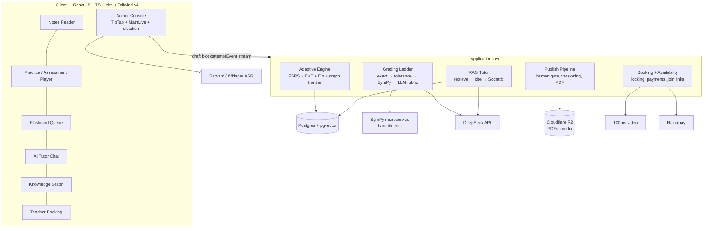

# VIDYA — Master Build Plan
**India-first learning platform · Maths first, Science after · Planning complete, build not started**

Working codename VIDYA (placeholder — rename at will). Date: 2026-08-31.
Produced by an 8-lane parallel research mission. Detail lives in `research/*.md`; **decisions live here
and in `decisions/*.md`.** Where this file and a lane file disagree, this file wins.

> **For the coding agent that builds this:** read this file, then `decisions/ADR-002-canonical-data-model.md`
> (the schema contract, **including Amendment 1**), `decisions/ADR-003-card-type-mix-policy.md` and
> `decisions/ADR-004-curriculum-scoped-selection.md`, then your task packet in §14. Do not implement from the lane research
> files directly — they contain superseded fragments.

---
## 1. What we are building, in one paragraph

A curriculum-bound study platform for Indian students. The operator authors structured teaching notes;
students read them, practise against an adaptive question bank that marks mathematically-equivalent
answers correctly, review flashcards on a spaced-repetition schedule tuned to their real exam date, ask
an AI tutor grounded in those same notes — and when the AI is not enough, book thirty minutes with a
real teacher who arrives already knowing what they are stuck on.

## 2. Positioning — and why the pillars are in the wrong order

Full argument in `decisions/ADR-001-product-thesis.md`. The short version:

**"AI tutor + adaptive practice + flashcards" is table stakes in 2026, not a differentiator.** Brilliant
leads its homepage with an AI tutor persona; Math Academy sells adaptive diagnostics at $49/mo; RemNote
ships notes + auto-flashcards + quizzes + mastery tracking + AI tutor in one product. Building only that
produces a worse-funded clone.

Two gaps none of them fill: **curriculum binding** (they are all syllabus-agnostic; an Indian student is
not learning "maths", they are passing CBSE Class 10) and **a human on demand** (no global tool puts a
real teacher on a call, and Indian study culture is built on tuition).

So the competitive ordering is the inverse of how the pillars were described:

| Rank | Pillar | Why |
|---|---|---|
| 1 | **Teacher call** | The moat. Nothing global has it; Indian demand is already proven and already paid for. |
| 2 | **Adaptive practice bound to a named syllabus** | The daily habit and the retention engine. |
| 3 | **AI answer-checking** | The credibility gate — see §3. |
| 4 | **AI tutor** | Table stakes, and the cheap triage layer that protects teacher-call margin. |
| 5 | **Notes + PDF** | The substrate everything hangs off, and the parent-visible artefact. |

Visual position (lane A): **Dr Frost Maths' operational seriousness, wearing Brilliant's interaction
polish, priced and localised like Physics Wallah.** Explicitly *not* Byju's/Vedantu/PW's signed-out
funnel idiom — no festival countdowns, no topper walls, no mega-menus, no default national leaderboard.

## 3. The three things that will kill this product if got wrong

1. **A correct answer marked wrong.** A student marked down for writing `0.5` instead of `1/2` will not
   file a bug — they will leave and tell their WhatsApp group. Lane D's evaluation harness is a **launch
   gate**, not a nice-to-have.
2. **The curriculum taxonomy.** Everything hangs off it. Getting it wrong is the one mistake that forces
   a rewrite. Resolved in ADR-002 — and the resolution corrects a real modelling error found in the
   research (board and exam track were conflated; a CBSE student preparing for JEE could not be
   represented at all).
3. **Unreviewed AI-generated content teaching wrong maths.** Hard human-approval gate, no exceptions,
   no confidence-score bypass.

---
## 4. System architecture

**Stack** (house default, confirmed by lanes A/B/F/G): React 18 + TypeScript + Vite + Tailwind v4 +
React Router + Zustand · `motion` via `LazyMotion`+`m` (~4.6KB, not the ~50KB full import) ·
`lucide-react` · TipTap v2/ProseMirror (MIT) for both author and reader (reader is the same instance
with `editable:false` — one schema, not two renderers) · MathLive for input, KaTeX for render ·
`@xyflow/react` and `react-force-graph-2d` for canvases · Dexie for offline · Postgres + pgvector ·
DigitalOcean Bangalore at launch → AWS Mumbai at ~5,000 students · Cloudflare R2 from day one.

**Hard performance budget** (lane E): target a ₹10–15k Android phone, 4–6GB RAM, 3–8 Mbps real 4G.
**Initial JS ≤ 200KB gzipped. LCP ≤ 2.5s on a Moto G Power / Fast-4G Lighthouse profile.** This is a
gate in CI, not an aspiration. Both figures are **ceilings, not targets** — aim meaningfully under.
Note honestly that this budget has **not** been validated against the mandatory dependency stack
(TipTap + KaTeX + MathLive + `motion` + charts): 100ms video and the PDF renderer must be lazy-loaded per
route, and if the editor bundle alone breaches 200KB the reader surface may need a lighter render path
than a `editable:false` TipTap instance. **Measure this in Phase 0 before committing to the architecture.**

## 5. Data model
**`decisions/ADR-002-canonical-data-model.md` is the contract.** It reconciles seven collisions between
lanes C, E, F and B, of which five were outright contradictions. Do not implement from lane files.

**ADR-004 amends the graph:** skill *identity* is board-agnostic but teaching *order* is not, so
`SkillEdge` carries an optional `curriculumScope` (null = global default) and `selectNextItem` takes a
`CurriculumContext`. Without this, ADR-002's Board/ExamTrack split was correct in the schema and never
reached the selection algorithm that needed it — the CBSE-student-preparing-for-JEE case would still have
been unresolvable. ADR-004 §3 also defines how two concurrent exam goals merge (one primary exam owns the
daily goal; secondary exams contribute scope, not pacing).

Three invariants a coding agent must not break:
- **`blockId` is immutable and never reused.** The entire personal-annotation layer anchors to it.
- **`AttemptEvent` ships with the frontend in Phase 1**, including `selectionPropensity` and
  `policyVersion`. They cost nothing now and are the only reason the adaptive engine can be upgraded
  later without a rewrite. If the frontend ships without them, the history is gone forever.
- **One `GradingMethod` enum**, matching lane D's verified ladder.

---
## 6. The adaptive engine (lane C)

Not reinforcement learning. Three well-understood systems wired together:
- **FSRS** via `ts-fsrs` (MIT) — when a card comes back. Works from day one with default weights, no
  training data.
- **BKT + Elo** — how confident we are the student knows a skill. Updates in closed form after every
  answer; needs no historical corpus. **DKT/SAKT rejected at launch** on data-volume grounds — the
  benchmarks they are built for have hundreds of thousands of rows; we will have hundreds of students.
- **Prerequisite-graph frontier selection** with difficulty targeted at the ~85% success zone. Every
  question served has an explainable reason ("you're at the frontier of X, and prerequisite Y is shaky")
  rather than a black-box choice.

**RL/contextual bandits: not at launch, deliberately.** Reward is a noisy delayed proxy for learning;
exploration spends a fragile early cohort's actual study time; and there is no way to evaluate a policy
offline without logged propensities. Log the propensities from day one, add the bandit at v3 once it can
be validated against history *before* touching a live student.

**Layered on top: the Exam Scheduler** (verified in `research/B2_remnote_verified.md`) — a complement to
FSRS, not a replacement, with five mechanisms: Final Review Period, Learning Period (two successful
recalls before spacing), Ensure Mastery (two consecutive recalls after a lapse), a **proposed** Catch-Up
Period, and a computed Exam Daily Goal. `Exam` is a first-class object carrying a date and a syllabus
scope. For an Indian student whose entire year points at one date, this is the spine of the experience:
the home screen answers *am I on track for 14 March?*

## 7. AI subsystems (lane D)

**Grading ladder — cheapest rung first, LLM last:**
`exact/normalised` → `numeric_tolerance` (sig figs, units) → **`cas_equivalence` (SymPy, hard timeout)**
→ `llm_rubric` (structured JSON: correct/partial/incorrect, marks, the specific misconception, feedback).

This was **verified in-session, not assumed**: SymPy 1.14.0 correctly resolves `2(x+3) == 2x+6`,
`1/2 == 0.5`, `sin²x+cos²x == 1`, correctly rejects a genuinely wrong answer, and a known SymPy hang case
is caught cleanly by the 2.0s timeout guard rather than freezing. The timeout is not optional.

**Misconception tagging** seeded from the Eedi/NeurIPS Diagnostic Questions dataset — wrong answers teach
the fix, not just "incorrect".

**Cost: ≈ $0.11 (~₹10.6) per active student per month** across tutor chat, grading and note generation
(script-computed). Non-obvious finding: DeepSeek's peak-pricing window maps to 06:30–09:30 and
11:30–15:30 IST, so **Indian after-school study hours are already off-peak.** Note DeepSeek changed its
pricing on 2026-08-16 — re-verify before build.

**Safety and moderation.** The platform serves minors and accepts free text from them (tutor questions,
answers, personal notes). Lane D names this as a real gap: moderation of student-submitted text before it
reaches the LLM, prompt-injection defence against a student's own answer text, PII handling in prompts,
logging/retention limits, and abuse handling. **Lane D could not confirm that DeepSeek exposes a dedicated
moderation endpoint** — so moderation must be treated as our own layer, not an assumed vendor feature.
This is a Phase 4 requirement, not a post-launch cleanup.

**Tutor guardrails.** The tutor's job is Socratic triage, not answering. Hint laddering; refuses to solve
a live assessment question; different behaviour in Practice vs Notes vs Assessment mode; **and when it is
unconfident, it escalates to a teacher booking with context attached.** Tutor and booking are one funnel,
not two features — that is the unit-economics mechanism that keeps human-call margin viable.

## 8. Content pipeline (lane F, corrected by B2)

Canonical format **TipTap/ProseMirror JSON** — the only option with zero serialisation risk against the
editor. KaTeX + the free MIT `@tiptap/extension-mathematics` (not the paid Pro package) + `mhchem` for
chemistry later. **PDF export: headless Chromium + Paged.js** (React-PDF rejected — no native LaTeX).
Per-user visible watermarking via `pdf-lib`; forensic watermarking left open. OCR ingest: **`marker`**
(Apache-2.0, free under $5M revenue) by default, **Mathpix** ($0.002/image) reserved for handwriting and
low-confidence escalation.

**The card-quality trap — a genuine finding, and a gap still open.** RemNote's own documentation argues
*against* cloze, list and multiple-choice cards ("among the most difficult things to remember"; memory
works by connections, not sequences; MCQ "not recommended for general-purpose learning"). Those are
precisely the three card types an LLM generates most readily. Left alone, our auto-generator will produce
the cheapest-to-build and worst-to-learn-from deck possible. **Resolved in `decisions/ADR-003-card-type-mix-policy.md`:** a type budget enforced at generation
(≥55% Concept/Descriptor, cloze capped at 20%, MCQ at 10%), five new deterministic publish gates, and —
the key structural move — **two decks, not one**. The mastery deck drives FSRS and mastery estimation;
an `exam_rehearsal` deck holds MCQ for board/JEE practice and is **excluded from mastery estimation**,
because answering by elimination is weak evidence of understanding. MCQ is genuinely useful when the real
exam is multiple-choice; it just must not be mistaken for mastery.

Verified RemNote card syntax to adopt (`::` concept, `;;` descriptor, `{{…}}` cloze, `>>` basic, with
direction modifiers) is in `research/B2_remnote_verified.md` §1. Two mechanics nobody anticipated and
both worth stealing: **ancestor context** on every card (with concept backs hidden so they don't leak
answers), and **partial list/set cards** (forget one item, drill that item alone, then restore the list).

## 9. Voice (lane H) — the contrarian call

The Wispr Flow ask bundles three different features. Verdicts:
- **(a) Dictation at the cursor — v1, but in the AUTHOR console first.** This is the strongest call in
  the lane: the real bottleneck for a bootstrapped build is getting a large body of teaching material
  *into* the platform. A fast dictate-while-explaining flow pays for itself immediately for the operator,
  with one forgiving user and a fast feedback loop. Student editor gets a scoped, opt-in version after.
- **(b) Lecture recording — reject for v1.** RemNote already owns it and badges it Pro; it is not
  differentiating and carries a real diarisation/summarisation pipeline cost. Pre-recorded material is an
  *ingest* problem for §8, not a Record button.
- **(c) Voice to the tutor — v2. Spoken practice answers — reject**, because grading spoken formulas
  compounds the two hardest open problems in the whole mission for a feature nobody asked for.

ASR must be chosen on **Indian-accented English and Hinglish code-switching**, where Indian providers
(Sarvam, AI4Bharat) may beat Whisper — see lane H for the comparison and cost curve. Voice must never be
the *only* path to any action: noisy shared homes are the norm, not the exception.

## 10. Teacher booking (lane E)

**100ms** for video (India-headquartered, India data residency, negligible per-minute cost at launch) —
Zoom Meeting SDK, though named by the operator, is materially more expensive and heavier for a
"join a link, no account" flow; keep as fallback. Double-booking is a **concurrency problem** requiring
real transactional locking, not optimistic UI. Booking lifecycle state machine and the Teacher /
AvailabilitySlot / Booking models are in lane E §5.

The differentiating detail: **the teacher joins already knowing what the student is stuck on** — recent
wrong answers, weak skills, the AI tutor transcript. That has consent implications, spelled out in E.

## 11. Commercial and compliance (lane E)

- **Launch on CBSE Class 9–10 Mathematics.** Note the honest tension the research surfaced: ~92% of
  higher-secondary exam-takers are on state boards and only ~8% on CBSE+ICSE — but CBSE families are the
  ones targeting engineering/medical entrance, with correspondingly higher willingness to pay, and CBSE
  is a *single* national syllabus whereas "state boards" is ~30 different syllabi in multiple languages —
  so the 92% is not one addressable market, it is thirty fragmented ones, each needing its own content and
  often its own language. Launching there would multiply authoring cost before the product is proven.
  The honest counter-argument is that CBSE is also the most competitively crowded segment; the response is
  that we are not competing on content breadth but on marking quality and the teacher escalation, neither
  of which the incumbents offer. Board is a swappable dimension from day one so board #2 is content
  authoring, not re-architecture.
- **NCERT prose, diagrams and worked examples are copyrighted.** Syllabus *structure* (topic names,
  sequencing, weightage) is not. Author original notes against the structure; do not scrape NCERT PDFs.
- **Pricing:** free tier (notes + limited practice) · **₹299/month or ₹2,499/year "Plus"** (full adaptive
  practice + unlimited AI tutor) · teacher calls sold as credits at **₹599 single / ₹1,999 for four**
  (₹499.75 effective), against a ₹250/call teacher payout.
- **Where the money actually comes from — state this correctly.** The 28–37% contribution margin on calls
  is a **ceiling, not a P&L number**: it excludes customer acquisition, content authoring, support,
  refunds and no-show absorption, and compliance operating cost. **Sensitivity: if teacher payout has to
  rise to ₹350–400/call to attract quality subject teachers — a real risk, not a hypothetical — the
  4-pack goes margin-negative at ₹499.75 effective.** The teacher-payout-to-call-price spread is the
  single number the operator must watch, and it should be re-run through lane E's script whenever either
  side moves, never re-estimated by eye.
  **So: the teacher call is the moat and the differentiator that makes the subscription sticky. The
  Plus subscription is the profit centre** (marginal cost per user ₹1–5/month). ADR-001 ranks the call
  first on *defensibility*; that is not a claim about where margin comes from, and the two must not be
  confused when pricing decisions are made.
- **Payments: Razorpay** (UPI-first, Subscriptions for UPI Autopay, Route for teacher payouts).
- **DPDP Act 2023 is in force**; the DPDP Rules were notified 13 Nov 2025 on a phased timeline through
  May 2027. Every student here is presumptively a minor, so **verifiable parental consent is the first
  thing in signup**, before any collection beyond identifying the parent. Behavioural tracking and
  targeted advertising at children are prohibited — which independently rules out several of the
  incumbent patterns we were already rejecting on taste grounds.
- **Open risk, operator's call:** sending student data (chat transcripts, wrong-answer history) to
  DeepSeek's China-hosted API. Options in lanes D and E: self-hosted open weights, an India-hosted
  endpoint, or anonymise before sending. **Not decided here.**

---
## 12. Surfaces (lane A, abridged — full table in `research/A_…` §6)

**P0 student:** signup with board/grade/exam capture · diagnostic placement · home/daily loop ·
syllabus library (chapter→topic with mastery, **not** reverse-chronological) · topic detail ·
practice session · assessment · assessment review · flashcard queue · AI tutor chat · notes reader + PDF.
**P1:** teacher booking · knowledge graph · progress analytics · settings · plan/upgrade.
**P2:** opt-in friend leaderboard (never a default national one).
**Teacher (P1):** dashboard (Dr Frost pattern — identity card, shared mastery donut, quick actions,
activity feed), roster, assign practice, student detail. **Author (P0):** editor, review queue, publish.

Nav: **mobile = bottom tab bar, 5 items, Practice emphasised centre; desktop = persistent left sidebar.**

## 13. What we deliberately are not building at launch
Social feeds · live cohort classes · a video lecture library · a global leaderboard · lecture recording ·
spoken practice answers · handwriting as a core capture path · multi-board content · Notion-style
database views · real-time collaborative editing · RL-driven sequencing.

---
## 14. Build sequence — task packets for the coding agent

Each phase ends in something demonstrable. Packets inside a phase are parallelisable; phases are not.
Every packet: strict file ownership, exact verification command, no git without operator instruction.

**Phase 0 — Foundations (blocking everything).**
`P0.1` repo scaffold, Vite+TS+Tailwind v4, CI with the 200KB/LCP budget as a failing gate.
**`P0.1b` bundle-budget spike** — build a throwaway route importing TipTap + KaTeX + MathLive + `motion`
and measure. If it breaches, the reader render path changes before anything is built on it.
`P0.2` implement ADR-002 schema **including Amendment 1** (User, Student, ParentGuardian, ConsentRecord,
Subscription, Entitlement, PersonalAnnotation, Misconception) as Postgres migrations + generated TS types.
**Single source of truth.**
**`P0.5` auth and identity skeleton** — phone-OTP login, roles, session, and a minimal parent-link +
`ConsentRecord` write path. **This was missing from every research lane and is a hard Phase 0 blocker:**
every per-student table keys off a `studentId`, so nothing after Phase 0 can store a row without it. The
*full* DPDP verification flow (DigiLocker / Consent Manager) remains the Phase 6 public-launch gate — but
the skeleton must exist now, or Phase 1 has nowhere to attach data.
`P0.3` design tokens from lane A §4 — including the light theme (the house tokens are dark-only; this is
a real gap, not a flag flip) and the shared 4-band mastery scale. Verify computed contrast, don't eyeball.
`P0.4` component kit + the command palette lifted from CarbonAnswer (`features/command-palette` — the
standout asset, full ARIA combobox, zero deps).

**Phase 1 — The content spine.** `P1.0` **seed the skill graph and `CurriculumPlacement` for CBSE
Class 9–10 Maths** — moved forward from Phase 3, because `P1.1`'s blocks require `skillTags` and `P2.1`'s
questions require `skillIds`; authoring content against a taxonomy that does not exist yet means
retro-tagging everything later. `P1.1` TipTap author editor + MathLive + block types.
`P1.2` publish pipeline: draft→review→published, versioning, immutable `blockId`, the human gate.
`P1.3` notes reader (same TipTap instance, `editable:false`). `P1.3b` **personal annotation layer** — highlights/notes anchored to immutable `blockId`, with the `orphaned` state surfaced when a block is deleted. `P1.4` PDF export via Paged.js.
`P1.5` **author-console dictation** (lane H's v1 — the operator's own bottleneck).
*Demo: operator authors a Class 10 chapter, publishes it, downloads the PDF.*

**Phase 2 — Practice and the grading ladder.** `P2.1` question bank + parameterised variants + sandboxed
evaluator. `P2.2` **the grading ladder incl. the SymPy service with its timeout guard.**
`P2.3` **the golden-set evaluation harness — a launch gate, and it gates itself: no LLM rung goes live
until it clears the accuracy bar.** `P2.4` practice player + MathLive answer entry + feedback animation.
`P2.5` `AttemptEvent` emission (must land here or the engine is unretrofittable).
*Demo: a student answers `2x+6` where the key says `2(x+3)` and is marked correct, with reasoning shown.*

**Phase 3 — Adaptive + flashcards.** `P3.1` ~~skill graph seeding~~ **moved to `P1.0`**; this packet now covers `SkillEdge` authoring incl.
ADR-004 `curriculumScope` overrides.
`P3.2` BKT+Elo mastery (filter to `deck: "mastery"` only). `P3.3` frontier selection at the 85% zone,
**taking `CurriculumContext` per ADR-004 §2**. `P3.4` diagnostic placement.
`P3.7` **subscription and entitlement** — Razorpay Subscriptions / UPI Autopay, server-side entitlement
checks gating free-tier limits, and the in-app mandate-cancellation flow lane E requires. Scheduled here
because this is where "unlimited adaptive practice" first needs a gate. **This is the revenue mechanism
and it had no packet at all in the first draft of this plan.**
`P3.5` FSRS queue via `ts-fsrs` + card types + **ADR-003 mix policy and the two-deck split**. `P3.6` Exam object + the five
exam-scheduler mechanisms. *Demo: placement test → personalised daily plan → "on track for 14 March".*

**Phase 4 — AI tutor.** `P4.1` chunking + embeddings + pgvector (note: CarbonAnswer's chat has **no
streaming** — build it, don't lift it). `P4.2` retrieval + citations back to note blocks.
`P4.3` streaming chat UI. `P4.4` Socratic guardrails + mode switching. `P4.5` **escalation to a booking.**

**Phase 5 — Teacher marketplace.** `P5.1` teacher profiles/availability. `P5.2` booking with transactional
double-booking prevention. `P5.3` call-credit purchase and ledger (subscription billing is `P3.7`, not here). `P5.4` 100ms join flow. `P5.5` pre-call context
handoff. `P5.6` teacher console.

**Phase 6 — Compliance and launch.** `P6.1` parental-consent signup flow (**gates public launch**).
`P6.2` DPDP data-subject rights. `P6.3` analytics. `P6.4` performance pass against the budget.

## 15. Top risks

| Risk | Mitigation | Owner |
|---|---|---|
| A correct answer marked wrong | Golden-set harness gates the LLM rung; appeals path; log every disagreement | P2.3 |
| Content authoring is the real bottleneck | Author-console dictation first (P1.5); AI drafting behind a human gate | P1 |
| AI generates pedagogically poor cards | ADR-003: type budget + publish gates + mastery/exam-rehearsal deck split | P3.5 |
| DeepSeek + minors' data under DPDP | **Operator decision required**; options in D/E | Operator |
| Knowledge graph unusable on mid-tier Android | ~800-node ceiling; **run the spike, it is unverified**; tree fallback on mobile | P1/P3 |
| Curriculum taxonomy wrong | ADR-002; board/track separated; placement join | P0.2 |
| Teacher supply doesn't materialise | Validate supply before building P5 | Operator |
| **Teacher payout rises to ₹350–400 → call 4-pack goes margin-negative** | Watch the payout-to-price spread; re-run lane E's script on every change; subscription is the profit centre, not calls | Operator |
| **Disintermediation** — student and teacher move the relationship off-platform after the first call | Never expose teacher personal contact; keep join links platform-issued and single-use; make the pre-call context handoff and follow-up assignment the reason to stay; monitor repeat-booking drop-off | P5 |
| **Account sharing / credential resale** — a routine revenue leak in Indian edtech | Device-count limits per account, concurrent-session limits, per-user PDF watermarking (already specified), anomaly detection on impossible-travel logins | P3.7 / P6 |
| Free-tier abuse of AI tutor and grading (cost leak) | Server-side `Entitlement` checks, never client-trusted; per-day caps | P3.7 |
| Student-submitted text abuse / prompt injection into the tutor | Own moderation layer — do not assume a vendor endpoint exists | P4 |

## 16. Decisions the operator owes before build
1. **Product name.**
2. **Launch track** — CBSE Class 9–10 Maths is recommended; confirm or override.
3. **DeepSeek and student data** — self-host, India-host, anonymise, or accept. Blocks Phase 4.
4. **B2B channel** — is a Dr Frost-style school/tuition-centre console in scope? Recommendation: model
   for it, don't build it until B2C retains. Changes the surface inventory materially.
5. **Teacher supply** — who are the first ten teachers, and at ₹250/call does that work for them?
6. **Pricing** — confirm ₹299/mo Plus and ₹599/₹1,999 call credits.
