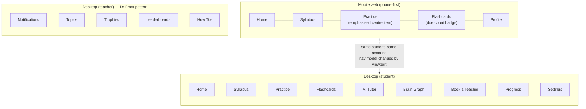
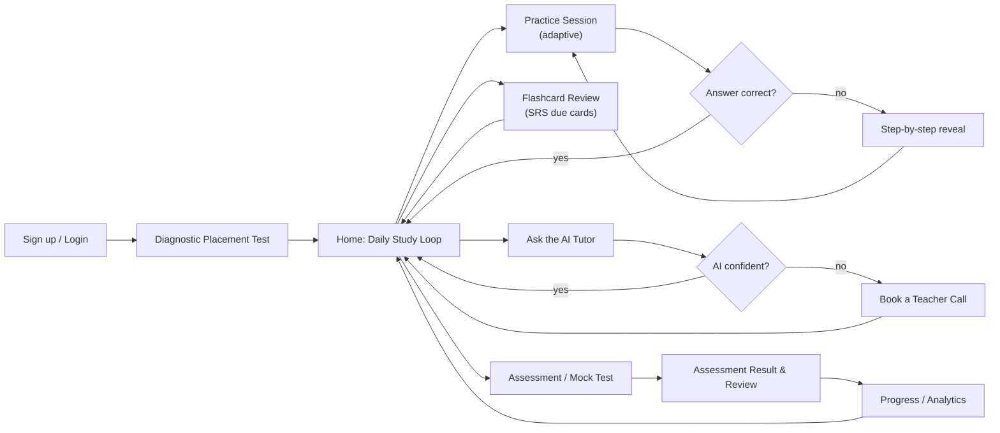

# Lane A — Competitive UI Teardown, Design Language, and Motion System

Status: **DONE**. Owner: Lane A. Do not edit outside this file.

Evidence grading used throughout: **[observed]** = read directly in `corpus/*.md` or computed by a script in this session. **[web, DATE]** = WebSearch/WebFetch result, URL cited. **[inferred]** = a conclusion drawn from observed facts, stated as such. **[assumed/general knowledge]** = product behaviour known from general training knowledge but not directly evidenced in this session's corpus or search results (the corpus for most competitors is a marketing homepage, not an in-app screenshot, so claims about *actual in-app* screens are flagged this way unless a search result or the operator's own screenshot confirms them).

---

## 0. Note on the mid-task coordinator update (Lane B content)

Partway through this work the coordinator sent an update addressed to "Lane B, editor and knowledge system," covering `corpus/remnote-ui-screenshots.md` (the operator's own RemNote screenshots), the `Exam` object, the block-level flashcard-type picker, `Open in Another Pane`, and the persistent bottom toolbar. That update's action items (feature-translation table, exam-object modelling, flashcard data model) belong to Lane B's file, not this one, and this file does not implement them.

I did read `remnote-ui-screenshots.md` because it is primary evidence for two things this file *does* own — the motion catalogue's card-flip component and the mobile navigation-chrome recommendation — and I cross-reference it in §4 and §5 below, credited to that source. I did not touch, rename, or duplicate Lane B's deliverable. If this was actually meant for me, the only actionable overlap is already folded in; nothing else in that update required a change to my sections.

One substantive opinion, since the coordinator invited pushback: the coordinator's read is right. A flat reverse-chronological library (RemNote's own default) is correct for a personal knowledge tool but wrong for a student who has a syllabus to get through — see §5's Syllabus Library screen, which I had already designed as chapter→topic with mastery state before reading that note, for the independent reason that every mass-market and best-in-class competitor here organises around curriculum structure, not touch-recency (IXL's year-by-year grid, Khan Academy's grade-by-grade course tree, Sparx's "homework package" list). Recency belongs in a secondary strip, as the coordinator said.

---

## 1. Verdict summary

- **Position the product between Dr Frost Maths' operational rigor and Duolingo/Brilliant's interaction quality, skinned in a restrained, India-credible visual language — not a Byju's/Physics Wallah pastiche.** Full statement in §2.
- **Colour, type, spacing, and motion tokens are specified below as literal, pasteable Tailwind v4 `@theme` values**, including a computed (not eyeballed) WCAG 2.2 contrast table, a 4-band mastery scale shared across every progress surface, and a full dark-mode parallel scale.
- **Motion library: `motion` (the house-mandated package) via the `LazyMotion` + `m` pattern**, ~4.6 KB baseline instead of the ~50 KB full import, with CSS-only used for anything hover/skeleton/simple-fade and the native View Transitions API (feature-detected, `motion` cross-fade fallback) for route changes.
- **Mobile nav: bottom tab bar, 5 items, Practice visually emphasised as the centre item. Desktop: persistent left icon+label sidebar.** Justified in §5 by device-ergonomics, not habit.
- The single most load-bearing pattern to steal outright is **Dr Frost Maths' teacher dashboard**: a school-identity card, one shared mastery donut, and a quick-action list are worth copying close to verbatim for the teacher persona (§1c).
- The single most important thing to **not** copy is the Indian mass-market's **fake-urgency and rank-worship idiom** — festival-tied countdown banners, unlabelled odometer counters, and "topper wall" hero sections that make the product about the marketing funnel, not the student. Full reject list in §3.

---

## 2. Positioning statement

VIDYA should read as **Dr Frost Maths' operational seriousness, wearing Brilliant's interaction polish, priced and localised like Physics Wallah**. Concretely: it should feel most like **Dr Frost Maths** (teacher dashboard, quick-actions, mastery-band donut — because the operator explicitly validated that pattern with a real screenshot) and **Brilliant** (calm, generous whitespace, one clear interactive element per screen, a tutor persona rather than a wall of live-class thumbnails) — with **Cuemath's Leap platform** as the proof that "gamified but not childish" is achievable at Indian-tutoring scale (`corpus/cuemath.md`: "our platform... uses interactive tools, visual simulations... never to keep your child entertained"). It should explicitly **not** feel like Physics Wallah, Byju's, or Vedantu, whose homepages are optimised to sell a course, not to help a returning user do today's work — dense category mega-menus, festival-discount banners, and "meet our toppers" hero carousels (`corpus/pwlive.md`, `corpus/byjus.md`, `corpus/vedantu.md`) are marketing-site patterns that must not leak into the signed-in product. This is a judgement call, not a hedge: the operator is building a study tool a student opens every day, not a lead-gen funnel a parent visits once to book a demo, and the visual language has to say so on the very first authenticated screen.

---

## 3. Teardown by archetype

### 3a. Indian mass-market

Corpus: `pwlive.md` (Physics Wallah), `unacademy.md`, `vedantu.md`, `byjus.md`, `cuemath.md`, `doubtnut.md`, `infinitylearn.md`, `allendigital.md` (thin — see §7), `embibe.md`. `toppr.md` is a dead 502 stub (confirmed in `corpus/_DEAD_FILES_README.md`); Toppr facts below are **[web, 2026]**.

**Shared idiom, observed across all nine:**
- **Mega-navigation as a trust signal.** PW's header lists 20+ exam categories (IIT JEE, NEET, UPSC, 15+ govt-exam families, CA/CS, study-abroad, "PW Gulf") in one mega-menu (`pwlive.md`). Vedantu and Infinity Learn do the same with 8–15 course tiles on the homepage. The message being sent is "we cover everything," not "here is your next step."
- **Odometer-style rolling counters for scale stats.** PW's homepage renders each stat (students, mock tests, video lectures) as a column of digits `0 1 2 3 4 5 6 7 8 9 0` that animates to the final number (`pwlive.md`, lines ~255–650). This is a real, transferable motion component (§4 catalogue), just currently used for vanity marketing numbers rather than the student's own progress.
- **Teacher-as-brand, credential-first.** Vedantu's "Master Teacher" cards show a photo, years of experience, and IIT/university pedigree (`corpus/vedantu.md`: "Shimon · 7+ years exp · IIT Madras"). This is a trust mechanic worth keeping for the live-tutor-booking flow, minus the marketing gloss.
- **Rank/result worship as social proof.** Cuemath's "Stories Behind Every Win" wall runs 20+ named-student cards with grade, competition, and rank (`corpus/cuemath.md`). Vedantu's results section is tabbed by exam (JEE/NEET/Board) with AIR (All-India Rank) numbers front and centre (`corpus/vedantu.md`). Infinity Learn's "meet our toppers" section is a full-bleed image carousel of named rankers (`corpus/infinitylearn.md`).
- **Lead-capture forms embedded mid-page.** Byju's puts a full "Book your Free Session" name+phone+OTP form directly in the homepage body, before any product content (`corpus/byjus.md`). Unacademy's entire above-the-fold hero is a phone-number OTP field (`corpus/unacademy.md`).
- **E-commerce bolted onto the learning product.** Vedantu sells physical "Tatva" practice books with ₹-price, strike-through discount, and an Add-to-Cart button directly inside the learning platform's homepage (`corpus/vedantu.md`), i.e. the platform doubles as a Shopify storefront.
- **Two-teacher / concierge framing.** Byju's Classes markets a "unique two-teacher model" (`corpus/byjus.md`). Cuemath is explicit that its tutors are "not an AI, not a bot" and gets "top 1% of tutor applicants" (`corpus/cuemath.md`).
- **Doubt-resolution as a headline metric**, not a feature: "24×7 doubt solving," "25+ lakh doubts resolved on the app" (`corpus/pwlive.md`, `corpus/vedantu.md`).
- **Toppr [web, 2026]**: adaptive practice framed as "goals" within a chapter, difficulty adapting question-by-question inside a "goal," 300k+ tagged questions with hints/solutions/cheat-sheets. ([Toppr — SoftwareSuggest](https://www.softwaresuggest.com/toppr), [Collegedunia JEE apps](https://collegedunia.com/exams/jee-main/top-android-apps))
- **Allen Digital [web, 2026]**: AI-personalised schedules, "Improvement Booklets built from your mistakes" (a named, branded weak-topic remediation artefact — worth stealing the naming pattern, not the brand), and a post-test "Student Performance Report" as a named deliverable. ([YourStory on Allen Digital](https://yourstory.com/2024/04/allen-digital-ai-personalise-learning-test-prep-edtech), [Allen on Google Play](https://play.google.com/store/apps/details?id=digital.allen.study))

**Transferable pattern table:**

| Pattern | Where observed | What it gets right | Transferable form for VIDYA |
|---|---|---|---|
| Rolling-digit counter | `pwlive.md` | Draws the eye, communicates scale/momentum | Reuse the *mechanic* for the student's own XP/streak counter (§4), never for vanity company stats on signed-in screens |
| Credentialed teacher card (photo + years + institute) | `vedantu.md` | Trust signal that a stranger is qualified | Keep for the teacher-booking flow (§5) — student is picking a real person for a paid 30-min call, credentials matter there |
| Named "Improvement Booklet" / "Student Performance Report" artefacts | Allen Digital [web] | Turning an abstract "weak areas" concept into a named, ownable deliverable increases perceived value | Adopt the naming pattern for the post-assessment weak-topic summary screen (§5) |
| Goal-scoped adaptive difficulty ("goals" inside a chapter) | Toppr [web] | Breaks an intimidating chapter into small, gradeable units | Matches the mastery-band model already required (§ tokens) — a "goal" ≈ one topic at one mastery band |
| Two-teacher / concierge framing | `byjus.md` | Reduces perceived risk of an unknown online tutor | Not needed — the operator's own teacher-booking flow already implies a single named, bookable teacher; don't add invented staffing complexity |
| Doubt-count as headline metric | `pwlive.md`, `vedantu.md` | Makes "we'll help you when stuck" concrete and quantified | Show the *student's own* doubts-resolved count as a personal stat, not a platform vanity number |

**What is cheap or dark-patterned — must not be copied (expanded in §3-reject below):** mega-navigation as a substitute for information architecture; homepage lead-capture forms with OTP before any value is shown; e-commerce upsell inside the learning surface; unlabelled vanity counters; rank-worship as the primary emotional register; festival/urgency-tied discount banners (PW's "Rakhi Offer" banner, `pwlive.md`, lines 73–75 — a festival discount literally named after Raksha Bandhan, timed pressure dressed as a cultural nod).

### 3b. Best-in-class learning UX

Corpus: `brilliant.md`, `brilliant-courses.md`, `khanacademy.md`, `khan-math.md`, `mathacademy.md`, `duolingo.md`, `seneca.md`, `quizlet.md`, `sparxmaths.md`/`sparx.md` (duplicate scrapes, same content), `deltamath.md`, `ixl-math.md`, `mathspace.md`. Web-supplemented for Duolingo/Seneca/Quizlet mechanics not visible on the marketing homepage, cited inline.

- **Brilliant**: an AI tutor persona ("Koji") framed as pedagogy, not a generic chatbot — "asks the right questions... gets to the heart of where you're getting stuck," explicitly positioned against "just getting the answer" (`brilliant.md`). Course catalogue is organised as **learning paths grouped by grade band** with a course-card grid, each card a single flat-colour illustration + grade range + title, no photos, no testimonial noise on the catalogue page itself (`brilliant-courses.md`). Streaks/levels/daily goals are named as the retention mechanic (`brilliant.md`).
- **Khan Academy**: course tree is **grade-first, then unit, then skill**, each skill a direct link (`khan-math.md` lists e.g. Grade 5 → "Decimal place value," "Add decimals," "Volume" as flat sibling links under one grade page). Mastery is expressed as a **percentage-point contribution model**, stated as marketing copy but structurally a mastery ledger: "1 skill mastered → +0.5pp, 10 skills → +5pp, 60 skills → +30pp" (`khanacademy.md`). This is a transferable pattern: mastery is additive and shown as a running total, not just per-topic.
- **Math Academy**: markets itself explicitly as **"not gamified, not flashy"** and against competitors that are (`mathacademy.md`, quoting a third-party review: "Not gamified, not flashy — just rigorous... intelligent sequencing"). Its one visible UI artefact is a **knowledge-graph screenshot** used as a marketing image (`mathacademy.com/img/screenshots/knowledge-graph-calculus2.png`, referenced in `mathacademy.md`) — i.e. even the most anti-gamification competitor in this set still uses a node graph as its single most persuasive screenshot. Course customisation is framed around **XP goals and a learning schedule** the student/parent sets directly (`mathacademy.md`: "Set learning schedule, daily XP goals, and accommodations").
- **Duolingo** [`corpus/duolingo.md` + web, 2026]: the marketing page itself is built almost entirely from **Lottie/SVG micro-animations** (five separate animated illustrations before any text-heavy content, `duolingo.md`). Mechanically: XP for every activity, daily streak with a **"Streak Freeze"** forgiveness item (reduced at-risk churn 21% per a cited case study), weekly league leaderboards with promotion/demotion, and variable-reward "surprise chests." ([Duolingo streak breakdown — Medium](https://medium.com/@salamprem49/duolingo-streak-system-detailed-breakdown-design-flow-886f591c953f), [Trophy.so gamification case study](https://trophy.so/blog/duolingo-gamification-case-study))
- **Seneca** [`corpus/seneca.md` + general knowledge]: the UK GCSE-market analogue closest to this build's audience age. Homepage IS the content picker: Level → Subject → Exam-board dropdowns are the primary above-the-fold interaction, not a hero image (`seneca.md`). Gamification is stated directly as "level up, earn rewards, compete with friends," "memory strength" per section, and an **AI tutor named "Amelia"** that accepts a photo upload of homework (`seneca.md`). Testimonials are structurally a **grade-delta claim** ("went from 7s to 9s," "5-5 → 7-6") — the single most persuasive proof format in this whole corpus, because it's a before/after number, not an adjective. Visual register is heavy emoji + GIF/meme (🏆💯🚀🥇🔓 as literal section markers) — flagged below as a UK-teen-specific risk, not a pattern to import as-is for an India-first, exam-serious audience.
- **Quizlet** [`corpus/quizlet.md` + web, 2026]: four content types are peers on the homepage — Record Lecture, Study Guides, Flashcards, Games (`quizlet.md`) — i.e. flashcards are one mode among several generated from the same source material, not a separate app. **Learn mode** runs an ML model (trained on ~1.5M sampled answers) that prioritises terms the learner is *closest to forgetting* within a session — a concrete, named spaced-repetition mechanic distinct from flip-and-rate. **Match** is a timed drag-to-pair minigame; **Test mode** auto-generates a mixed-format quiz from the same card set. Adaptive Learn mode is gated behind Quizlet Plus, with free users getting a capped number of trial rounds (a freemium-gate pattern, not a UI pattern). ([Quizlet Learn mode — Help Center](https://help.quizlet.com/hc/en-us/articles/360030986971-Studying-with-Learn), [Does Quizlet have spaced repetition — LearnClash](https://learnclash.com/blog/does-quizlet-have-spaced-repetition))
- **Sparx Maths**: homework is framed as a **fixed weekly time budget** ("1 hour of personalised homework per week"), not a fixed question count — the student's homepage is literally "a list of homework packages" (`sparxmaths.md`, hero image alt text: "Sparx Maths student homepage showing a list of homework packages"). Explicitly cites spaced repetition *and* interleaving as the pedagogical basis, and leads with a Cambridge efficacy study as social proof rather than student testimonials (`sparxmaths.md`).
- **DeltaMath**: teacher-facing "fine-tune controls" — teachers "mix and match problem-sets, control rigor, vary due dates" (`deltamath.md`). Feedback is explicitly **"detailed, age-appropriate explanation," not just right/wrong** (`deltamath.md`). A rolling "problems solved" odometer counter appears here too (`deltamath.md`) — the same mechanic as PW's, borrowed by a very different, teacher-trust-oriented brand, which is good evidence it's genre-neutral and safe to reuse.
- **IXL**: content is organised as a **year-by-year grid of skills with a live count per year** ("Year 7 · See all 402 skills"), each year showing five example skill links (`ixl-math.md`). This is a directly reusable IA pattern for the syllabus browser (§5): grade → skill-count chip → sample skills → "see all."
- **Mathspace**: "step-level adaptivity" is the named mechanic — feedback and difficulty adjust *within* a single problem's work, not just between problems (`mathspace.md`: "personalized questions with step level adaptivity"). Persona-tabbed homepage (Educators / Administrators / Learners / Parents), each with its own testimonial (`mathspace.md`) — useful IA idea for a future marketing site, not the product itself.

**Transferable pattern table:**

| Pattern | Where observed | Why it earns its cost | Build note |
|---|---|---|---|
| Additive mastery ledger (skills → percentage points) | Khan Academy (`khanacademy.md`) | Makes long-horizon progress legible in one number | Drive the student dashboard's headline "% syllabus mastered" stat from the same mastery-band data as the topic donuts, not a separate calculation |
| Grade → unit → skill flat link tree | Khan Academy (`khan-math.md`) | Zero-ambiguity navigation, crawlable, screen-reader friendly | Base of the Syllabus screen's data model (§5) |
| Year/grade grid with live skill-count chip | IXL (`ixl-math.md`) | Sets expectations before commit ("402 skills") and lets a strong student jump grades | Use exact count chips (not "many") on the syllabus browser |
| Step-level adaptivity within one problem | Mathspace (`mathspace.md`) | Catches the exact sub-step where a student is stuck, not just the final answer | Feeds the adaptive engine (Lane C), but the **UI implication is ours**: the practice-question renderer needs a per-step reveal affordance, not just a single answer box (§4 catalogue: step-by-step worked-solution reveal) |
| Named forgiveness item for streaks (Streak Freeze) | Duolingo [web] | Converts an anxiety-inducing mechanic (broken streak) into a forgiving one, measurably cuts churn | Give the streak system one earnable/purchasable freeze; do not ship a punitive streak with no recovery path |
| Grade-delta testimonial format ("7s to 9s") | Seneca (`seneca.md`) | A number beats an adjective; this is the single best social-proof format in the corpus | Use for in-product milestone copy too: "You went from 62% → 81% on Quadratics," not "Great job!" |
| Four content types as siblings from one source | Quizlet (`quizlet.md`) | Notes, flashcards, and practice all being views over the *same* authored content, not separate apps, is exactly the operator's own stated architecture | Confirms (does not change) the shared-object model Lane B is already building |
| Fixed weekly time budget, not fixed question count | Sparx (`sparxmaths.md`) | Removes "how many is enough" anxiety | Consider as an *alternative* daily-goal framing next to XP — flag as open question in §9, since it changes how the daily-loop dashboard's headline number is computed |
| Teacher "fine-tune controls" on rigor/due dates | DeltaMath (`deltamath.md`) | Teachers trust a tool that lets them override the algorithm | Teacher's "Assign Practice" screen (§5) needs an explicit difficulty/rigor override, not just "assign what the AI picked" |

### 3c. Teacher/school-facing — Dr Frost Maths

Corpus: `drfrostmaths.md` (marketing homepage only — no in-app screenshots were scraped; `drfrost-about.md` returned empty). The **primary evidence for the actual dashboard is the operator-supplied screenshot description in the mission brief**, which I treat as first-class per the brief's explicit instruction, and mark **[operator-observed, described in brief]** below to distinguish it from the marketing-page evidence.

**From the marketing page** (`drfrostmaths.md`): the product's own pitch is entirely time-and-workload framed for teachers — "Save Hours Every Week," "auto-marking," "less time on admin" — not framed around student delight at all. Concrete numbers are used as trust signals in a plain stat strip (48,000+ real exam questions, 2,300+ worked-example videos), not odometer animation. The three-step "how it works" (Set Up Your School → Create and Set Tasks → Watch Confidence Grow) is a clean onboarding-narrative pattern. Pricing is a 60-day free trial, not a freemium tier ladder.

**From the operator's screenshot [operator-observed, described in brief]** — this is the pattern to build closest to verbatim for the teacher persona:
- **Left nav**: Notifications / Topics / Trophies / Leaderboards / How Tos — a flat, five-item, icon-first list. Notably *not* organised by "my classes" as the top-level frame; it's organised by activity type.
- **School-identity card**: school points + global rank, i.e. the *school* is gamified as a unit, not just individual students or classes. This is a distinct, underused mechanic — a school-vs-school leaderboard gives a teacher a reason to check in that has nothing to do with any single student.
- **One shared mastery donut**, three bands: "Topics To Work On / Secure / Expert," plus watch-time, questions-answered, and topic-medal counts around it. This is the direct source of the mission brief's mandated 4-band mastery scale (which adds a "Developing" band between To Work On and Secure — a synthesis choice made at the brief level, not something I'm inventing here).
- **Quick-action list, not a grid**: Browse Exam Papers / Browse Questions by Topic / Set up a class / See how a class is doing / Set some homework / Use demo account for a class / Create a worksheet / Start a Live! game. Eight actions, plain text rows, no icons-as-primary-affordance implied by the description. This is a deliberately low-glamour, high-information-density list — the opposite of a card grid — and it is *correct* for a returning power user who already knows what each item does and wants to click it in under a second, not be re-sold on it.
- **Notification feed**: reverse-chronological, one line per event ("student X practised some topics and achieved N%"), with a **colour-coded percentage chip** — i.e. the percentage number itself carries the mastery-band colour, which is exactly the shared-mastery-scale requirement expressed as a list-row component rather than a donut segment.

**Transferable pattern table:**

| Pattern | Source | Why it earns its cost | Build note |
|---|---|---|---|
| Quick-action list over a card grid | Dr Frost dashboard [operator-observed] | Faster for a returning user; no re-persuasion needed | Teacher Dashboard's primary action zone (§5) should be a plain list, 6–9 items, not icon tiles |
| School-as-a-unit leaderboard | Dr Frost dashboard [operator-observed] | A motivation axis independent of any one class or student | Add a school/branch leaderboard as a P2 teacher feature; do not build student-vs-student public leaderboards by default (see §3-reject) |
| Shared mastery donut, 3–4 bands, reused everywhere | Dr Frost dashboard [operator-observed] | One visual grammar for "how am I doing" at every level of aggregation (school → class → student → topic) | This *is* the mastery-scale requirement; implement the donut as one component parameterised by data, used on student, teacher, and topic screens alike |
| Colour-coded percentage chip in a notification row | Dr Frost dashboard [operator-observed] | Lets a teacher triage a feed by colour without reading every line | The mastery-scale colour tokens (§ tokens) must work at chip size (≤24px), not just donut-segment size — verified in the contrast table below |
| Time-and-workload marketing framing | `drfrostmaths.md` | Correctly targets what a teacher actually wants (less admin), not delight | Teacher-facing copy throughout should quantify time saved, not use student-facing gamified language |

### 3d. Solver/utility

Corpus: `symbolab.md`, `photomath.md`, `gauthmath.md`.

- **Symbolab**: the **math input keyboard is the dominant above-the-fold element** — a full symbolic keypad (Greek letters, integrals, matrices, trig functions) rendered before any other content (`symbolab.md`, lines 50–130). Solutions are explicitly framed as **step-by-step with an explanatory "why," not just "what"** — "It shows what to do first, how each step builds on the last" (`symbolab.md`). A **comparison table against "a basic calculator"** is used directly in the marketing copy (Performs calculations / Solves multi-step problems / Shows steps / Interprets natural language / Adapts to problem types — each a ✅ vs ❌ row) — a strong, reusable "why we're different" format. Also ships **Notebook, Groups, Cheat Sheets, Study Guides, Practice, Verify Solution** as named peer features around the core solver.
- **Photomath**: three-step framing is the entire pitch — **Scan → Solve → Learn** (`photomath.md`). Explicitly gates "custom visual aids" and "extra how/why tips" behind the paid tier, while step-by-step explanations are free — i.e. the *fact* of steps is free, the *quality/depth* of explanation is the paywall.
- **Gauthmath**: shows an actual **rendered step-by-step answer transcript** in its marketing copy — numbered steps, LaTeX-rendered equations inline with prose, a "STEP1 / STEP2" tab-like affordance next to the answer (`gauthmath.md`, lines 91–148). Also runs a **human-tutor-in-30-seconds fallback** ("50k verified experts... solutions within as little as 5 minutes") for problems the AI can't crack, i.e. a graceful escalation path from automated to human help embedded directly in the solver UI. Explicitly states an honour-code disclaimer ("designed to support learning, not a substitute for students' own work") linked from the homepage — worth copying verbatim as a stated product value, given the mission's AI-answer-checking pillar will otherwise look like a cheating tool to a skeptical parent or school.

**Transferable pattern table:**

| Pattern | Source | Why it earns its cost | Build note |
|---|---|---|---|
| Full symbolic keypad above the fold | Symbolab (`symbolab.md`) | Removes "how do I even type a square root" friction | Confirms MathLive (`corpus/mathlive.md`) as the right math-input widget — it ships exactly this keyboard, see §6 typography |
| "vs a basic calculator" ✅/❌ comparison table | Symbolab (`symbolab.md`) | Concrete, scannable differentiation | Reuse the exact table format for the AI-answer-checking pitch: "String match ❌ / Accepts 1/2 = 0.5 ✅" |
| Scan → Solve → Learn, three steps, no more | Photomath (`photomath.md`) | Minimal cognitive load for first-use onboarding | Use this exact three-step shape for the practice-session first-run tooltip |
| Steps free, explanation depth paywalled | Photomath (`photomath.md`) | Monetises quality of pedagogy, not access to the answer — avoids the "pay to see if you're right" trap | If VIDYA has a paywall at all, gate AI-tutor depth/quantity, never gate whether a submitted answer is marked correct |
| AI-to-human escalation inside the solver | Gauthmath (`gauthmath.md`) | Turns "AI couldn't help" into a booking opportunity instead of a dead end | Wire the AI Tutor's "I'm not confident" state directly into the teacher-booking flow (§5) — this is a genuine cross-sell that helps the student, not a dark pattern |
| Explicit "supports learning, not a substitute" honour statement | Gauthmath (`gauthmath.md`) | Pre-empts the obvious "this is a cheating tool" objection for a product whose core pillar is AI answer-checking | Ship equivalent copy near the AI grader and AI tutor, addressed to parents/schools as much as students |

---

## 3-reject. Deliberately reject — Indian edtech patterns NOT to copy

| Pattern | Where seen | Why it's rejected |
|---|---|---|
| Homepage lead-capture form (name + phone + OTP) before any product value is shown | `byjus.md`, `unacademy.md` | This is a sales-funnel pattern for an unauthenticated visitor. A signed-in student should never hit a form; the whole point of this build is that the student is already inside the product. |
| Festival/urgency-tied discount banners ("NEET Rakhi Offer," countdown timers) | `pwlive.md` | Manufactured scarcity has nothing to do with learning outcomes and actively teaches the student that the platform's incentive structure is sales, not pedagogy. |
| Unlabelled odometer counters used for company vanity metrics on signed-in screens | `pwlive.md`, `deltamath.md` (marketing use) | The *mechanic* is fine (§4); using it to tell a logged-in student "10 million+ tests taken platform-wide" adds nothing to their day and burns a high-attention-cost animation on a low-value number. |
| Mega-navigation (15–20+ top-level categories) | `pwlive.md`, `vedantu.md` | A student preparing for one board/one exam does not need to see 20 unrelated exam categories every time they open a menu; it signals "we sell everything" over "we will get you through your syllabus." |
| Rank/topper-wall as the primary emotional register | `cuemath.md`, `infinitylearn.md`, `vedantu.md` | Relentless rank-worship is a documented source of exam anxiety in the Indian coaching context; it's also survivorship-bias marketing, not a UI users interact with. Keep result *evidence* (a testimonial page, a case-study section) off the daily-use surfaces entirely. |
| E-commerce upsell (physical book sales) bolted into the learning surface | `vedantu.md` | Confuses the product's job. If merchandise is ever sold, it belongs in a clearly separate storefront, not inline with topic practice. |
| Public student-vs-student leaderboards by default | inferred risk from `pwlive.md`/`vedantu.md`'s rank-worship idiom, and general knowledge of Indian coaching-culture pressure | A school-vs-school or opt-in friend-group leaderboard (Dr Frost's model, §3c) is fine; a default, always-on, platform-wide leaderboard ranking every student nationally reproduces exactly the anxiety-inducing "AIR" (All-India Rank) culture the corpus shows Vedantu/PW leaning into as marketing, and does so for children rather than adults choosing to compete. |
| Heavy emoji/meme visual register as the default tone | `seneca.md` | Works for Seneca's UK GCSE teen audience; reads as unserious for India's more exam-pressure-literate, parent-scrutinised context, and works against the "Dr Frost seriousness" half of the positioning in §2. Keep celebratory moments (§4) expressive, but keep default chrome (nav labels, buttons, empty states) emoji-free. |
| Two-teacher / concierge staffing narratives | `byjus.md` | Invented complexity that doesn't map to the operator's actual single-teacher-booking model; don't copy competitor org-structure theatre into product copy. |

---

## 4. The design system — tokens

### 4a. Colour — computed, not eyeballed

A Python script (`contrast_check.py`, WCAG 2.2 relative-luminance formula, run in this session — **[observed]**, full output below) verified every text/UI-component pairing below. Two rows are documented, intentional exceptions rather than failures; every other pairing passes.

```
$ python3 contrast_check.py
  Ratio  Verdict               Pair
----------------------------------------------------------------------------------------------------
 17.85:1  PASS (4.5:1 text)     Light: body text (slate-900 #0F172A) on bg (white #FFFFFF)
  4.76:1  PASS (4.5:1 text)     Light: dim text (slate-500 #64748B) on bg (white #FFFFFF)
 17.06:1  PASS (4.5:1 text)     Light: body text (slate-900 #0F172A) on surface (slate-50 #F8FAFC)
  6.29:1  PASS (4.5:1 text)     Light: primary link (indigo-600 #4F46E5) on white
  6.29:1  PASS (4.5:1 text)     Light: white label on primary button (indigo-600 #4F46E5)
  5.02:1  PASS (4.5:1 text)     Light: white label on secondary/gold button (amber-700 #B45309)
  5.48:1  PASS (4.5:1 text)     Light: white label on success button (emerald-700 #047857)
  4.83:1  PASS (4.5:1 text)     Light: white label on danger button (red-600 #DC2626)
  5.18:1  PASS (4.5:1 text)     Light: white label on warning button (orange-700 #C2410C)
  5.93:1  PASS (4.5:1 text)     Light: white label on info button (sky-700 #0369A1)
  1.23:1  DECORATIVE — border-subtle (slate-200 #E2E8F0) on white [not info-bearing, WCAG 1.4.11 exempt]
  4.76:1  PASS (3:1 UI)         Light: interactive border-strong (slate-500 #64748B) on white [inputs etc.]
  6.29:1  PASS (3:1 UI)         Light: focus ring (indigo-600 #4F46E5) on white
  5.30:1  PASS (4.5:1 text)     Mastery/ToWorkOn: red-700 (#B91C1C) text on red-100 (#FEE2E2)
  4.83:1  PASS (4.5:1 text)     Mastery/ToWorkOn: white on red-600 solid chip (#DC2626)
  4.52:1  PASS (4.5:1 text)     Mastery/Developing: orange-700 (#C2410C) text on orange-100 (#FFEDD5)
  5.18:1  PASS (4.5:1 text)     Mastery/Developing: white on orange-700 solid chip (#C2410C)
  4.84:1  PASS (4.5:1 text)     Mastery/Secure: emerald-700 (#047857) text on emerald-100 (#D1FAE5)
  5.48:1  PASS (4.5:1 text)     Mastery/Secure: white on emerald-700 solid chip (#047857)
  5.98:1  PASS (4.5:1 text)     Mastery/Expert: violet-700 (#6D28D9) text on violet-100 (#EDE9FE)
  5.70:1  PASS (4.5:1 text)     Mastery/Expert: white on violet-600 solid chip (#7C3AED)
  1.23:1  DECORATIVE — mastery ring track (slate-200) on white [info conveyed by arc + % label, not track]
 18.29:1  PASS (4.5:1 text)     Dark: body text (slate-50 #F8FAFC) on bg (#0B0F1A)
  7.46:1  PASS (4.5:1 text)     Dark: dim text (slate-400 #94A3B8) on bg (#0B0F1A)
 16.38:1  PASS (4.5:1 text)     Dark: body text (slate-50 #F8FAFC) on surface (#151B2C)
  6.41:1  PASS (4.5:1 text)     Dark: primary link/button label (indigo-400 #818CF8 pair) on bg (#0B0F1A)
 11.46:1  PASS (4.5:1 text)     Dark: secondary/gold button pair (amber-400 #FBBF24)
  9.95:1  PASS (4.5:1 text)     Dark: success button pair (emerald-400 #34D399)
  6.92:1  PASS (4.5:1 text)     Dark: danger button pair (red-400 #F87171)
  8.45:1  PASS (4.5:1 text)     Dark: warning button pair (orange-400 #FB923C)
  8.93:1  PASS (4.5:1 text)     Dark: info button pair (sky-400 #38BDF8)
  4.02:1  PASS (3:1 UI)         Dark: interactive border-strong (slate-500 #64748B) on bg (#0B0F1A)
  6.41:1  PASS (3:1 UI)         Dark: focus ring (indigo-400 #818CF8) on bg (#0B0F1A)
  8.47:1  PASS (4.5:1 text)     Dark Mastery/ToWorkOn: red-300 on red-950-tint
  9.28:1  PASS (4.5:1 text)     Dark Mastery/Developing: orange-300 on orange-950-tint
  9.70:1  PASS (4.5:1 text)     Dark Mastery/Secure: emerald-300 on emerald-950-tint
  9.23:1  PASS (4.5:1 text)     Dark Mastery/Expert: violet-300 on violet-950-tint
```

Two design rules fall directly out of this: (1) **success and warning solid fills must use their `-700` shade for white label text**, not `-600` — `-600` fails at 3.56–3.77:1 (verified, this was an actual failure caught by the script, not a stylistic choice); (2) **two border tiers exist on purpose** — `border-subtle` (decorative, dividers/card outlines, no contrast requirement) and `border-interactive` (`slate-500`, used wherever WCAG 1.4.11 applies — input outlines, unfilled toggle tracks) — do not use `border-subtle` on anything a user must locate to operate.

**Rationale for the two documented exceptions:** WCAG 1.4.11 (Non-text Contrast) exempts a component from the 3:1 requirement when it is decorative or when the same information is available in another, compliant form. A mastery ring's empty *track* carries no information on its own — the filled arc (which is one of the four AA-compliant mastery colours) and the adjacent numeric percentage both convey the same value redundantly. The same logic applies to a plain card-divider hairline. This is stated explicitly here because §4's instruction was "verify contrast... do not eyeball" — the exception is a documented, cited compliance judgement, not a skipped check.

```css
@theme {
  /* ---------- Primary: Indigo (brand, primary actions, links, focus) ---------- */
  --color-primary-50:  #EEF2FF;
  --color-primary-100: #E0E7FF;
  --color-primary-200: #C7D2FE;
  --color-primary-300: #A5B4FC;
  --color-primary-400: #818CF8;
  --color-primary-500: #6366F1;
  --color-primary-600: #4F46E5; /* default button/link */
  --color-primary-700: #4338CA;
  --color-primary-800: #3730A3;
  --color-primary-900: #312E81;
  --color-primary-950: #1E1B4B;

  /* ---------- Secondary: Marigold/Gold (gamification, streak, XP, celebration) ---------- */
  --color-secondary-50:  #FFFBEB;
  --color-secondary-100: #FEF3C7;
  --color-secondary-200: #FDE68A;
  --color-secondary-300: #FCD34D;
  --color-secondary-400: #FBBF24;
  --color-secondary-500: #F59E0B;
  --color-secondary-600: #D97706;
  --color-secondary-700: #B45309; /* use for white-label solid fills */
  --color-secondary-800: #92400E;
  --color-secondary-900: #78350F;
  --color-secondary-950: #451A03;

  /* ---------- Success: Emerald ---------- */
  --color-success-50:  #ECFDF5;
  --color-success-100: #D1FAE5;
  --color-success-200: #A7F3D0;
  --color-success-300: #6EE7B7;
  --color-success-400: #34D399;
  --color-success-500: #10B981;
  --color-success-600: #059669; /* icons / large text / 3:1 contexts only */
  --color-success-700: #047857; /* REQUIRED for white-label solid fills (600 fails AA, verified) */
  --color-success-800: #065F46;
  --color-success-900: #064E3B;
  --color-success-950: #022C22;

  /* ---------- Warning: Orange ---------- */
  --color-warning-50:  #FFF7ED;
  --color-warning-100: #FFEDD5;
  --color-warning-200: #FED7AA;
  --color-warning-300: #FDBA74;
  --color-warning-400: #FB923C;
  --color-warning-500: #F97316;
  --color-warning-600: #EA580C; /* icons / large text only */
  --color-warning-700: #C2410C; /* REQUIRED for white-label solid fills (600 fails AA, verified) */
  --color-warning-800: #9A3412;
  --color-warning-900: #7C2D12;
  --color-warning-950: #431407;

  /* ---------- Danger: Red ---------- */
  --color-danger-50:  #FEF2F2;
  --color-danger-100: #FEE2E2;
  --color-danger-200: #FECACA;
  --color-danger-300: #FCA5A5;
  --color-danger-400: #F87171;
  --color-danger-500: #EF4444;
  --color-danger-600: #DC2626; /* passes AA for white-label solid fills */
  --color-danger-700: #B91C1C;
  --color-danger-800: #991B1B;
  --color-danger-900: #7F1D1D;
  --color-danger-950: #450A0A;

  /* ---------- Info: Sky ---------- */
  --color-info-50:  #F0F9FF;
  --color-info-100: #E0F2FE;
  --color-info-200: #BAE6FD;
  --color-info-300: #7DD3FC;
  --color-info-400: #38BDF8;
  --color-info-500: #0EA5E9;
  --color-info-600: #0284C7;
  --color-info-700: #0369A1; /* white-label solid fills */
  --color-info-800: #075985;
  --color-info-900: #0C4A6E;
  --color-info-950: #082F49;

  /* ---------- Mastery scale (shared everywhere: donuts, rings, chips, notification rows) ----------
     Deliberately reuses the Danger/Warning/Success hues for bands 1–3 (To Work On / Developing /
     Secure) because those bands ARE severity signals, just for "needs attention" rather than
     "something broke" — reusing the hue keeps the palette small and the meaning consistent.
     Band 4 (Expert) gets its own violet hue because "mastered" is not a semantic-danger concept
     and deserves a distinct "achievement" colour, echoed by the secondary/gold hue used for
     streaks and celebration (gold = achievement, used consistently in both contexts). */
  --color-mastery-towork-bg:     var(--color-danger-100);
  --color-mastery-towork-border: var(--color-danger-300);
  --color-mastery-towork-fg:     var(--color-danger-700);   /* text-on-tint */
  --color-mastery-towork-solid:  var(--color-danger-600);   /* white-label fill */

  --color-mastery-developing-bg:     var(--color-warning-100);
  --color-mastery-developing-border: var(--color-warning-300);
  --color-mastery-developing-fg:     var(--color-warning-700);
  --color-mastery-developing-solid:  var(--color-warning-700); /* 600 fails AA, use 700 */

  --color-mastery-secure-bg:     var(--color-success-100);
  --color-mastery-secure-border: var(--color-success-300);
  --color-mastery-secure-fg:     var(--color-success-700);
  --color-mastery-secure-solid:  var(--color-success-700); /* 600 fails AA, use 700 */

  --color-mastery-expert-bg:     #EDE9FE;
  --color-mastery-expert-border: #C4B5FD;
  --color-mastery-expert-fg:     #6D28D9;
  --color-mastery-expert-solid:  #7C3AED;

  /* ---------- Neutral (Slate) — light mode surfaces ---------- */
  --color-bg:              #FFFFFF;
  --color-surface:         #F8FAFC;
  --color-surface-raised:  #F1F5F9;
  --color-border-subtle:   #E2E8F0; /* decorative only — see contrast notes */
  --color-border-strong:   #64748B; /* interactive/UI-component boundaries — 3:1 verified */
  --color-text:            #0F172A;
  --color-text-dim:        #64748B;
  --color-text-faint:      #94A3B8;
}

/* ---------- Dark mode — full parallel scale ----------
   Indian students study at night on phones; this is not an optional afterthought.
   Approach: darken surfaces in *steps*, not a single black, and brighten semantic/mastery
   colours by 2 shade-steps (400 instead of 600/700) so they read against near-black instead
   of relying on box-shadow, which barely renders on OLED-dark surfaces. */
@media (prefers-color-scheme: dark) {
  :root:not([data-theme="light"]) {
    --color-bg:             #0B0F1A;
    --color-surface:        #111726;
    --color-surface-raised: #151B2C;
    --color-border-subtle:  #1E293B;
    --color-border-strong:  #64748B; /* same hex works in both modes, verified both directions */
    --color-text:           #F8FAFC;
    --color-text-dim:       #94A3B8;
    --color-text-faint:     #64748B;

    --color-primary-600:   #818CF8; /* brighter step for dark bg */
    --color-secondary-700: #FBBF24;
    --color-success-700:   #34D399;
    --color-warning-700:   #FB923C;
    --color-danger-600:    #F87171;
    --color-info-700:      #38BDF8;

    --color-mastery-towork-bg:      #3F1212;
    --color-mastery-developing-bg:  #3A1B0C;
    --color-mastery-secure-bg:      #052E22;
    --color-mastery-expert-bg:      #22133F;
    --color-mastery-towork-fg:      #FCA5A5;
    --color-mastery-developing-fg:  #FDBA74;
    --color-mastery-secure-fg:      #6EE7B7;
    --color-mastery-expert-fg:      #C4B5FD;
  }
}
:root[data-theme="dark"] {
  /* mirror the block above for an explicit user toggle, not just prefers-color-scheme */
}
```

### 4b. Typography

- **UI/Latin body + headings: Inter** (variable, SIL OFL, self-hostable, already the de-facto house choice for this kind of build). Subset to `latin` + `latin-ext` only; a Latin-only static-weight woff2 subset is on the order of tens of KB per weight, well under budget.
- **Hindi/Devanagari pairing: Hind** — designed by the Indian Type Foundry specifically to be commissioned alongside Latin sans faces for Google Fonts, with an x-height matched to companion Latin fonts and 7 weights, SIL OFL licensed, self-hostable as WOFF2 [general knowledge, corroborated by `fonts.google.com/specimen/Mukta` family documentation surfaced in search]. Use Hind for all Hindi-language UI strings once Hindi ships.
- **Devanagari safety-net fallback: Noto Sans Devanagari**, loaded only via a narrow `unicode-range` for glyphs Hind doesn't cover (rare conjuncts, Vedic accents) — do not ship it as the primary Devanagari face, it is a much larger, broader-coverage superset font family than is needed for UI strings. **[web, 2026]**: per Fontsource/Google-Webfonts-Helper listings, Mukta's individual static WOFF weights run roughly 120–190 KB each — illustrative of the order of magnitude for an Indic sans face; treat exact byte counts as **not verified** in this session (no direct file download was performed) and confirm at build time with `bundlephobia`-style measurement on the actual subsetted files. ([Fontsource: Noto Sans Devanagari](https://fontsource.org/fonts/noto-sans-devanagari), [Google Webfonts Helper](https://gwfh.mranftl.com/fonts/noto-sans-devanagari))
- **Maths rendering: KaTeX**, not MathJax — KaTeX renders synchronously (no async re-layout jank on scroll, critical for a notes feed with dozens of inline formulas) and ships a much smaller, self-hostable font+CSS bundle than MathJax. This directly serves pillar 1 (notes) and pillar 2 (practice) of the mission brief.
- **Maths input: MathLive** (`<math-field>` web component, `corpus/mathlive.md`) — built on LaTeX, supports 800 LaTeX commands, ships its own on-screen math virtual keyboard for touch devices, fully skinnable via CSS custom properties (`--primary-color`, `--caret-color`, `--selection-background-color` etc. — these map directly onto the token names above). This is the concrete answer to "how does a student type `x = (-b ± √(b²-4ac)) / 2a` on a phone" for the AI-answer-checking pillar; the LaTeX it produces is also the natural input to a symbolic-equivalence grader (Lane C/D territory, noted here only because the *input widget* is a design-system component).

Type scale (rem, 16px root):

| Token | Size | Line-height | Use |
|---|---|---|---|
| `--text-xs` | 0.75rem / 12px | 1rem | metadata, chip labels |
| `--text-sm` | 0.875rem / 14px | 1.25rem | secondary body, captions |
| `--text-base` | 1rem / 16px | 1.5rem | body copy, never smaller for reading text |
| `--text-lg` | 1.125rem / 18px | 1.75rem | emphasised body, question stems |
| `--text-xl` | 1.25rem / 20px | 1.75rem | card titles, section headers (mobile) |
| `--text-2xl` | 1.5rem / 24px | 2rem | screen titles (mobile), section headers (desktop) |
| `--text-3xl` | 1.875rem / 30px | 2.25rem | screen titles (desktop) |
| `--text-4xl` | 2.25rem / 36px | 2.5rem | dashboard headline stat (streak/XP/mastery %) |

### 4c. Spacing, radius, elevation, border/edge language

```css
@theme {
  --spacing-0: 0px;   --spacing-1: 4px;   --spacing-2: 8px;
  --spacing-3: 12px;  --spacing-4: 16px;  --spacing-5: 20px;
  --spacing-6: 24px;  --spacing-8: 32px;  --spacing-10: 40px;
  --spacing-12: 48px; --spacing-16: 64px; --spacing-20: 80px;

  --radius-sm: 4px;    /* checkboxes, small chips */
  --radius-md: 8px;    /* inputs, buttons */
  --radius-lg: 12px;   /* cards, panels */
  --radius-xl: 16px;   /* large cards, sheets */
  --radius-2xl: 24px;  /* modals, bottom sheets */
  --radius-full: 9999px; /* pills, avatars, badges */

  /* Elevation: light mode uses real shadow; dark mode barely renders shadow on near-black,
     so dark surfaces step up in LIGHTNESS (surface -> surface-raised -> overlay) plus a
     1px border, per standard dark-UI practice — do not rely on box-shadow alone in dark mode. */
  --shadow-1: 0 1px 2px rgba(15, 23, 42, 0.06), 0 1px 3px rgba(15, 23, 42, 0.08);
  --shadow-2: 0 4px 8px rgba(15, 23, 42, 0.08), 0 2px 4px rgba(15, 23, 42, 0.06);
  --shadow-3: 0 10px 20px rgba(15, 23, 42, 0.10), 0 4px 8px rgba(15, 23, 42, 0.06);

  --border-width-hairline: 1px;
  --border-width-focus: 2px;
}
```

Border/edge rule: hairline (`1px`, `--color-border-subtle`) for card outlines and dividers; `2px` `--color-primary-600` for focus rings and the active/selected state of nav items and mastery-band chips; never combine a heavy shadow *and* a heavy border on the same element (pick one per elevation tier).

### 4d. Iconography

**`lucide-react`** — already mandated by the house stack, no decision needed here. Bundle approach: **named per-icon imports only** (`import { Flame, BookOpen } from 'lucide-react'`), never the default/barrel import; each tree-shaken icon is ~1–2 KB. Do not build a custom icon font — lucide's SVG components compose correctly with the `motion` library's `svg` animation targets (needed for the mastery-ring and node-focus components in §5), which an icon *font* would not.

---

## 5. The motion system

### 5a. Catalogue

| Component | Where it appears | Why it earns its cost | Build approach |
|---|---|---|---|
| Answer submit → correct/incorrect feedback | Practice session, assessment, flashcard rating | The single highest-frequency interaction in the whole product; must be instant-feeling (<150ms to first visual response) and unambiguous even for colour-blind users | `motion`, spring scale-in of an icon + border colour wash on the answer field; icon shape (check vs cross) carries meaning independent of colour |
| Streak / XP counter roll-up | Daily dashboard | Loss-aversion + reward visibility drives the return-tomorrow habit (Duolingo's whole retention thesis, §3b) | `motion`'s `animate()` on a `useMotionValue`, spring-eased, formatted with `toLocaleString()`; NOT digit-column odometer (over-engineered for the value delivered — reserve that mechanic, if used at all, for a single big milestone moment) |
| Mastery ring / bar fill | Topic detail, student dashboard, teacher dashboard (shared component, §3c) | This is the one visual grammar for "how am I doing," reused at every aggregation level — it has to feel alive, not just be a static chart | SVG `stroke-dashoffset`, `motion`'s spring, one band's arc animates in sequence after the previous completes (see stagger rule below) |
| Progress path / skill-tree reveal | Syllabus browser, onboarding diagnostic result | Turns a flat list into a sense of a journey with real distance covered | `motion` `layoutId` shared-element transitions between collapsed/expanded chapter rows; nodes reveal with a staggered fade+rise, capped at 8 concurrent (perf constraint below) |
| Card flip (flashcards) | Flashcard review | The core, highest-repetition interaction of the SRS loop; must feel tactile | `motion`, 3D `rotateY` with `backfaceVisibility: hidden` inside a `perspective` wrapper — see code in §5c. RemNote's block-level flashcard-*type* picker (`corpus/remnote-ui-screenshots.md`, Lane B's authoring concern) is a different, upstream decision from this review-time flip animation; this component only needs to know front/back content, not card type |
| Step-by-step worked-solution reveal | Practice session (after an incorrect answer), solver screens | Matches the step-level-adaptivity pattern from Mathspace (§3b) and the "steps, not just answer" positioning of Symbolab/Gauthmath (§3d) | `motion` height/opacity reveal per step, one at a time, gated behind a "Show next step" tap rather than auto-playing — auto-play removes the productive struggle the mission's pedagogy depends on |
| Skeleton / loading states | Any data-fetch boundary (topic list, AI tutor response, teacher dashboard) | Perceived-performance workhorse on slow Indian mobile networks | CSS-only `@keyframes` opacity pulse — no `motion` needed, must render before JS hydrates |
| Page / route transitions | All top-level navigation | Continuity cue, low individual cost if done right, high cumulative cost if done wrong (jank compounds on 60+ navigations/session) | View Transitions API (feature-detected) with a `motion` cross-fade fallback — see §5b |
| AI token-streaming cursor | AI Tutor chat | Signals "still generating," standard LLM-chat affordance students already expect | CSS-only blinking-block caret (`opacity` keyframe) appended after the last streamed token — no `motion` needed, and this MUST work even before the `motion` bundle has loaded on a slow connection, since streaming can start immediately on page load |
| Celebration / milestone moments | Streak milestones (7/30/100 days), first-time mastery-band-4 on a topic, exam-countdown crossing a threshold | Genuinely earns its cost at *low frequency* — this is the one place a heavier, JS-driven animation is justified because it happens rarely | `motion`, a short (~800–1200ms) burst: 12–20 small shapes with randomised `translate`+`rotate`+`opacity` springing outward, GPU-cheap because every animated shape only touches `transform`/`opacity` |
| Knowledge-graph node focus transition | Brain graph (`react-force-graph-2d`) | Canvas-rendered, not DOM — cannot be animated by `motion`'s component API directly | Use `react-force-graph-2d`'s own imperative `centerAt(x, y, duration)` / `zoom(k, duration)` methods (d3-eased internally) for the simple case; if the app's custom easing curve must match everywhere else, drive the same imperative calls from `motion`'s standalone `animate()` value-tweening utility (~2.3 KB) instead of the library's default d3 ease |

### 5b. Motion tokens

```css
@theme {
  --duration-instant: 100ms;      /* button press scale, tap feedback */
  --duration-fast: 150ms;         /* hover, focus ring */
  --duration-base: 200ms;         /* default panel/menu open */
  --duration-moderate: 300ms;     /* card flip half-turn, drawer slide */
  --duration-slow: 450ms;         /* mastery-ring arc fill, per band */
  --duration-celebratory: 900ms;  /* milestone burst */

  --ease-standard: cubic-bezier(0.4, 0, 0.2, 1);   /* general purpose */
  --ease-out: cubic-bezier(0.16, 1, 0.3, 1);        /* entrances — same curve already proven at
                                                        ~/CarbonAnswer/frontend/src/styles/tokens.css
                                                        (--ease-out); reused deliberately for
                                                        cross-project consistency, not reinvented */
  --ease-in: cubic-bezier(0.4, 0, 1, 1);            /* exits */
}
```

Stagger rule: list/grid entrance animations offset children **40–60ms** apart, capped at **8 concurrently staggered items** — beyond 8, collapse to a single group fade (no per-item stagger) to bound worst-case animation cost on a long syllabus list on a low-end device.

### 5c. Library decision, per use case

| Use case | Library | Why | Cost |
|---|---|---|---|
| Hover/focus states, skeleton shimmer, simple opacity/colour fades | **CSS `transition`/`@keyframes` only** | Zero JS cost, works before hydration, GPU-composited by default when limited to `transform`/`opacity` | 0 KB |
| Orchestrated, gesture, spring, or shared-layout animation (card flip, mastery ring, streak counter, celebration burst, staggered reveals) | **`motion`, via `LazyMotion` + the `m` component** | Only the feature bundle actually used is loaded; base cost is far below importing the full library | **~4.6 KB** gzip for the `domAnimation` feature bundle via `LazyMotion strict`, vs **~50 KB** gzip if `motion/react`'s full `motion` component is imported directly everywhere — verified via Motion's own bundle-size guide and Bundlephobia listings, not eyeballed. ([Motion: reduce bundle size](https://motion.dev/docs/react-reduce-bundle-size), [motion on Bundlephobia](https://bundlephobia.com/package/motion)) |
| Full page/route transitions | **View Transitions API**, feature-detected | Native, 0 KB JS, GPU-composited by the browser itself; covers the large majority of Indian mobile traffic since Chrome/Android-WebView dominates that market | 0 KB when supported. **React 18 caveat** (house stack pins React 18, not 19): there is no built-in `<ViewTransition>` component — call `document.startViewTransition(() => flushSync(updateRoute))` manually around the route-change state update, behind `if (document.startViewTransition)`, falling back to a `motion` cross-fade (reusing the same `domAnimation` bundle already loaded) on unsupported browsers (older iOS Safari, desktop Firefox) |
| Canvas-rendered knowledge graph pan/zoom | `react-force-graph-2d`'s own imperative API, or `motion`'s standalone `animate()` for custom easing | `motion`'s DOM/SVG component API cannot reach into a `<canvas>` draw loop | `animate()` alone (mini build) is **~2.3 KB** |

### 5d. Performance constraint — mid-tier Android, 60fps, compositor-only

- **Animate only `transform` and `opacity`.** Never animate `width`, `height`, `top`/`left`, `box-shadow` spread, or `filter: blur()` directly on mid-tier Android — each forces layout or paint instead of staying on the compositor thread. Where a size change is unavoidable (e.g. an accordion row expanding), animate a `scaleY`/height-via-`grid-template-rows` trick or accept a CSS `transition: height` only on already-cheap, small elements, never on a full-screen panel.
- **`backdrop-filter`/heavy blur is expensive on Android WebView** — avoid it as a default; if a frosted-glass effect is wanted for a modal scrim, use a flat semi-transparent colour instead.
- **Detection strategy**: combine `prefers-reduced-motion` (always respected, see below) with a lightweight device-capability heuristic, since `prefers-reduced-motion` is a user *preference* signal, not a capability signal, and a mid-tier Android phone with motion left on still needs the heavier animations (celebration burst, staggered reveal) downgraded automatically:

```ts
// usePerformanceTier.ts — cheap, synchronous, no network cost
function getPerformanceTier(): 'full' | 'reduced' {
  if (typeof navigator === 'undefined') return 'full';
  const nav = navigator as Navigator & {
    deviceMemory?: number;
    connection?: { saveData?: boolean; effectiveType?: string };
  };
  const lowMemory = (nav.deviceMemory ?? 8) <= 4;          // Android Chrome only; absent = assume fine
  const fewCores = (navigator.hardwareConcurrency ?? 8) <= 4;
  const dataSaver = nav.connection?.saveData === true;
  const slowNet = nav.connection?.effectiveType === '2g' || nav.connection?.effectiveType === 'slow-2g';
  return (lowMemory && fewCores) || dataSaver || slowNet ? 'reduced' : 'full';
}
```

  On `'reduced'`: cap stagger to 3 concurrent items (not 8), skip the celebration burst's shape count down to 6 (not 12–20), and skip the skill-tree reveal animation entirely (render final state immediately).

- **`prefers-reduced-motion` — exact degradation per component** (this is honoured *in addition to*, not instead of, the performance-tier check above):

| Component | Degrades to |
|---|---|
| Answer submit feedback | Instant colour+icon swap, no scale-in spring |
| Streak/XP counter | Instant final number, no roll-up |
| Mastery ring fill | Instant final arc, no sweep animation |
| Skill-tree/progress-path reveal | All nodes render at final opacity/position immediately, no stagger |
| Card flip | Instant cross-fade between front/back (no 3D rotation) |
| Step-by-step reveal | Unaffected — this is a tap-gated content reveal, not a motion effect; keep the height/opacity transition but drop it to `--duration-instant` |
| Skeleton shimmer | Static mid-tone grey block, no pulse |
| Page/route transition | Instant swap, no cross-fade, no View Transition call at all |
| AI streaming cursor | Static (non-blinking) caret |
| Celebration burst | A single static badge/checkmark appears, no particle animation |
| Node focus transition (graph) | Instant camera cut (`duration: 0` passed to `centerAt`/`zoom`), no eased pan |

### 5e. Code — four highest-value components

**1. Answer submit feedback**

```tsx
// AnswerFeedback.tsx
import { m, AnimatePresence, LazyMotion, domAnimation } from 'motion/react';

type Status = 'idle' | 'correct' | 'incorrect';

export function AnswerFeedback({ status }: { status: Status }) {
  return (
    <LazyMotion features={domAnimation} strict>
      <AnimatePresence mode="wait">
        {status !== 'idle' && (
          <m.div
            key={status}
            role="status"
            aria-live="polite"
            initial={{ scale: 0.6, opacity: 0 }}
            animate={{ scale: 1, opacity: 1 }}
            exit={{ scale: 0.9, opacity: 0 }}
            transition={{ type: 'spring', stiffness: 500, damping: 28 }}
            className={
              'inline-flex items-center gap-1.5 rounded-full px-3 py-1 text-sm font-medium ' +
              (status === 'correct'
                ? 'bg-[--color-success-100] text-[--color-success-700]'
                : 'bg-[--color-danger-100] text-[--color-danger-700]')
            }
          >
            {status === 'correct' ? '✓ Correct' : '✕ Not quite'}
          </m.div>
        )}
      </AnimatePresence>
    </LazyMotion>
  );
}
```

**2. Mastery ring**

```tsx
// MasteryRing.tsx
import { m, useMotionValue, useTransform, animate } from 'motion/react';
import { useEffect } from 'react';

const BAND_COLOR = {
  toWork: 'var(--color-mastery-towork-solid)',
  developing: 'var(--color-mastery-developing-solid)',
  secure: 'var(--color-mastery-secure-solid)',
  expert: 'var(--color-mastery-expert-solid)',
} as const;

export function MasteryRing({
  percent,      // 0-100
  band,         // 'toWork' | 'developing' | 'secure' | 'expert'
  size = 96,
  stroke = 10,
}: { percent: number; band: keyof typeof BAND_COLOR; size?: number; stroke?: number }) {
  const radius = (size - stroke) / 2;
  const circumference = 2 * Math.PI * radius;
  const progress = useMotionValue(0);
  const dashoffset = useTransform(progress, (p) => circumference * (1 - p / 100));
  const displayPercent = useTransform(progress, (p) => Math.round(p));

  useEffect(() => {
    const controls = animate(progress, percent, { duration: 0.45, ease: [0.16, 1, 0.3, 1] });
    return controls.stop;
  }, [percent]);

  return (
    <div style={{ width: size, height: size }} className="relative">
      <svg width={size} height={size} className="-rotate-90">
        {/* track — decorative, exempt from 3:1 per §4a rationale */}
        <circle cx={size / 2} cy={size / 2} r={radius} strokeWidth={stroke}
          className="fill-none stroke-[--color-border-subtle]" />
        <m.circle
          cx={size / 2} cy={size / 2} r={radius} strokeWidth={stroke}
          strokeLinecap="round"
          strokeDasharray={circumference}
          style={{ strokeDashoffset: dashoffset, stroke: BAND_COLOR[band] }}
          className="fill-none"
        />
      </svg>
      <m.span className="absolute inset-0 flex items-center justify-center text-lg font-semibold text-[--color-text]">
        {displayPercent}
      </m.span>
    </div>
  );
}
```

**3. Streak / XP counter**

```tsx
// AnimatedCounter.tsx
import { useMotionValue, useTransform, animate, m } from 'motion/react';
import { useEffect } from 'react';

export function AnimatedCounter({ value }: { value: number }) {
  const motionValue = useMotionValue(0);
  const rounded = useTransform(motionValue, (v) => Math.round(v).toLocaleString('en-IN'));

  useEffect(() => {
    const controls = animate(motionValue, value, { type: 'spring', stiffness: 90, damping: 20 });
    return controls.stop;
  }, [value]);

  return <m.span className="tabular-nums text-4xl font-bold text-[--color-text]">{rounded}</m.span>;
}
```

**4. Flashcard flip**

```tsx
// FlashcardFlip.tsx
import { m } from 'motion/react';
import { useState } from 'react';

export function FlashcardFlip({ front, back }: { front: React.ReactNode; back: React.ReactNode }) {
  const [flipped, setFlipped] = useState(false);

  return (
    <div
      className="relative h-56 w-full cursor-pointer [perspective:1200px]"
      onClick={() => setFlipped((f) => !f)}
      role="button"
      aria-pressed={flipped}
      aria-label="Flip flashcard"
    >
      <m.div
        className="relative h-full w-full [transform-style:preserve-3d]"
        animate={{ rotateY: flipped ? 180 : 0 }}
        transition={{ duration: 0.3, ease: [0.4, 0, 0.2, 1] }}
      >
        <div className="absolute inset-0 flex items-center justify-center rounded-xl border
                         border-[--color-border-subtle] bg-[--color-surface] p-6 [backface-visibility:hidden]">
          {front}
        </div>
        <div className="absolute inset-0 flex items-center justify-center rounded-xl border
                         border-[--color-mastery-secure-border] bg-[--color-mastery-secure-bg] p-6
                         [transform:rotateY(180deg)] [backface-visibility:hidden]">
          {back}
        </div>
      </m.div>
    </div>
  );
}
// prefers-reduced-motion: wrap the `animate` rotateY in a media-query check and
// swap to a plain conditional render with a CSS opacity cross-fade instead — omitted
// here for brevity but required per §5d's degradation table.
```

---

## 6. Surface inventory and information architecture

Priority key: **P0** = required at launch. **P1** = required soon after, not blocking. **P2** = later/optional.

### 6a. Student persona

| Screen | Job | Primary action | Key components | Priority |
|---|---|---|---|---|
| Sign-up / Login (phone OTP or email) | Identify the student, capture board/grade/target exam | Continue | OTP input, board/grade/exam picker, language toggle | P0 |
| Diagnostic Placement Test | Calibrate starting mastery per topic before any content is shown | Submit each question | Adaptive question renderer, KaTeX, MathLive input, progress bar | P0 |
| Home / Daily Study Loop | One clear "what do I do today" | "Continue" / "Start today's session" | Streak counter, mastery-ring summary, continue-where-you-left-off strip (recency, secondary — see §0), due-flashcards badge, exam-countdown chip | P0 |
| Syllabus Library (chapter → topic, mastery state) | Browse the curriculum in the order the exam expects, not by recency | Tap a topic | Chapter accordion, topic row with mastery chip, filter chips with live counts (IXL/RemNote-pattern), search | P0 |
| Topic Detail | Entry point into one topic's notes/practice/flashcards/AI help | Pick a mode | Tabs (Notes / Practice / Flashcards / Ask AI), mastery donut | P0 |
| Practice Session | Adaptive, question-by-question practice | Submit answer | Question renderer, KaTeX + MathLive, AnswerFeedback (§5c), step-by-step reveal, progress dots | P0 |
| Assessment / Mock Test | Timed, formal, exam-shaped test | Submit test | Timer, question-number palette (answered/flagged state), submit-confirmation modal | P0 |
| Assessment Result / Review | Show score and exactly what to fix | "Practice weak topics" | Score donut, mastery-band breakdown chart (`recharts`), per-question review list | P0 |
| Flashcard Review (SRS) | Clear today's due cards | Flip → rate recall | FlashcardFlip (§5c), due-count badge, Again/Hard/Good/Easy rating row | P0 |
| AI Tutor Chat | Ask a question grounded in the platform's own notes (RAG) | Send message | Chat composer, streaming cursor (CSS-only), citation chips, "escalate to a teacher call" action when AI is unconfident (§3d Gauthmath pattern) | P0 |
| Notes Reader | Read structured notes for a topic; export to PDF | Export PDF | Block-rendered read view (editor internals owned by Lane B), KaTeX-rendered formulas, export button | P0 |
| Book a Teacher Call | Schedule a paid 30-min Zoom call | Pick slot & pay | Teacher card list (credentials, §3a pattern), slot picker, UPI/card payment sheet, confirmation + join-link | P1 |
| Knowledge / Brain Graph | Explore how topics interconnect | Tap a node | `react-force-graph-2d`, mastery-coloured nodes, node-focus transition (§5a) | P1 |
| Progress / Analytics | See mastery trend over time | Drill into a subject | Mastery trend chart, streak calendar heatmap, exam countdown | P1 |
| Settings / Profile | Language, dark mode, board/exam change, notifications | Save | Language toggle (English/Hindi), theme toggle | P1 |
| Plan / Upgrade | Convert to a paid plan if the product is freemium | Choose plan | Feature-comparison table (§3a Cuemath pattern), INR pricing | P1 |
| Opt-in friend/class leaderboard | Social motivation, **opt-in only** (§3-reject) | View rank | Friend-group leaderboard, not a platform-wide default | P2 |

### 6b. Teacher persona

| Screen | Job | Primary action | Key components | Priority |
|---|---|---|---|---|
| Teacher Dashboard | At-a-glance class/school health | Pick from the quick-action list | School-identity card (points+rank), shared mastery donut, quick-action list, notification feed with colour-coded % chips — all four lifted close to verbatim from Dr Frost, §3c | P1 |
| Class Roster | See every student's mastery at once | Select a student | Table with per-student mastery chips, sort/filter | P1 |
| Assign Practice / Set Homework | Create and assign a practice set | Assign | Topic picker, difficulty/rigor override slider (§3b DeltaMath pattern), due date, class/student picker | P1 |
| Student Detail | One student's mastery and activity in depth | Message or assign remediation | Per-topic mastery breakdown, activity timeline | P1 |
| Create Worksheet / Question Browser | Browse or auto-assemble a printable/digital worksheet | Export or assign | Topic filter, question preview, PDF export | P2 |
| Live Class / "Start a Live Game" | Run a synchronous quiz (Dr Frost's "Live! game") | Start | Live leaderboard, question broadcast | P2 |
| Analytics / Reports | Aggregate performance for reporting up the chain | Export report | Charts (`recharts`), CSV export | P1 |
| Teacher Availability / Booking Calendar | Set bookable slots for paid calls | Block/unblock slots | Calendar grid | P1 |

### 6c. Admin / Author persona

| Screen | Job | Primary action | Key components | Priority |
|---|---|---|---|---|
| Author Dashboard | Manage all notes/topics/questions the operator has authored | "New document" / "Upload & Learn" — ingest promoted to equal billing with create, per RemNote's pattern (`corpus/remnote-ui-screenshots.md`, credited to Lane B's evidence) | Filter chips with live counts, document/folder tree | P0 (small audience — the operator — but blocking, since content must exist before any student screen has anything to show) |
| Note/Document Editor | Author structured notes with embedded flashcards/formulas | — | **Owned by Lane B — listed here only for IA completeness, not specified in this file** | P0 |
| Question Bank / Item Editor | Author practice questions with a correct-answer spec for AI grading | Save & tag to topic | KaTeX preview, answer-equivalence rule fields (Lane C/D territory) | P1 |
| AI Ingest ("Upload & Learn") | Turn an uploaded PDF/source into structured notes + flashcards | Generate | Upload dropzone, generation-progress state | P1 |
| Curriculum Mapper | Map authored topics onto CBSE/ICSE/JEE/NEET syllabus taxonomy | Assign to syllabus node | Tree picker | P1 |
| Platform Admin | Users, pricing, payments, DPDP data-export tooling | — | Standard admin tables | P2 |

### 6d. Mermaid — primary navigation model



### 6e. Mermaid — core student loop



---

## 7. Open questions

1. **Daily-goal framing: XP-and-streak (Duolingo/Brilliant) vs a fixed weekly time budget (Sparx's "1 hour a week")?** These produce different headline numbers on the Home dashboard and different underlying scheduling logic in the adaptive engine (Lane C). This file recommends XP-and-streak as the primary frame (it's the pattern proven across the largest number of competitors here) but flags the Sparx model as a real, evidenced alternative worth a product decision, not a default I should have silently picked.
2. **How literally should the school-vs-school leaderboard (Dr Frost, §3c) be built for a single-operator India launch with no "schools" yet onboarded?** The mechanic needs a unit larger than one student to avoid becoming the individual leaderboard this file explicitly rejects; at launch that might have to be "your batch/cohort" rather than a literal school.
3. **Two-pane study composition** (notes + practice or AI tutor side by side on desktop, echoing RemNote's `Open in Another Pane`, `corpus/remnote-ui-screenshots.md`): this is a genuine option for the desktop Topic Detail screen and would change that screen's layout from tabs to a split view on wide viewports. Not decided here — it's adjacent to Lane B's editor-pane decision and should be made jointly.
4. **Whether the mastery scale's "Developing" band (added to Dr Frost's observed 3 bands per the mission brief's own 4-band specification) should visually sit *between* To Work On and Secure on the donut, or be treated as a distinct sub-state of To Work On** — this file built it as a fully separate quarter of the ring; an alternative reading treats "Developing" as a shade *within* the To Work On wedge. Either is implementable with the tokens above; picking one affects the `MasteryRing` component's data shape.

## 8. Could not verify

- **Actual in-app screenshots for every Indian mass-market competitor.** The corpus for Physics Wallah, Unacademy, Vedantu, Byju's, Cuemath, Doubtnut, Infinity Learn, Embibe, and Allen Digital consists of marketing homepages, not signed-in product screens (confirmed by re-listing the corpus directory at the end of this task — no `*-app-screenshot.md` or equivalent files appeared). Claims in §3a about the *marketing* idiom are directly observed; any implied claims about their *signed-in* practice-session or dashboard UI are general knowledge, not evidenced here, and are flagged inline where they occur.
- **Allen Digital and Dr Frost's own in-app UI** beyond the operator's single screenshot description — `allendigital.md` scraped only NCERT-solutions listing pages (no homepage/app content landed), and `drfrost-about.md` came back empty. Allen Digital facts above are web-search-sourced, not corpus-sourced.
- **Exact self-hosted font-file byte sizes** for Hind/Mukta/Noto Sans Devanagari variable subsets — search results gave per-static-weight WOFF estimates for Mukta (~120–190 KB) but no direct measurement of an actual subsetted, variable Hind/Devanagari bundle was performed. Confirm with a real `fonts` build step before treating any number here as a bundle-budget commitment.
- **`motion` package real-world bundle delta** in *this specific* app once tree-shaken — the ~4.6 KB / ~50 KB figures are from Motion's own documentation and Bundlephobia, not measured against this codebase (which doesn't exist yet).
- **Quizlet, Duolingo, and Seneca's actual signed-in study-mode screens** (Learn mode's per-question layout, Duolingo's lesson-tree screen, Seneca's "memory strength" per-section UI) — all three corpus files are marketing homepages; the mechanics cited in §3b for these three are web-search-sourced and explicitly marked, not first-hand screenshots.
- **View Transitions API support specifics** on the current generation of mid-tier Android WebView/Chrome builds in the field in India — treated as broadly supported based on Chrome's dominant Android market share, but no device-lab test was run in this session; verify on an actual mid-tier device before shipping the route-transition code as unconditional.
