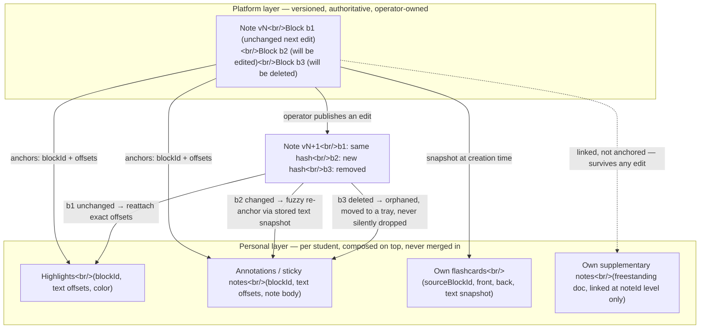

# Lane B — Notes & Knowledge System: Editor UX, RemNote Translation, Flashcards, Knowledge Graph

Status: DONE_WITH_CONCERNS (see "Open questions" and "Could not verify" — the strategic decisions below are load-bearing and confident; a handful of cross-lane confirmations are still needed).

Scope boundary respected throughout: canonical block JSON schema, PDF export and the authoring pipeline are **lane F's**; the spaced-repetition algorithm and mastery/prerequisite engine internals are **lane C's**; visual tokens and motion are **lane A's**. Everything below is interaction design and feature architecture for the notes/knowledge surfaces — where I need something those lanes own, I reference it as "per lane F/C/A" and move on.

---

## 1. Verdict summary

| # | Decision | Verdict |
|---|---|---|
| 1 | Note model | **Two layers**: a published, versioned, platform-owned note (canonical blocks) + a personal, student-owned overlay (highlights, annotations, own flashcards, own notes) composed as *decorations*, never merged into the canonical document. |
| 2 | Can students edit canonical notes? | **No direct edit.** Annotate-only, plus an explicit **fork-to-own-copy** escape hatch (duplicate becomes a freestanding personal document, no longer synced). |
| 3 | Editor engine | **TipTap v2 / ProseMirror** (MIT) for both author and reader surfaces, but **not the same runtime configuration** — author = fully editable; student reader = a `editable:false` TipTap instance sharing the identical extension/schema set (not a hand-rolled second renderer). Runner-up: **Lexical** (MIT) — switch condition below. |
| 4 | Novel (steven-tey/novel) | **Mine it for UX ideas only** (slash menu, bubble menu). Do not fork or depend on it — its stack (Next.js, Vercel Blob, OpenAI, Vercel AI SDK) doesn't match ours (Vite, DeepSeek), and its docs describe a Notion-clone editor, not a curriculum authoring tool. |
| 5 | Math input | **MathLive** (MIT) for authoring (WYSIWYG LaTeX input + virtual keyboard), **KaTeX** (MIT) for rendering-only display on the read side. Same LaTeX string round-trips between them. |
| 6 | RemNote mechanics | See full table in §4. Headline: ADOPT cloze/inline-card authoring syntax, image occlusion, the exam-date scheduler, PDF/slide annotation, AI cards with a human quality gate, mastery badges, curriculum-tree-as-hierarchy. ADAPT the Rem's triune identity, backlinks/Portals, and tables. REJECT freeform end-user-editable hierarchy, handwriting-as-core-capture, and full Notion-style multi-view databases. |
| 7 | Knowledge graph | `react-force-graph-2d` on desktop, hard ceiling **~800 rendered nodes per view** (filter by subject/exam-track above that). Mobile fallback: **collapsible curriculum tree**, not a shrunk force graph, plus a linear "prerequisite chip path" for the single highest-value query. |
| 8 | Search | Cmd+K palette reusing the house `notion-style-productivity-app` skill's `CommandSource`/`CommandPalette` pattern near-verbatim, with a **curriculum-aware ranking function** replacing its personal-wiki recency default. |
| 9 | Offline | **Dexie.js** (IndexedDB, MIT) + explicit per-note/unit "Download for offline" + last-write-wins outbox sync. Defer CRDT / real-time multi-device sync to v2+. |
| 10 | Reading modes | Explicit **Study Mode vs Reference Mode** toggle — warranted, specified in §6. |

---

## 2. The core strategic translation

RemNote, Notion, Obsidian, and Mochi all share one premise: **the user is the author of their own knowledge base.** Every mechanic in those products — freeform hierarchy, emergent backlinks, anyone-can-edit-anywhere — exists to serve a single person curating their own notes over years.

This platform inverts that premise: **the operator authors a curriculum once; thousands of students consume the same material and personalise on top of it.** That inversion is the single fact that should drive every UX decision in this lane. Concretely:

- **What transfers directly** (the mechanic doesn't care who authored the content): spaced repetition review UX, cloze-deletion authoring syntax, image occlusion, the exam-date scheduler, PDF/slide annotation, per-card AI explanations, mastery badges. These are all about *how one person studies material*, and a student studying operator-authored material needs exactly the same tools as someone studying their own notes.
- **What must be re-cast** (the mechanic assumes single-author-editing-everything and has to be split into "operator does this" vs "student does that"): the Rem's identity as a freely-nestable node (recast as a stable, operator-controlled Block), backlinks/Portals (recast as curated prerequisite links, not emergent cross-links from thousands of uncoordinated editors), tags/hierarchy (recast as a fixed curriculum taxonomy, not a personal tag vocabulary).
- **What is actively wrong for this product**: an open hierarchy where any user can create/reparent nodes anywhere (this is RemNote's entire selling point for personal use, and it would shred a curriculum: lane F's canonical schema and PDF export need stable trees, lane C's prerequisite graph needs stable topic IDs — neither survives 50,000 students independently restructuring "their" copy of the same tree). Handwriting-as-primary-capture is also wrong here: RemNote's handwriting exists because the *student* is taking the primary lecture notes; here the operator supplies typed source material, so handwriting has no primary-capture role (it survives only as a speculative, low-priority scratchpad for a student's own working — see §4, item 8).

### The two-layer note model



**Composition rules (data and visual):**

1. **Identity and versioning.** Every canonical Block carries a stable `blockId` (UUID, assigned once at authoring time, immutable across every future version — this is lane F's schema, referenced not defined here) and every Note carries a monotonic `version` integer, incremented on publish. Diffing is **block-level**, not whole-document: each block also carries a content hash. This matters because a document-level hash would invalidate every annotation on any edit anywhere in the note; a block-level hash invalidates only the annotations actually anchored to the block that changed.
2. **Anchoring.** A personal-layer highlight or annotation stores `{blockId, textOffsetStart, textOffsetEnd, textSnapshot}` — `textSnapshot` is the literal highlighted/annotated substring plus a few words of surrounding context. This is the same pattern used by web annotation tools (e.g. Hypothesis) and by Google Docs comments to survive document edits: exact offsets are the fast path, the text snapshot is the fallback anchor.
3. **On republish, per block:**
   - **Unchanged hash** → all anchors on that block reattach at their exact stored offsets. No user-visible change.
   - **Changed hash, block still exists** → attempt a fuzzy re-anchor: search the new block content for the stored `textSnapshot` (substring match first, then a simple nearest-match/edit-distance search if the exact snapshot no longer appears verbatim). If found, reattach and mark the annotation with a soft "may have shifted" indicator the first time the student sees it. If not found, treat as orphaned.
   - **Block deleted** → orphaned outright.
   - **Orphaned annotations are never silently deleted.** They move to a small "Orphaned notes" tray reachable from the note (and from the student's personal-layer settings), so nothing a student wrote ever vanishes without a trace — they can re-attach manually, convert to a freestanding note, or delete it themselves.
4. **Own flashcards** store their own front/back text plus a `textSnapshot` of the source at creation time, so the card itself is never broken by a source edit — it only loses its "jump to source" deep link if the source block becomes unrecoverable, exactly like an orphaned annotation.
5. **Own supplementary notes are not anchored to a version at all.** They're freestanding personal documents linked at the *note* level (`attachedToNoteId`), not the block level, so they are completely unaffected by republishing — this is what keeps the re-anchoring problem scoped to *annotations* only, not to everything a student writes.
6. **Visual composition:** the personal layer never edits the rendered DOM of the published note in place. It is drawn as an overlay — implemented as ProseMirror `Decoration`s (a non-destructive, well-established ProseMirror primitive for exactly this: temporary marks over a document that never touch the document's own JSON) on top of the read-only published doc. Highlights render as a background-color decoration; annotations render as a small margin-anchored indicator that opens a popover; nothing in the personal layer is ever written into the canonical block tree.

### Can students edit canonical notes?

**No — annotate-only, with an explicit fork escape hatch.** Reasoning: this is a taught-curriculum product, not a wiki. If any student could edit the shared note, the operator's authored material becomes a moving target for every other student reading it, lane F's PDF export has no stable source to export from, and lane C's mastery/prerequisite graph has no stable block IDs to key against. RemNote/Notion's "everyone can edit the shared graph" mechanic is exactly the wrong import here.

What students *can* do: highlight, annotate, make their own flashcards anchored to a block, write their own supplementary notes attached to the note — and, if they want to meaningfully rewrite something in their own words, **fork**: a "Make your own copy" action duplicates the published note (at its current version) into the student's personal namespace as a fully editable document. From that point it behaves exactly like a personal supplementary note — clearly labeled ("Your copy, based on v12 — no longer updates automatically"), never synced back, never visible to other students. This gives students real agency without ever putting canonical content at risk.

---

## 3. Editor technology decision

| Criterion | TipTap / ProseMirror | Lexical | Plate | BlockNote | Slate |
|---|---|---|---|---|---|
| Foundation | Wraps ProseMirror (battle-tested, 2015-era, extremely mature schema/transaction model) | Meta's own engine, no ProseMirror dependency | Built on Slate | Built on TipTap/ProseMirror | Own engine |
| License | MIT (core); paid Pro extensions (collaboration, comments, version history, AI commands) are optional | MIT | MIT | MPL-2.0 core; XL packages GPL-3.0 (need a commercial license to avoid copyleft) | MIT |
| Block-based UX out of the box | No — you compose it from nodes/extensions yourself (this is the "headless" trade-off) | No — same, lower-level | Yes, Notion-like blocks pre-built | Yes, Notion-like blocks pre-built, most turnkey of the five | No |
| Maths/LaTeX node support | Official `@tiptap/extension-mathematics` (KaTeX-backed) plus community options (`@aarkue/tiptap-math-extension`) | No official maths node; would be custom-built | Community only | Not first-class | Not first-class |
| Collaborative editing headroom | Yes, via Tiptap Pro Collaboration (Yjs-backed) — paid | Yes, Meta invests heavily here for internal use; strong plugin model for it | Inherits Slate's, weaker | Inherits TipTap's | Possible but more manual |
| Android Chrome IME/composition record | **Real, documented bugs**: DOM/doc state going out of sync during IME composition, composition-order issues with blur events, cursor-jump bugs around `contenteditable=false` nodes near compositions (ProseMirror issues [#784](https://github.com/ProseMirror/prosemirror/issues/784), [#565](https://github.com/ProseMirror/prosemirror/issues/565), observed 2026-08-31). Most of these have documented fixes/workarounds in recent ProseMirror releases. | **Also real, arguably worse for non-Latin scripts**: content consolidating at node boundaries during IME ([#6354](https://github.com/facebook/lexical/issues/6354)), CJK composition broken specifically on Android Firefox ([#6377](https://github.com/facebook/lexical/issues/6377)), typing regressions reported specifically on non-Gboard keyboards — Samsung Keyboard, SwiftKey ([#7649](https://github.com/facebook/lexical/issues/7649), observed 2026-08-31) — that last one matters directly for India, where Samsung and Xiaomi devices with their own keyboard apps are common. | Inherits Slate's composition bugs, which are also documented ([#5883](https://github.com/ianstormtaylor/slate/issues/5883), [#4400](https://github.com/ianstormtaylor/slate/issues/4400)) | Inherits ProseMirror's (see TipTap column) | Own documented Android composition bugs, historically less actively patched than ProseMirror's |
| Bundle size | Modular — "add only the extensions you need" (`tiptap.md`, corpus); StarterKit + math + table extensions realistically lands in the 80–150KB gzip range for the author bundle | Comparable core, similarly plugin-based | Heavier — bundles more block chrome by default | Reported unnecessary-language-file bloat in code blocks (~192KB gzipped from bundled Shiki grammars alone per [BlockNote #1487](https://github.com/TypeCellOS/BlockNote/issues/1487)) unless trimmed | Comparable to TipTap for a minimal schema |
| Extension API quality | Mature, well-documented, large ecosystem, official UI component library (`tiptap.dev/docs/ui-components`) | Clean plugin model, less community extension coverage | Good, inherits some TipTap-like ergonomics | Good but younger, narrower community | Historically praised then partly deprecated in favor of newer engines by parts of the ecosystem |
| Maintenance health (2026) | Actively developed, official templates, Pro tier funding the OSS core | Actively developed by Meta, "best bet for high-scale/mobile-parity-critical surfaces" per 2026 comparisons | Actively developed, smaller team | Actively developed, smaller team, still finding its footing on edge cases | Slower-moving; comparisons note its engine "historically less performant... on very long documents" |

**Recommendation: TipTap / ProseMirror (MIT).** Reasoning:

1. It is the only option here with an **official, KaTeX-backed maths node extension** — for a maths-first curriculum product this alone is close to decisive; everyone else requires building that from scratch.
2. Its Android IME bugs are real but are the *best-documented and most actively patched* of the group — ProseMirror's changelog shows a steady stream of composition fixes, and the specific failure modes (cursor jump around `contenteditable=false`, blur/compositionend ordering) are things a v1 build can route around by keeping inline non-text nodes (math, embedded questions) out of the direct typing path where possible.
3. It gives the cleanest read/write split for this product's two-layer model (see below) — a `editable:false` TipTap instance is a first-class, documented mode, not a workaround.
4. Lower switching risk than Lexical's plugin model for a small team, given the operator's stack is already React/Vite, not a Meta-scale internal surface.

**Runner-up: Lexical.** Switching condition: if field testing on actual low-end Android devices (Samsung/Xiaomi keyboards specifically, since India's device mix skews heavily toward these) surfaces IME breakage on TipTap that can't be worked around within a reasonable time budget, **or** if real-time collaborative co-authoring by multiple staff authors becomes a genuine v2 requirement (Lexical's plugin architecture and Meta's own investment make it the stronger long-term bet there). Do not pre-emptively switch — both engines have real, documented Android bugs; this is a property of `contenteditable` on Android Chrome in general, not a reason to prefer one over the other today.

**On Novel (steven-tey/novel), since the operator named it explicitly:** Novel is a thin, opinionated wrapper around TipTap + the Vercel AI SDK + OpenAI, built for Next.js/Vercel deployment (`novel-repo.md`, corpus — Apache-2.0, 16.4k stars, last release Feb 2025 per the scraped repo page, observed 2026-08-31). Its actual value is UX ideas, not code: the slash-command menu, the selection-triggered bubble menu, and the "type and get an AI continuation" flow are all worth studying and re-implementing directly against TipTap's own extension API. **Do not fork or `npm install` it** — its environment variables (`OPENAI_API_KEY`, Vercel Blob token) and Next.js-specific plumbing don't map onto a Vite app calling DeepSeek, and pulling in a Next.js-shaped dependency for its UI ideas alone would be net-negative. Build the slash menu and bubble menu as first-party TipTap extensions using Novel as a design reference only.

**Do the author and reader surfaces share an implementation?** Partially, deliberately:

- **Same schema, same extension set** for both — this guarantees a canonical note renders identically in the author's live preview and in the student's actual reading view, including custom nodes (maths, image occlusion, embedded questions, transclusion). No second renderer to keep in sync.
- **Different runtime configuration.** The author surface is a fully editable TipTap instance carrying the full input/keymap/InputRule pipeline (this is where all the IME risk concentrates — but it's used by a handful of operator/staff accounts, not by every student, which is the right place to concentrate that risk). The student reader surface is a TipTap instance mounted with `editable:false`: no composition happens on a non-editable `contenteditable`, so almost the entire IME bug class above simply does not apply there. The personal-layer highlight/annotation overlay is implemented as decorations on top of that read-only instance (§2), not as a second editable document. The only genuinely editable `contenteditable` surface most students ever touch is a small, low-stakes one: their own supplementary-notes editor (a separate, minimal TipTap instance — paragraph/list/bold/link only, no custom nodes) opened on demand from the personal-notes panel. This concentrates 95% of the platform's `contenteditable`/IME exposure into the tiny author population and keeps the mass-market student surface almost entirely read-only.

---

## 4. RemNote feature translation table

| Mechanic | How it actually works | Verdict | Interaction spec (if ADOPT/ADAPT) |
|---|---|---|---|
| **The Rem** — atomic unit that is simultaneously an outline node, a link target, and a flashcard | In RemNote, literally every bullet a user types ("Rem") can be all three at once, freely, anywhere in the hierarchy | **ADAPT** | Bind the triune identity to the operator-authored canonical Block (lane F's schema) instead of a freely-creatable personal bullet. Every Block has a stable `blockId` that is simultaneously: (a) an addressable deep-link target (`noteId#blockId`), (b) a valid flashcard source if the author marks it "cardable," and (c) an addressable knowledge-graph node if tagged with a `topicId`. Students cannot create new top-level canonical Blocks; their own Rem-like objects (own notes, own cards) follow the same three-role pattern but live entirely in the personal layer. |
| Inline flashcard creation syntax (`Concept :: Descriptor`, `{{cloze}}`, list/cluster cards, multi-line cards) | Typing `Concept :: Descriptor` on a line auto-generates a two-sided Q/A card from that structure; `{{text}}` cloze-deletes; a bulleted list under a concept can become a "list card" (recall all N items) or split into a "cluster" of mini cards. Import syntax also supports `>>`/`==` for basic front/back and double-curly-braces for cloze (help.remnote.com, [Creating Flashcards](https://help.remnote.com/en/articles/6025481-creating-flashcards), [Import from Text](https://help.remnote.com/en/articles/9252072-how-to-import-flashcards-from-text), observed 2026-08-31) | **ADOPT for authoring, REJECT for the student surface** | Author editor only: implement `::` and `{{...}}` as TipTap `InputRule`s (regex-triggered transform-on-type, the same mechanism TipTap's own markdown-shortcut extensions use). `::` converts the current block into a linked Concept/Descriptor pair and emits a Flashcard record with `sourceBlockId`. `{{...}}` wraps the enclosed span in a `ClozeMark`; multiple `{{c1::...}}`/`{{c2::...}}` groups in one block emit one card per group. A bullet list gets a toolbar action "Make list card" → one card whose answer is "recall all N items." Students never see `::`/`{{}}` syntax while reading — their inline card creation is a deliberate action (select text → "Make Flashcard" from the highlight popover, §6), not implicit typed syntax, because students aren't authoring the outline. |
| Image occlusion cards | Rectangle or freeform-tape masks are drawn over an image; each masked region becomes its own card (front: image with region hidden; back: region revealed), with an option to merge multiple regions onto one card ([Image Occlusion Cards](https://help.remnote.com/en/articles/6511625-image-occlusion-cards), observed 2026-08-31) | **ADOPT — high value**, explicitly flagged in the brief for Physics/Chemistry diagrams and geometry | Authoring: insert an image block → "Occlude" toolbar action opens a canvas overlay on the ``; masks are stored as `{shape:'rect'|'freeform', coords}[]` in the block's data — never baked into image pixels, so mask count (= card count) stays independently editable from the source image asset. Reading/review: render the image with un-revealed masks as opaque boxes; tap/click a mask to reveal; "merge occlusions" groups masks onto one card, matching RemNote's model. |
| Daily review Queue + exam-date scheduler | The exam scheduler is a modulation layer over whatever base spaced-repetition algorithm is running (SM-2 or FSRS), not a replacement: it paces new-card introduction so everything is "learned" before the exam date and inserts an extra full-review pass shortly before it ([Understanding the Exam Scheduler](https://help.remnote.com/en/articles/9102040-understanding-the-exam-scheduler), [FSRS](https://help.remnote.com/en/articles/9124137-the-fsrs-spaced-repetition-algorithm) — FSRS reportedly needs 20–30% fewer reviews than SM-2 for the same retention, observed 2026-08-31) | **ADOPT — highest priority**, explicitly named as extremely relevant to JEE/NEET/board-exam India | UX only (the scheduling math is lane C's): student sets `examDate` per subject/exam-track in settings. The Queue screen shows one merged list (today's due reviews + newly-introduced cards, computed by lane C, rendered by me). A persistent status strip at the top of the Queue shows a 3-state traffic light — on-track / behind / ahead — never a raw percentage, because a color plus one short nudge line is actionable and a raw number isn't. Tapping it opens a per-day workload chart (recharts, per house stack) of cards-due-per-day between now and exam date. |
| Bidirectional references, backlinks, Portals (transclusion) | Any reference/link/portal/tag creates a bidirectional link; the referenced bullet shows a small backlink counter. Portals open a live window onto a bullet defined elsewhere (triggered by typing `((`); Search Portals auto-gather everything that references a document ([Backlinks](https://help.remnote.com/en/articles/6030776-backlinks), [References vs Tags vs Portals](https://help.remnote.com/en/articles/6634227-what-s-the-difference-between-references-tags-and-portals), observed 2026-08-31) | **ADAPT** | Backlinks recast as **curated** prerequisite/related-topic links, not emergent student-authored cross-links — thousands of students can't collectively maintain one coherent backlink graph the way one personal-wiki author can, and an emergent-link graph would be noise, not signal, at this scale. A Block declares `relatedTopicIds[]` and `prerequisiteTopicIds[]`, authored explicitly by the operator (or suggested by lane F's content pipeline and confirmed by the operator — never auto-published from student behavior). Rendered as a small "Related" chip rail at block/note level, feeding directly into the knowledge-graph edges (§7). Portals: **ADOPT narrowly** as a `TransclusionNode` — embed a live, read-only view of a block from Topic A inside Topic B's note (e.g. re-showing the quadratic formula inside a projectile-motion note), storing `{noteId, blockId, version}`. Editing only ever happens at the source; this avoids duplicating definitions across notes without any live multi-writer risk. |
| Tags/hierarchy and the document tree | Fully freeform — any Rem can be tagged with any other Rem, hierarchy is whatever the user builds | **ADAPT** | Fixed-shape tree, not freeform: `Board/Curriculum > Subject > Unit > Topic > Note`, matching how Indian students actually navigate a syllabus (e.g. CBSE Class 11 Physics → Unit 4: Laws of Motion → Topic: Friction). Rendered as a collapsible left-rail tree on desktop, a bottom-sheet list on mobile (same component reused as the knowledge graph's mobile fallback, §7). Cross-cutting facet tags (`#JEE-2027`, `#NCERT-exemplar`, `#frequently-asked`) layered on top, operator-curated only — students filter by tag, never create one. |
| PDF and slide annotation with notes alongside | Upload a PDF/slide deck, annotate with highlights/drawings/shapes, with notes alongside in the same document | **ADOPT** — needed for uploaded worksheets/past papers | Desktop: split-pane (PDF viewer beside a notes column). Mobile: tab-switch between the two (screen too narrow for a split). Annotations belong to the personal layer, anchored to `{pdfId, pageNumber, coordinates}` rather than to the PDF's bytes, so a corrected re-upload of the same worksheet doesn't strand annotations if page geometry is unchanged. Viewing library: default recommendation is `react-pdf` (pdf.js-based, MIT) — **confirm with lane F** before committing, since they own PDF export and a shared pdf.js-based toolchain for both viewing and export may be preferable to two separate PDF stacks. |
| Handwriting input and conversion | Take handwritten notes on a tablet in lecture, convert sketches to text | **REJECT for v1 core notes** | The operator supplies typed source material — students are not the primary note-takers, so handwriting has no primary-capture role here. Narrow, speculative, v2+ possibility only: an optional scratchpad canvas for a student's own working-out during practice questions, with no handwriting-to-text conversion needed (it's just shown work, not captured content). Flagged as inferred/low-priority, not part of this v1 recommendation. |
| AI-generated flashcards, quizzes, summaries, per-card AI explanations | One-click AI generation of cards/quizzes/summaries from notes, PDFs, or transcripts; every card gets an AI explanation on demand | **ADOPT the UX pattern**; model/RAG implementation is out of this lane | Authoring: a "Generate flashcards from this note" action produces suggested cards the author must individually review/edit/discard before anything publishes — never auto-published, because these become canonical cards every student sees, so a human quality gate is non-negotiable here in a way it isn't for RemNote's single-user case. Reading: a per-card "Explain" affordance calls the AI tutor with `{cardFront, cardBack, sourceBlockId}`, rendered inline, and **cached per card** so repeat views don't re-call the API — DeepSeek's v4-flash pricing is cheap (~$0.66/1M output tokens off-peak per `corpus/deepseek-pricing.md`, observed 2026-08-31) but caching is still the right default at platform scale with a shared card population. |
| Mastery tracking per topic | Visual progress-per-topic indicator | **ADOPT the visualization**; the scoring algorithm is lane C's | One consistent visual language — a filled progress ring, using lane A's token colors, with poor/fair/good/mastered bands — reused identically in three places: the curriculum tree row, the knowledge-graph node, and the top of the note itself ("Your mastery: 72%"). Reusing one widget everywhere is deliberate: students should form a single mental model of what the ring means, not learn three different indicators. |
| Tables/databases as blocks | Full Notion-style database block: a record set with swappable table/kanban/calendar/gallery views | **ADAPT — narrow** | Adopt only a static `TableBlock` node (`@tiptap/extension-table`-based) for authored content tables (trigonometric identity tables, periodic-table snippets). **Reject** the full multi-view-database mechanic from the house `notion-style-productivity-app` skill — there's no product need for a student "database of my own records" in a curriculum-notes product, and building swappable views is real, unnecessary cost here. |

---

## 5. The authoring surface

**Slash-command menu** (`/` at the start of an empty block) — the concrete command list for maths teaching:

`/h1` `/h2` `/h3` · `/paragraph` · `/bulleted-list` `/numbered-list` `/toggle-list` (collapsible, for "click to expand" derivations) · `/quote` · `/callout` (info / warning / tip / exam-tip variants) · `/divider` · `/image` · `/table` · `/math-block` (display equation, mounts a MathLive field) · `/code` (for the rare CS-adjacent content) · `/embed-question` (opens a picker over the practice-question bank, owned by another lane) · `/image-occlusion` · `/transclusion` (embed a block from another note, §4) · `/pdf-embed` · `/video-embed` · `/flashcard` (manual Q&A card block, for cards that don't fit the `::`/`{{}}` inline flow) · `/cloze` · `/worked-example` (the progressive-disclosure step container, §6) · `/columns` (side-by-side layout — e.g. two solution methods compared) · `/formula-reference` (pulls a definition from a shared formula sheet via transclusion). A `/graph-embed` (interactive function plotter) is a plausible v2 addition, not scoped for v1.

**Block-type inventory** from a UX perspective: text blocks (paragraph, headings, quote, callout) need no chrome beyond the standard drag handle; structural blocks (toggle, columns, table) need a visible collapse/expand or column-boundary affordance; media blocks (image, PDF, video, transclusion) need a hover-revealed action bar (replace / occlude / delete); interactive blocks (embedded question, flashcard, cloze, math) need a distinct visual treatment in the author view (a subtle colored left border is enough) so the author can tell at a glance which blocks are "static content" versus "will be interactive for the student."

**Drag-handle and block-menu behaviour:** a six-dot handle appears on hover to the left of every block (standard Notion/BlockNote convention); dragging reorders within the same nesting level; the handle's click opens a block menu (Turn into / Duplicate / Delete / Move to... / Comment) rather than dragging being the only way to access those actions — this matters on trackpads and is essential once touch/tablet authoring is considered.

**Keyboard-first flow and the full shortcut table:**

| Action | Shortcut | Note |
|---|---|---|
| Global command palette | `Cmd/Ctrl+K` | Owned exclusively by the app shell, everywhere. Deliberately **not** shared with "insert link," to avoid the classic Notion-style ambiguity. |
| Insert/edit link on selection | `Cmd/Ctrl+Shift+K` | Chosen specifically to avoid colliding with the palette above. |
| Bold / Italic / Underline / Inline code | `Cmd/Ctrl+B` / `I` / `U` / `E` | Standard, matches every rich-text editor. |
| Inline math | Type `$...$` | Auto-renders on typing the closing `$` via a TipTap `InputRule` (no shortcut needed) — the standard behaviour of `@tiptap/extension-mathematics`. |
| Display math block | Type `$$` at line start, or `/math-block` | Mounts a MathLive field. |
| Insert cloze on selection | `Cmd/Ctrl+Shift+C` | Deliberately reuses Anki's own cloze shortcut (`Ctrl+Shift+C` on desktop) — many operators/teachers already know this convention. |
| Slash command menu | `/` at start of an empty block | — |
| Turn block into... | `Cmd/Ctrl+Alt+0`..`6` | 0 = paragraph, 1–3 = H1–H3, matching the Notion convention many authors already know. |
| Move block up / down | `Alt+Shift+Up` / `Alt+Shift+Down` | — |
| Indent / outdent | `Tab` / `Shift+Tab` | — |
| Duplicate block | `Cmd/Ctrl+Shift+D` | **Not** plain `Cmd+D` — that's the Chrome desktop bookmark shortcut, and while `preventDefault` can usually reclaim it, don't fight a reserved OS/browser binding when a clean alternative exists. |
| Preview (renders through the exact same read-only student component) | `Cmd/Ctrl+Shift+E` | — |
| Publish | Button only, no shortcut | Irreversible/high-consequence actions don't get keyboard shortcuts — same principle as never binding "delete" to a bare key. |
| Save | None — autosave | Debounced ~800ms after the last keystroke, plus save-on-blur, matching Notion/Google Docs; no manual save action needed. |

**Maths input while authoring:** mount a MathLive `<math-field>` custom element (MIT-licensed, current version 0.110.0 per npm, observed 2026-08-31) inside a TipTap NodeView for both the inline-math mark and the display-math block. MathLive gives WYSIWYG-as-you-type rendering plus an optional on-screen virtual math keyboard (documented at [mathlive.io/mathfield/guides/virtual-keyboard](https://mathlive.io/mathfield/guides/virtual-keyboard/)) while still storing/returning a plain LaTeX string via its `.value` API — that LaTeX string is exactly what gets persisted in the block's JSON (lane F's schema) and is exactly what KaTeX renders on the read side, so editing and display share one source format with no lossy conversion. **How does an author type an integral quickly?** MathLive recognizes LaTeX control sequences typed literally (e.g. typing `\int` renders the integral symbol live and advances the cursor into its bound/integrand placeholder slots via its "smart fence" placeholder navigation), the same tab-through-placeholder UX as Overleaf-style LaTeX-aware editors. This specific interaction is **inferred** from MathLive's documented API and virtual-keyboard support, not independently hands-on tested in this session — flag for a quick spike before committing to it as the primary authoring flow.

**Embedding a practice question inside a note:** a `QuestionEmbedBlock` node storing `{questionId}` (a reference into the question bank owned by a different lane). Inserted via `/embed-question`, which opens a searchable picker reusing the same fuzzy-search infrastructure as the global command palette (§8), scoped to the question bank. Renders as the live interactive question inline in Study Mode; collapses to a "Practice Question ↗" chip in Reference Mode (§6).

**Preview/publish flow:** Draft (author-only) → Preview (renders through the *identical* read-only student component used in production — no separate preview template to keep in sync) → Publish (creates immutable version `N`, diffed block-by-block against `N-1` to drive the annotation re-anchoring in §2). Students already reading version `N-1` see a small, non-blocking "Updated ↻" affordance on their next visit rather than a forced reload mid-session — never yank content out from under someone mid-read.

---

## 6. The reading surface

**Study Mode vs Reference Mode — warranted, and specified:**

- **Study Mode** (default on first visit to a note): worked examples reveal progressively — a `WorkedExampleBlock` holds ordered `StepNode` children, each hidden behind a "Show next step" action, with a "Show all steps" escape hatch for anyone who wants to skip ahead. Inline "check your understanding" questions are low-stakes, single-question, answer-inline-no-navigation-away widgets — distinct from the full `QuestionEmbedBlock` — that interrupt the reading flow deliberately.
- **Reference Mode** (default on repeat visits, or explicit toggle): everything expanded, dense, optimized for pre-exam lookup — no gated reveals, a pinned formula/definition summary rail.
- Toggle state is remembered per note per student, stored in the personal layer (it's a preference about *this student's* relationship to *this note*, not canonical content).

**Highlighting and note-taking:** native browser Selection/Range API drives the interaction (no need for a second editable ProseMirror instance just to highlight, per §3) — select text → a small popover toolbar appears with four actions: **Highlight** (color picker, per lane A's tokens) · **Note** (opens a small annotation composer anchored to the selection) · **Make Flashcard** (pre-fills front/back from the selection, opens the manual card editor) · **Ask AI about this**. This mirrors the well-proven Kindle/Readwise highlight-popover pattern, which is specifically well-suited to touch.

**"I'm stuck → ask the AI tutor about this block":** every block gets a lightweight, hover/long-press-revealed "Ask AI" affordance (in addition to the selection popover's version for a specific passage). Clicking it hands the (separately-owned) tutor chat surface a context payload:

```
{
  "noteId": "...",
  "noteVersion": 12,
  "blockId": "...",
  "blockType": "worked_example_step" | "paragraph" | "math_block" | ...,
  "blockContent": "<plain text, LaTeX kept as raw source, not rendered HTML>",
  "surroundingContext": {
    "before": "<previous 1-2 blocks' plain text, for disambiguation>",
    "after": "<next 1-2 blocks' plain text>"
  },
  "studentQuestion": "<freeform text the student typed, may be empty — 'explain this' is a valid default>"
}
```

This is the full extent of this lane's ownership of the AI tutor interaction — the chat UI itself (streaming, history, DeepSeek routing) is presumably owned by a lane not represented in my scope boundary; see Open Questions.

**Reading progress:** a thin, persistent progress bar at the top of the note tracking blocks scrolled past (Medium/Readwise-style — cheap, well-proven), stored in the personal layer keyed to `(noteId, version)`.

**Mobile reading experience:** single column always (no split layouts below tablet width); a sticky bottom toolbar (not a single floating FAB — Android students need reliable one-handed thumb reach across a 3–4 icon bar) with Highlight-mode toggle / Ask AI / Flashcards-from-this-note / TOC bottom-sheet; a font-size stepper (Indian low-end Android device screens and DPI vary enormously — do not assume one comfortable default size); every math block wrapped in its own `overflow-x: auto` horizontal-scroll container, since KaTeX output cannot reflow and long derivations must scroll within their own box rather than break the page's own horizontal scroll; image occlusion cards render full-width.

---

## 7. The knowledge graph surface

**What it's for here — not decoration, three concrete jobs:**

1. **Prerequisite navigation** — "what do I need before I can learn X": click a node, see its incoming prerequisite chain highlighted, click through to the earliest still-unmastered prerequisite.
2. **Mastery visualization** — the same mastery ring used elsewhere (§4), applied per node.
3. **Gap discovery** — a "weak spots" filter that dims everything except nodes below a mastery threshold, so a student prepping for an exam sees exactly what's red. (Math Academy explicitly brands its whole product around "knowledge graph technology" for this reason — `corpus/mathacademy.md`, observed 2026-08-31 — this is validated prior art for the same India/exam-prep audience shape, not a novel idea.)

**Visual encoding:**

| Channel | Encodes |
|---|---|
| Node color | Subject family (Math / Physics / Chemistry / Biology), per lane A's token palette — referenced, not defined here. |
| Node ring fill | Mastery percentage from lane C's engine (0–100%, hollow/grey = unattempted). Same visual language as the mastery badge everywhere else in the product. |
| Node size | Curriculum exam-weightage (bigger = more marks in the relevant JEE/board exam) as the **primary** encoding, since exam relevance is what the operator explicitly cares about. A secondary "centrality" toggle (size = number of downstream-dependent topics) is a reasonable v1.1 addition, not required for launch. |
| Edge style | Solid arrow = hard prerequisite (must master before). Dashed/thin = related/see-also, non-blocking. |
| Edge color | Grey by default; highlighted amber/gold when it's part of an active "path to goal" selection. |

**Interaction:** click a node → focus mode (dim non-neighbors, show the full ancestor prerequisite chain). A "path to X" mode: pick a target topic, and the shortest/complete prerequisite chain from the student's current mastered frontier to that target highlights — a plain BFS/topological-sort traversal over prerequisite edges, cheap even at a few thousand nodes since it's graph traversal, not physics simulation. Double-click enters an isolated per-node detail view.

**Mobile fallback — a force-directed graph is genuinely poor on a small screen, and the research backs that up, not just intuition:** `react-force-graph-2d` performance visibly degrades past roughly 5,000–7,000 combined nodes+links even on desktop hardware, and users have reported the underlying WebGL engine running out of memory entirely around ~118,000 nodes ([react-force-graph #223](https://github.com/vasturiano/react-force-graph/issues/223), [#202](https://github.com/vasturiano/react-force-graph/issues/202), observed 2026-08-31). Beyond the raw performance ceiling, touch-based pan/zoom/drag-to-untangle spatial exploration is close to unusable on a 6-inch screen regardless of node count. Recommendation: **on mobile, replace the force graph entirely with the same collapsible curriculum tree used for navigation** (§4) — mastery ring shown as a small badge per row, tap to expand/collapse, tap a topic to open its note. This is not extra build cost since that tree has to exist anyway. For the single highest-value graph query specifically ("what do I need before X"), offer a lighter, touch-friendly linear alternative on mobile: a chip-list breadcrumb generated by the same BFS path-to-goal query — e.g. "To learn Integration by Parts you need: ✓ Differentiation → ✓ Product Rule → ○ Integration Basics" — with zero graph rendering involved.

**Node-count ceiling and fallback strategy:** a realistic combined Math + Physics + Chemistry + Biology curriculum at CBSE/JEE topic granularity is on the order of 1,000–1,500 topic nodes (a full subject's syllabus tree typically runs 150–400 leaf topics). That's comfortably under the ~5,000-node danger zone *only if* rendered as separate, filtered views. **Recommended hard ceiling: 800 rendered nodes per force-graph view.** Above that, the UI must force a subject/board/exam-track pre-filter before rendering the force layout — an "all subjects at once" view should never render as one giant force graph on any device; it should always render as the tree/list view described above. This ceiling is a conservative inference from generic-node GitHub performance reports, not a number benchmarked against this product's specific per-node draw complexity (rings, labels) — flagged in Could Not Verify.

---

## 8. Search and command palette

**Architecture:** reuse the house `notion-style-productivity-app` skill's `CommandSource`/`CommandPalette` pattern (`~/.claude/skills/notion-style-productivity-app/reference/{CommandPalette.tsx,commandRegistry.ts,fuzzySearch.ts,HighlightText.tsx,useRecentItems.ts}`) essentially as-is: one `CommandSource` per searchable thing, the palette owns merging/grouping/ranking and knows nothing about what a "note" or "topic" is, `cmdk` + `fuse.js` for the list chrome and fuzzy matching, `shouldFilter={false}` since sources rank their own results (the skill's own documented gotcha), and a stale-response guard for the async sources. `Cmd/Ctrl+K` opens it globally (see §5's shortcut table for why it's reserved exclusively for this).

**Searchable sources:** Notes (title + body text) · Topics (curriculum tree nodes — selecting one focuses the knowledge graph or opens the tree at that node) · Flashcards (front/back text) · Questions (practice question stems — likely populated from a different lane's data, still searchable here) · Commands (navigation + actions, e.g. "Start review queue," "Set exam date") · Recent items (capped at 3–5 per the skill's own gotcha about recency lists losing usefulness once they grow past a handful).

**Ranking — this is the one place the house skill's default doesn't transfer:** the skill's pattern assumes a personal wiki, where recency/frequency is the natural default ranking signal. **This corpus is a curriculum, not a personal wiki, and ranking should reflect that:** (1) exact structural/title match ranks highest, (2) proximity to the student's current position in the syllabus is boosted (a topic near their active unit outranks an equally-fuzzy match from an unrelated subject), (3) mastery gap gets a mild boost on ambiguous queries — "that thing about factorising" is more likely to mean something not yet mastered than something already aced, so nudge toward the gap, (4) recency/frequency is a tiebreaker only, not the primary signal. Implementation: keep Fuse.js doing per-source fuzzy text scoring exactly as the skill does, then apply this curriculum-aware boost as a post-merge score adjustment in the palette's own merge step — architecturally this is the same "palette owns ranking" seam the skill already provides, just with a different scoring function passed into it.

**"Jump to":** a dedicated lightweight `CommandSource` pattern-matches curriculum tree paths directly (typing "unit 3" or a topic name jumps straight to that tree location), so common navigation doesn't have to round-trip through full fuzzy text search.

---

## 9. Offline and sync

**What must work offline:** (1) previously-viewed notes — cache the published block-tree JSON plus rendered assets (images, KaTeX output) keyed by `(noteId, version)`, LRU-evicted; (2) the daily review Queue — flashcard due-lists must be fully computable and answerable with zero connectivity, since doing reviews on a commute with no signal is one of the actual reasons people love RemNote/Anki in the first place; (3) PDFs the student has already opened once, cached as a blob in IndexedDB; (4) anything the student writes offline (own notes, own cards, highlights, review answers) — must queue locally and sync on reconnect, never block on connectivity. **Explicitly not required offline for v1:** the AI tutor chat (needs a live API call), live teacher booking, first-time download of content not yet viewed, and any server-computed adaptive question generation.

**Local-first storage choice: Dexie.js** (IndexedDB wrapper, MIT, current v4.4.5 per npm, observed 2026-08-31) over a full sync engine (RxDB, Yjs, ElectricSQL, PowerSync). Reasoning: the personal layer's conflict surface is narrow — one student, rarely more than one active device at a time, low write concurrency. This does **not** need CRDT-grade conflict-free merge; a much simpler policy is sufficient and drastically cheaper to build and maintain. Recommendation:

- Dexie tables mirroring the personal-layer schema: `highlights`, `annotations`, `ownNotes`, `ownCards`, `reviewLog`.
- A simple outbox pattern: unsynced records are flagged `_dirty: true`; a background sync-on-reconnect worker POSTs them; the server assigns the canonical id/timestamp and clears the flag.
- Conflict policy: **last-write-wins by `updatedAt`** for mutable personal records (highlights, annotations, own-notes content). The one deliberate exception: spaced-repetition review logs are append-only events, never mutated records — so there is no conflict to resolve there at all; this is lane C's territory but worth flagging here since it directly shapes the sync design (appends never conflict, only mutable records need a resolution policy).
- Asset caching layer: a Workbox-based service worker for the app shell, KaTeX fonts, and icons, sitting alongside Dexie for data — standard PWA practice, cheap to add.

**What's explicitly deferred past v1 — be honest about the cost:** full local-first architecture (CRDT-based real-time multi-device sync of the personal layer, automatic background full-corpus pre-download) is a real complexity and engineering-cost multiplier that this bootstrapped build does not need on day one. Recommend an explicit, student-initiated "Download for offline" action per note/unit rather than any automatic bulk-download system — this respects both limited storage on low-end Android devices and limited engineering time. Ship "offline reading + offline review queue + queued sync of personal writes" for v1; defer "offline-capable everything, multi-device real-time" to v2+.

---

## Open questions

1. **Who owns the AI tutor chat surface itself** (streaming UI, message history, DeepSeek routing)? This document only specifies the trigger interaction and the context payload handed to it from a note block (§6). No lane in my scope-boundary briefing was named as owning that chat surface — if no other lane covers it, that's a gap in the mission's lane assignment, not something this document can close.
2. **PDF viewing library should be confirmed with lane F** (owns PDF export/content pipeline) so viewing and export share a coherent toolchain rather than two unrelated PDF stacks — I've defaulted to `react-pdf`/pdf.js for viewing but this is a coordination point, not a unilateral call.
3. **Shared/proxy accounts** (a parent or tutor viewing a student's notes/mastery, common in Indian ed-tech) are not scoped anywhere in the mission brief. The personal-layer ownership model here assumes one student = one account; if shared-viewing or proxy accounts are a real requirement, the ownership model in §2 needs revisiting.
4. **Does the operator want any student-to-student sharing** of personal notes or flashcard decks (Quizlet's entire value proposition)? Deliberately out of scope in this document, consistent with the "operator authors, student consumes" framing — worth an explicit one-line confirmation given how central shared decks are to Quizlet/Anki's actual usage.
5. **Curriculum taxonomy depth** (`Board > Subject > Unit > Topic > Note`, five levels, §4) is inferred from how Indian boards publish syllabi, not validated against an actual CBSE/JEE syllabus document — needs a check against whatever source material lane F or the operator is working from.

## Could not verify

- No corpus file or session tool gave first-hand access to a live RemNote, TipTap, Lexical, BlockNote, or MathLive instance. All mechanic descriptions and comparison claims above come from WebSearch summaries of vendor docs, GitHub issue trackers, and third-party 2026 comparison articles (all cited inline with URLs, observed 2026-08-31) — not from running or testing any of these tools in this session.
- `corpus/remnote-features.md` resolved to RemNote's own 404 page when read directly — it contains no usable content; all RemNote specifics here instead come from `corpus/remnote.md` (a marketing homepage scrape) plus targeted WebSearch of `help.remnote.com` articles.
- `corpus/novel-repo.md` is a scrape of the GitHub repository's file-listing/README page, not the actual source code — my recommendation to mine Novel for UX ideas rather than fork it rests on its documented tech stack (Next.js, Vercel Blob, OpenAI) being a poor fit, not on having read its component source.
- BlockNote's actual mobile/touch behavior was not directly found in search results (only bundle-size and licensing information surfaced) — treated as unknown/assumed-similar-to-its-underlying-ProseMirror-core rather than independently confirmed.
- The MathLive "type `\int`, tab through placeholders" authoring flow described in §5 is inferred from MathLive's documented API/virtual-keyboard support, not hands-on tested — flagged there as needing a quick spike before committing.
- The 800-node knowledge-graph ceiling (§7) is a conservative inference from generic-node `react-force-graph-2d` GitHub performance reports, not a number benchmarked against this product's specific per-node rendering complexity (mastery rings, labels, custom draw calls).
