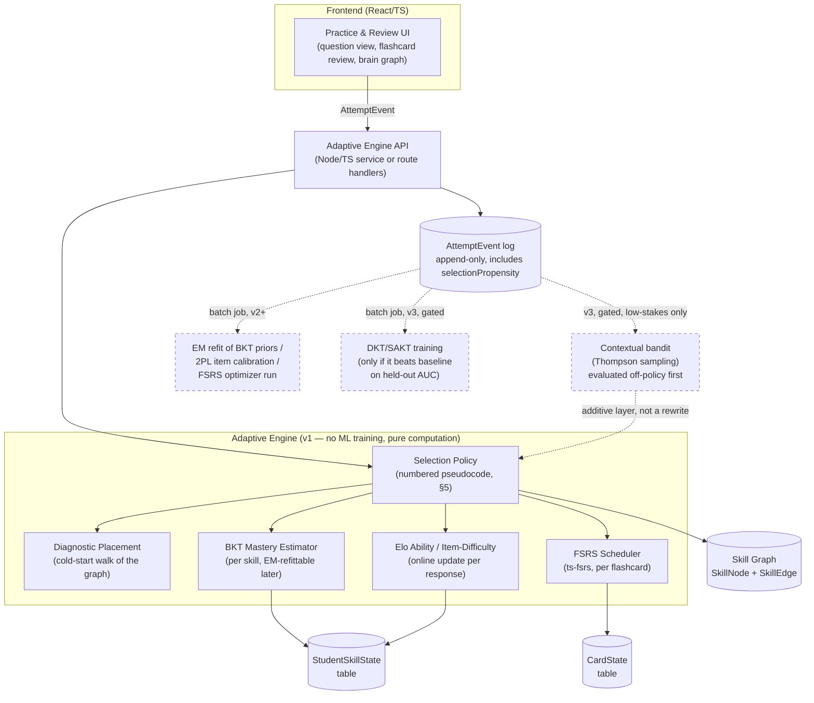

# Lane C — Adaptive Learning / Mastery Engine

Status: DONE. Owner: Lane C agent. Do not edit outside this file (per mission brief).

Evidence grading used throughout: **[O]** observed this session (fetched/read directly), **[I]** inferred from observed material, **[A]** assumed / recalled from general knowledge, not independently verified this session. Load-bearing claims are tagged; anything untagged in a sentence inherits the nearest preceding tag.

---

## 1. Verdict summary

The engine the operator is calling "reinforcement learning and all jazzy techniques" should actually be three much simpler, well-understood systems wired together: (1) a **spaced-repetition scheduler** (FSRS) that decides *when* a student re-sees a flashcard, (2) a **per-topic mastery estimate** (Bayesian Knowledge Tracing seeded with literature priors, plus an Elo-style difficulty/ability rating) that decides *how sure we are* a student knows something, and (3) a **prerequisite knowledge graph** that decides *what's next* by walking from a student's frontier of half-mastered topics outward — the same approach Math Academy uses under the hood. None of this requires machine-learning training data, a GPU, or a live model at launch; it runs as plain arithmetic on a Postgres-backed state table. Actual reinforcement learning (contextual bandits, policy learning) is real, useful technology — but it needs response volume and an offline evaluation method this platform will not have in year one, and using it prematurely means experimenting on real students' limited study time with an unvalidated policy. The correct move is to build the simple system now, log every event richly enough that a bandit or neural knowledge-tracing model can be bolted on later without a rewrite, and only add real RL once there's enough logged data to evaluate it safely offline first.

---

## 2. Recommended architecture



The dashed boxes are v2/v3 upgrades — nothing in the v1 box requires them to exist, and nothing in v1 needs to be rewritten to add them (see §6 roadmap and §7 telemetry design for why).

---

## 3. Decision table

| # | Decision | Chosen | Runner-up | Why | Confidence |
|---|---|---|---|---|---|
| 1 | Spaced-repetition scheduler | **FSRS** (FSRS-6, via `ts-fsrs`) | SM-2 | FSRS fits a 3-component memory model (difficulty, stability, retrievability) and needs 20–30% fewer reviews than SM-2 for the same retention, benchmarked on 500M+ Anki reviews [I, via open-spaced-repetition benchmark work, corroborated by multiple 2026 comparison write-ups — see §9]. It shipped with sane global default weights, so it works from day 1 with zero student history — no training step required at launch. `ts-fsrs` is TypeScript-native, matching the house stack. | High |
| 2 | Mastery / knowledge tracing | **BKT (per skill) + Elo-style item/ability rating** | 2PL Item Response Theory | BKT is a 4-parameter Hidden Markov Model (P(L0), P(T), P(guess), P(slip)) [O] that produces one interpretable "probability of mastery" number per student per skill, updates after every single response with closed-form math, and needs zero historical data to start (seed with literature-typical priors, tune later). IRT (1PL/2PL/3PL) is more statistically rigorous but 2PL/3PL item calibration needs on the order of hundreds of responses *per item* before estimates stabilize [A] — a bank of thousands of maths questions won't have that in year one. Elo-style rating (what Duolingo's "Birdbrain" and Khan-style systems use) is the practical middle ground: it updates online, needs no batch fit, and is mathematically the same family as IRT's logistic curve [O]. DKT/SAKT (neural) are explicitly rejected for launch — see row 2b. | High (on rejecting DKT at launch); Medium (on exact BKT prior values — must be tuned) |
| 2b | Deep/neural knowledge tracing (DKT, SAKT) | **Not at launch** | — | Deep sequence models need large interaction logs to train usefully; the public research benchmarks these were built for (ASSISTments etc.) have hundreds of thousands to millions of interaction rows [I]. A platform with a few hundred to a few thousand students in year one, each doing modest practice volume, will not produce that. There is a formal proof that BKT's steady-state is equivalent to an IRT logistic curve [O, EDM literature], meaning BKT+Elo is not a "lesser" method — it is the correct choice for the data regime this platform will actually be in. | High |
| 3 | Question selection policy | **Prerequisite-graph frontier selection + Elo-matched difficulty targeting (~85% success zone)** | Multi-armed bandit (Thompson sampling) over items | This is Math Academy's proven production approach [O, from their own "Fractional Implicit Repetition" (FIRe) writeup — see §9], and it gives a structurally honest reason for every question served ("you're at the frontier of X, and prerequisite Y is shaky") rather than a black-box bandit choice. The ~85% target success rate has a real citation (Wilson et al. 2019, *Nature Communications*, "The Eighty Five Percent Rule for optimal learning") [O] — but see the caveat in §9: that result was demonstrated on gradient-descent/perceptual-classification learning, not proven directly for discrete K-12 maths item selection. Treat 85% as a strong, well-known prior to start from, not a validated constant for this exact domain. Bandits are the right *future* tool once there's enough same-skill traffic per arm to converge — see row 5. | High (on graph-driven-first); Medium (on the exact 85% number's domain transfer) |
| 4 | Prerequisite knowledge graph structure | **Directed graph with two edge types — `prerequisite` and `encompasses` — with fractional edge weights** | Flat per-topic mastery, no explicit graph | A flat structure cannot drive the operator's requested "brain graph" visual, cannot do targeted remediation ("you're stuck on quadratics because your factoring is shaky"), and cannot do short diagnostic placement. Math Academy's FIRe insight [O] is that a *prerequisite* relationship ("must know A before B") is distinct from an *encompassing* relationship ("solving B necessarily practices A, partially or fully") — modeling both lets repetition credit "trickle down" through the graph on success and doubt "propagate up" on failure, which is what makes both remediation and diagnostic placement efficient. | High |
| 5 | Where RL (contextual bandits / full RL) applies | **Not at launch. Build the logging (§7) so it is addable later without a rewrite.** | Bandit restricted to one low-stakes decision (e.g., hint style) introduced early | Three unresolved problems block RL/bandits at launch: (a) reward definition — correctness/completion are noisy, delayed proxies for actual learning; (b) exploration cost — a bandit or RL policy must deliberately serve non-optimal content to real students to learn, which spends a fragile early cohort's limited study time and retention on experimentation [O, RL-in-education literature flags this as an explicit ethical concern]; (c) offline evaluation — you cannot safely validate a new policy without either a simulator or logged-propensity data, neither of which exist yet. The fix is cheap: log a `selectionPropensity`/policy-id field on every serve decision from day one (§7), so once volume exists, a bandit can be evaluated off-policy against real historical logs *before* ever touching a live student. | High |
| 6 | Gamification / retention mechanics | **XP, mastery bars, "topics to work on" list, streaks with freeze tokens, cohort-based (not global) leagues** | Global leaderboard | Duolingo's own product design deliberately avoids global leaderboards — users are matched into small skill-similar cohorts/divisions specifically because "unfair competition demotivates faster than no competition at all" [I, industry case-study sources — see confidence caveat]. Streak mechanics without a forgiveness mechanism (freeze tokens) create anxiety and are a known dropout trigger when a long streak breaks [I]. Mastery bars and "what to work on next" lists are low-risk, high-clarity motivators with no documented downside found in this research pass. | Medium — most gamification evidence found was from industry case studies/marketing-adjacent blogs, not peer-reviewed papers; see §9 |
| 7 | Telemetry / event schema | **Single append-only `AttemptEvent` stream + `StudentSkillState` + `CardState` tables, not just aggregate counters** | Aggregate stats only (running totals, no raw event log) | Losing the raw per-attempt log now means every future upgrade in §6 (BKT re-fit, item calibration, DKT training, off-policy bandit evaluation) has to wait a full data-collection cycle *after* the decision to upgrade is made. The frontend is being built first per the mission brief — if these events aren't emitted from day one, the engine cannot be retrofitted onto historical data that was never captured. | High |

---

## 4. Data models (TypeScript)

These are the concrete interfaces a coding agent should implement. Field names are illustrative; keep them, they encode the semantics discussed above.

```typescript
// ── Skill / Topic node ──────────────────────────────────────────────
export type Subject = "maths" | "physics" | "chemistry" | "biology";
export type Board = "CBSE" | "ICSE" | "STATE" | "JEE" | "NEET";

export interface SkillNode {
  id: string;                 // UUID
  slug: string;                // e.g. "quadratic-factoring"
  title: string;
  subject: Subject;
  boards: Board[];              // a topic can map to multiple curricula
  gradeLevel: number;           // e.g. 8, 9, 10, 11, 12
  description: string;
  seedDifficulty: number;       // Elo-scale seed, e.g. 1200, tuned by curriculum designer
  contentRefs: string[];        // note/block IDs this topic is taught in (links to Lane A's notes)
  createdAt: string;            // ISO 8601
  updatedAt: string;
}

// ── Prerequisite / encompassing edge ────────────────────────────────
// Direction convention:
//   prerequisite edge: fromSkillId is required BEFORE toSkillId
//     e.g. { from: "linear-equations", to: "quadratic-factoring", type: "prerequisite" }
//   encompasses edge: fromSkillId (the ADVANCED topic) partially/fully practices toSkillId
//     e.g. { from: "quadratic-factoring", to: "integer-multiplication", type: "encompasses", weight: 0.6 }
export type EdgeType = "prerequisite" | "encompasses";

export interface SkillEdge {
  id: string;
  fromSkillId: string;
  toSkillId: string;
  type: EdgeType;
  weight: number;               // 0.0–1.0 fractional strength (FIRe-style partial credit)
  required: boolean;            // hard gate (must reach mastery threshold) vs soft/helpful relationship
}

// ── Per-student, per-skill state (BKT + Elo) ────────────────────────
export type SkillStatus =
  | "locked"        // prerequisites not yet satisfied
  | "available"     // at the frontier, not yet attempted
  | "in_progress"
  | "mastered"
  | "needs_review";  // was mastered, confidence has decayed or a prerequisite failed

export interface StudentSkillState {
  studentId: string;
  skillId: string;
  pMastery: number;             // BKT P(L_t): posterior probability of mastery, 0.0–1.0
  abilityRating: number;        // Elo rating for this student within this skill, seeded 1200
  status: SkillStatus;
  attemptsCount: number;
  correctCount: number;
  consecutiveCorrect: number;
  lastPracticedAt: string | null;
  masteredAt: string | null;
  updatedAt: string;
}

// ── Per-card SRS state (FSRS, via ts-fsrs) ──────────────────────────
export type FsrsCardPhase = "new" | "learning" | "review" | "relearning";

export interface CardState {
  cardId: string;
  studentId: string;
  skillId: string | null;       // link back to the topic graph; null for standalone fact cards
  due: string;                  // ISO date — when this card is next due
  stability: number;            // FSRS S
  difficulty: number;           // FSRS D, 1–10
  elapsedDays: number;
  scheduledDays: number;
  reps: number;
  lapses: number;
  state: FsrsCardPhase;
  lastReview: string | null;
}

// ── The attempt event (the load-bearing telemetry record) ──────────
export type ItemType = "practice_question" | "flashcard" | "diagnostic" | "assessment";
export type SelectionPolicy = "diagnostic" | "graph_frontier" | "srs_due" | "bandit" | "manual";
export type GradingMethod = "exact" | "cas_equivalence" | "manual"; // ties to Lane covering AI answer-checking

export interface AttemptEvent {
  eventId: string;               // UUID
  studentId: string;
  sessionId: string;
  skillId: string;
  itemId: string;                 // question or card ID
  itemType: ItemType;

  attemptStartedAt: string;       // ISO 8601 — when the question was first shown
  answerSubmittedAt: string;      // ISO 8601 — when the student submitted
  timeOnQuestionMs: number;       // derived, but store explicitly for query convenience

  isCorrect: boolean;
  studentAnswerRaw: string;
  gradingMethod: GradingMethod;

  hintsUsed: number;
  retryCount: number;

  difficultyAtServe: number;      // item's Elo rating snapshot at serve time
  studentAbilityAtServe: number;  // student's Elo rating snapshot at serve time

  selectionPolicy: SelectionPolicy;
  // Probability that THIS item was selected under the active policy at serve time.
  // For a deterministic v1 policy this can be 1.0 with policyVersion recorded instead —
  // the point is that off-policy evaluation of a future bandit needs SOME record of
  // "what the logging policy would have done," and it is much cheaper to log this now
  // than to reconstruct it later. See §6 (RL verdict) for why this field exists.
  selectionPropensity: number;
  policyVersion: string;          // e.g. "v1-graph-frontier-2026-08"

  srsRatingGiven?: 1 | 2 | 3 | 4; // Again / Hard / Good / Easy — only for itemType "flashcard"
}
```

---

## 5. Selection algorithm (numbered pseudocode)

This is the request-time logic the coding agent implements. It assumes `StudentSkillState`, `CardState`, `SkillNode`, and `SkillEdge` are queryable, and that a grading service (owned by another lane) supplies `isCorrect` for a submitted answer.

```
FUNCTION selectNextItem(studentId, subjectContext):

  1. dueCards = query CardState WHERE studentId = studentId
                AND due <= now() AND skillId IN subjectContext
     IF dueCards.length > 0 AND dueCards.length has not exceeded dailyReviewCap:
         RETURN oldest-due card from dueCards, selectionPolicy = "srs_due"

  2. studentSkills = query StudentSkillState WHERE studentId = studentId
     IF studentSkills.length == 0:                       // brand-new student, this subject
         RETURN runDiagnosticPlacement(studentId, subjectContext)   // see step 8

  3. frontier = []
     FOR EACH skill IN SkillNode WHERE subject = subjectContext:
         requiredPrereqs = SkillEdge WHERE toSkillId = skill.id
                            AND type = "prerequisite" AND required = true
         allPrereqsMet = ALL(prereq IN requiredPrereqs:
                              StudentSkillState(studentId, prereq.fromSkillId).pMastery >= MASTERY_THRESHOLD)
         currentState = StudentSkillState(studentId, skill.id)  // may not exist yet
         IF allPrereqsMet AND (currentState is null OR currentState.status != "mastered"):
             frontier.push(skill)

  4. needsReview = studentSkills WHERE status == "needs_review"
     candidatePool = needsReview.length > 0 ? needsReview : frontier
     // Tie-break within candidatePool: earliest-unpracticed in curriculum topological order,
     // unless the student has an active exam-date goal, in which case weight toward
     // skills tagged for that exam/board.
     chosenSkill = pickByCurriculumOrderAndRecency(candidatePool)

  5. items = query ItemBank WHERE skillId = chosenSkill.id
     studentAbility = StudentSkillState(studentId, chosenSkill.id).abilityRating OR chosenSkill.seedDifficulty
     targetItem = item IN items minimizing
                  | expectedScore(studentAbility, item.difficultyRating) - 0.85 |
     // expectedScore is the standard Elo/logistic expected-score formula:
     //   E = 1 / (1 + 10^((item.difficulty - studentAbility) / 400))
     RETURN targetItem, selectionPolicy = "graph_frontier"


FUNCTION recordResponse(studentId, item, isCorrect, timeOnQuestionMs, hintsUsed, retryCount):

  6. Update Elo ratings (K = tuning constant, e.g. 24):
       expected = expectedScore(studentAbility, item.difficultyRating)
       studentAbility' = studentAbility + K * (isCorrect - expected)
       item.difficultyRating' = item.difficultyRating - K * (isCorrect - expected)
       persist both.

  7. Update BKT posterior for the skill (standard forward pass):
       IF isCorrect:
           pMastery' = [pMastery * (1 - pSlip)] /
                       [pMastery * (1 - pSlip) + (1 - pMastery) * pGuess]
       ELSE:
           pMastery' = [pMastery * pSlip] /
                       [pMastery * pSlip + (1 - pMastery) * (1 - pGuess)]
       // then apply the learning transition:
       pMastery_next = pMastery' + (1 - pMastery') * pTransition
       persist pMastery_next.

  8. IF pMastery_next >= MASTERY_THRESHOLD (e.g. 0.90) AND consecutiveCorrect >= MIN_REPS (e.g. 3):
        status = "mastered"; masteredAt = now()
        FOR EACH edge IN SkillEdge WHERE fromSkillId = skill.id AND type = "encompasses":
            // trickle mastery credit down to component skills, discounted by edge weight
            targetState = StudentSkillState(studentId, edge.toSkillId)
            targetState.pMastery = targetState.pMastery + edge.weight * (1 - targetState.pMastery) * 0.5
            persist targetState.
        unlock any skill whose required prerequisites are now all met (recompute frontier membership)

  9. ELSE IF two consecutive incorrect responses on this skill:
        status = "needs_review"
        FOR EACH edge IN SkillEdge WHERE toSkillId = skill.id AND type = "prerequisite" AND required = true:
            // propagate doubt upward — a failure may indicate a shaky prerequisite, not just this topic
            targetState = StudentSkillState(studentId, edge.fromSkillId)
            targetState.pMastery = targetState.pMastery * 0.95   // small decay, not a hard reset
            IF targetState.pMastery < REVIEW_TRIGGER_THRESHOLD (e.g. 0.6):
                targetState.status = "needs_review"
            persist targetState.

  10. IF item.itemType == "flashcard":
        card = CardState for (studentId, item.cardId)
        rating = mapCorrectnessToFsrsRating(isCorrect, hintsUsed)  // e.g. wrong=1(Again), correct+hint=3(Good), correct-no-hint-fast=4(Easy)
        updatedCard = FSRS.repeat(card, rating, now())   // ts-fsrs library call
        persist updatedCard.

  11. Write one AttemptEvent row with all snapshot fields (§4), including selectionPropensity
      and policyVersion, regardless of branch taken above. This row is the only place
      v2/v3 upgrades (§6) get their training/evaluation data from — do not skip it.


FUNCTION runDiagnosticPlacement(studentId, subjectContext):

  12. anchors = one skill per major curriculum strand at the student's stated grade level
      (e.g. for grade 9 maths: one anchor each in Number, Algebra, Geometry, Statistics)
  13. FOR EACH anchor:
        ask ONE question at the anchor's difficulty
        IF correct:
            seed pMastery = 0.8 for anchor AND all its required prerequisites (assume known)
            move anchor one step DEEPER in that strand (harder skill), repeat step 13 for it
        IF incorrect:
            seed pMastery = 0.3 for anchor
            move anchor one step SHALLOWER (immediate prerequisite), repeat step 13 for it
        stop this strand's walk when a question flips from correct to incorrect (found the frontier),
        or after MAX_QUESTIONS_PER_STRAND (e.g. 4) is reached.
  14. cap total diagnostic length at ~15–20 questions across all strands (keep it short —
      this mirrors Math Academy's fast per-topic pacing philosophy [O]).
  15. Persist StudentSkillState for every visited skill; mark status "available" at each
      strand's frontier, "locked" above it, "mastered"-but-flagged-for-light-confirmation below it.
```

Constants (`MASTERY_THRESHOLD`, `pSlip`, `pGuess`, `pTransition`, `K`, `MIN_REPS`, `REVIEW_TRIGGER_THRESHOLD`) are tuning knobs — starting values are given in §6/§8, all are refittable from data in v2 without changing this control flow.

---

## 6. Staged roadmap

| Stage | Trigger (data volume) | What changes | What stays the same |
|---|---|---|---|
| **v1 — Launch** | 0 students, 0 historical data | BKT seeded with literature-typical priors (e.g. P(L0)=0.3, P(T)=0.15, P(guess)=0.25, P(slip)=0.1 [A] — tune per subject during content build, these are starting points, not measured values). Elo ratings start at 1200 for all new students/items. FSRS runs on `ts-fsrs`'s shipped global default weights (fit on aggregate anonymized data by the library authors, not your own students). Diagnostic placement seeds new students. Everything computed synchronously in the request path — no batch jobs, no GPU, runs on a small Node service or even in serverless functions. | — |
| **v2 — ~500 students / tens of thousands of logged `AttemptEvent` rows, ideally 200+ responses per major skill and per frequently-served item** | Enough response volume exists per skill/item to re-estimate parameters instead of guessing them | (a) Re-fit BKT's four parameters per skill via EM on real logs (offline batch script, replaces the seeded priors — validate via cross-validated held-out log-loss, don't just trust the fit). (b) Run the FSRS optimizer (Python `fsrs-optimizer` or the Rust `fsrs-rs` crate) on your own accumulated review logs to get platform-specific (or even per-student, if volume allows) FSRS weights instead of the library's generic defaults — check the optimizer's current documentation for its recommended minimum review count before running it, this was not independently verified this session (see §9). (c) Optionally begin 2PL IRT calibration for your highest-traffic items once each has enough responses. | The graph structure, the selection control flow (§5), and all data model shapes are unchanged — this stage only replaces constants with fitted values. |
| **v3 — ~5,000 students / hundreds of thousands to low millions of logged interactions** | Enough volume exists to train and honestly evaluate a sequence model | (a) Train DKT or SAKT on your own logs and compare against the BKT+Elo baseline on a held-out set (AUC/RMSE); adopt only if it wins by a real margin — do not replace an interpretable, working system with a black box for a marginal gain. Training is offline/batch (rent a cloud GPU for a few hours; no owned hardware, no always-on GPU needed since inference can also be precomputed in a nightly batch and cached). (b) Introduce a contextual bandit (Thompson sampling) as an *additive* layer for bounded, low-stakes decisions only (e.g., choosing between 2–3 similarly-appropriate next items, or hint style) — gated behind an off-policy evaluation using the `selectionPropensity` field logged since v1, so the policy is validated against real historical data before it ever touches a live student. (c) Full RL for long-horizon curriculum sequencing: still the **default answer is no** — revisit only if a validated offline simulator/replay evaluation exists and there is dedicated ML engineering capacity to own it; do not build this speculatively. | The event schema (§4) and the core selection loop (§5) do not need to be rewritten — the bandit slots in as an alternative branch inside step 5/6 of the pseudocode, selected only for the specific low-stakes decisions it's validated for. |

---

## 7. Named libraries, versions, licenses

| Library | Purpose | Version (as observed, Aug 2026) | License | Notes |
|---|---|---|---|---|
| `ts-fsrs` (npm, `open-spaced-repetition/ts-fsrs`) | FSRS-6 spaced-repetition scheduler, TypeScript | ~5.4.x [O, npm listing showed 5.4.1 "3 months ago" at research time — re-check `npm view ts-fsrs version` at implementation time] | **MIT** [O, fetched `LICENSE` file directly] | Runs client- or server-side; requires Node ≥20 for the npm build; ships default global weights so no training needed at v1 |
| `fsrs-rs` (crates.io, `open-spaced-repetition/fsrs-rs`) | Rust FSRS implementation + optimizer (training on your own review logs) | actively published, marked stable on crates.io [O] | **BSD-3-Clause** [O, fetched `LICENSE` file directly] | Not needed at v1; relevant only if/when the team wants a Rust-side batch optimizer for v2's parameter refit |
| `fsrs-optimizer` (PyPI) | Python reference implementation of the FSRS parameter optimizer, for running against exported review-log CSVs | not independently checked this session | **not verified this session** — check before use | Used at v2 to refit weights on your own data; the Rust `fsrs-rs` crate can substitute if the team prefers to avoid a Python dependency |
| `@xyflow/react` | Node-canvas rendering for the prerequisite graph editor / brain graph | already in house stack | already vetted by prior projects | Use for the interactive brain-graph view; nodes = `SkillNode`, edges = `SkillEdge` |
| `react-force-graph-2d` | Force-directed graph rendering, alternative/complementary to `@xyflow/react` for a large, organically-laid-out brain graph (hundreds of skill nodes) vs. `@xyflow/react`'s more structured node-canvas feel | already in house stack | already vetted | Recommend force-graph specifically for the *student-facing* "your brain" visualization (large, exploratory), and `@xyflow/react` for any *editor* view where the operator/curriculum author arranges the graph by hand |
| BKT implementation | No named library recommended — implement directly | — | — | The math is ~10 lines (§5, steps 7–9); a small custom TypeScript module avoids a dependency for something this simple. For the v2 EM refit, a short Python/numpy script (offline, not in the request path) is the standard approach in the KT literature [A] |
| Elo update | No named library recommended — implement directly | — | — | Standard Elo update is ~5 lines; not worth a dependency |

---

## 8. Constants to seed at launch (tuning knobs, not measured values)

All of these are **assumed/starting-point** values [A] pending v2 recalibration from real data — flag them clearly to whoever builds this so they aren't mistaken for validated numbers:

- BKT priors: P(L0) = 0.3, P(T) = 0.15, P(guess) = 0.25, P(slip) = 0.1 — vary per subject/topic difficulty class if the content team has strong intuitions (e.g. lower guess-rate for open-response algebra vs multiple-choice arithmetic).
- MASTERY_THRESHOLD = 0.90 pMastery, sustained over MIN_REPS = 3 consecutive correct.
- REVIEW_TRIGGER_THRESHOLD = 0.6 pMastery (drops below this → flagged `needs_review`).
- Elo K-factor = 24 (standard chess-derived starting point; lower it as ratings stabilize with volume).
- Target success rate for item selection = 0.85 (Wilson et al. 2019 — see caveat in §9 on domain transfer).
- Diagnostic placement cap ≈ 15–20 questions total, ≤4 per curriculum strand.
- Daily SRS review cap: needs an operator decision (see §9 open questions) — no default asserted here.

---

## 9. Open questions for the operator

1. **Session/pacing targets.** Math Academy paces students through a new topic roughly every 20 minutes of focused practice [O]. What's the realistic Indian-mobile-student daily study session length this platform should assume? This directly sets the SRS daily-review cap and how aggressively the graph-frontier selector should push new topics vs. consolidate.
2. **Mastery threshold vs. speed trade-off.** MASTERY_THRESHOLD = 0.90 with 3 sustained reps (§8) is a rigor-leaning default. A lower threshold moves students faster but risks false "mastered" flags. This is a pedagogy/product call the operator should weigh in on, not something to leave as an engineering default.
3. **Flashcard provenance.** Are flashcards auto-generated from the operator's uploaded notes (RemNote-style AI generation, mentioned in the mission brief), teacher-authored, or both? This affects whether `CardState` needs a generation-provenance field and whether card-skill linkage is automatic or manual.
4. **Leaderboards and DPDP Act 2023.** Displaying comparative performance data about minors (even in cohort-based leagues) may need a privacy/consent review under India's data-protection law. This is flagged here because it touches the gamification recommendation in §3 row 6, but ownership of that compliance question belongs to whichever lane covers legal/compliance — surface it there.
5. **Grading interface contract.** This engine's `AttemptEvent.isCorrect` and `gradingMethod` fields assume a separate "AI answer checking" component (pillar 3 of the product, mission brief) supplies a boolean correctness verdict plus a method tag (exact match vs. CAS-equivalence vs. manual). Confirm this exact interface with whichever lane owns that grader so the two integrate without rework.

---

## 10. Things I could not verify

- The exact current npm-published version of `ts-fsrs` should be re-checked at implementation time (`npm view ts-fsrs version`); this research observed 5.4.1 via a secondary listing, not a direct `npm view` call.
- `fsrs-optimizer` (PyPI)'s license was not fetched or confirmed this session — verify before depending on it in the v2 pipeline.
- Precise minimum review-count thresholds for (a) reliable FSRS parameter optimization on your own data, (b) stable per-skill BKT EM re-fit, and (c) stable per-item 2PL calibration were given in this document as commonly-cited rules of thumb from the spaced-repetition and psychometrics communities [A], not as a single verified primary-source number. Treat them as starting heuristics; validate any real re-fit via cross-validated held-out log-loss before trusting it, rather than trusting the parameter count alone.
- The Wilson et al. (2019) 85%-success-rate result was verified as a real, peer-reviewed *Nature Communications* paper [O], but it was demonstrated on gradient-descent-trained models and perceptual/binary-classification learning tasks — its direct applicability to discrete, multi-step K-12 mathematics problem selection was not established by any source found in this research pass. Use it as a well-known starting prior, not as domain-proven fact.
- Duolingo-specific retention numbers cited in §3 (7+ day streak users retaining at 2.4x, churn reduction 47%→28%) came from industry case-study/marketing-adjacent sources (StriveCloud, Trophy.so), not from Duolingo's own published research or SEC filings. They are directionally consistent with Duolingo's own public statements about the value of streaks but were not cross-checked against a primary source this session.
- The exact FSRS retrievability-decay formula constants (the power-law exponent and scaling factor) differ slightly across FSRS-4.5/5/6 per secondary technical write-ups found; this document deliberately does not hard-code those constants (§4/§5 reference "the library's `repeat()` call" rather than reimplementing the forgetting curve) specifically so the coding agent reads them from whichever `ts-fsrs` version is actually installed, rather than from a version-specific number in this file that could drift out of sync.
- No corpus material or direct source was found for RemNote's or Anki's actual scheduling *engineering* (as opposed to product marketing pages) — the `remnote.md` and `anki.md` corpus files available in this project are marketing/landing pages, not technical documentation; RemNote's spaced-repetition specifics (if it doesn't just use SM-2/FSRS itself) are unconfirmed.
- Competitor scrapes for Duolingo, Quizlet, Seneca, IXL, DeltaMath, Mathspace, Symbolab, and Photomath all failed in the shared corpus (`_harvest.log` shows firecrawl rate-limiting on all of them) — this document's Duolingo material comes entirely from WebSearch results about Duolingo's published research and case studies, not from a direct site scrape.

---

## Sources cited (URLs, as found this session, Aug 2026)

- FSRS vs SM-2 benchmarks / Anki adoption: https://faqs.ankiweb.net/what-spaced-repetition-algorithm , https://github.com/open-spaced-repetition/ts-fsrs , https://github.com/open-spaced-repetition/fsrs-rs
- `ts-fsrs` license (fetched directly): https://raw.githubusercontent.com/open-spaced-repetition/ts-fsrs/main/LICENSE (MIT)
- `fsrs-rs` license (fetched directly): https://raw.githubusercontent.com/open-spaced-repetition/fsrs-rs/main/LICENSE (BSD-3-Clause)
- FSRS algorithm mechanics: https://github.com/open-spaced-repetition/awesome-fsrs/wiki/The-Algorithm , https://expertium.github.io/Algorithm.html , https://borretti.me/article/implementing-fsrs-in-100-lines
- Bayesian Knowledge Tracing formulas and BKT↔IRT equivalence: https://cdn.amazon.science/b8/25/bbd83c28452c822e4db44a7f949b/parametric-constraints-for-bayesian-knowledge-tracing-from-first-principles.pdf
- Cold-start knowledge tracing limitations: https://arxiv.org/html/2406.10296
- Elo rating in adaptive educational systems: https://www.sciencedirect.com/science/article/abs/pii/S036013151630080X
- Duolingo half-life regression (original ACL 2016 paper): https://research.duolingo.com/papers/settles.acl16.pdf ; GitHub: https://github.com/duolingo/halflife-regression
- Duolingo "Birdbrain" / Goldilocks difficulty: https://spectrum.ieee.org/duolingo
- Wilson et al. 2019, "The Eighty Five Percent Rule for optimal learning," Nature Communications: https://www.nature.com/articles/s41467-019-12552-4
- Math Academy's Fractional Implicit Repetition (FIRe): https://www.justinmath.com/individualized-spaced-repetition-in-hierarchical-knowledge-structures/ ; https://www.mathacademy.com/how-our-ai-works
- Multi-armed bandits in intelligent tutoring systems: https://files.eric.ed.gov/fulltext/EJ1115278.pdf ; https://arxiv.org/pdf/2501.03999
- RL in education, ethical/technical challenges: https://www.mdpi.com/2227-9709/10/3/74 ; https://arxiv.org/pdf/2202.11296
- Duolingo gamification / cohort matchmaking design rationale: https://trophy.so/blog/duolingo-gamification-case-study ; https://www.strivecloud.io/blog/gamification-examples-boost-user-retention-duolingo
- Deep/attention-based knowledge tracing (DKT/SAKT) data needs: https://stanford.edu/~cpiech/bio/papers/deepKnowledgeTracing.pdf ; https://pykt-toolkit.readthedocs.io/en/latest/models.html
- Project corpus (read directly, this session): `Projects/EdTech Platform/corpus/mathacademy.md`, `anki.md`, `drfrostmaths.md`, `remnote.md`, `khanacademy.md`; harvest status: `Projects/EdTech Platform/corpus/_harvest.log`
