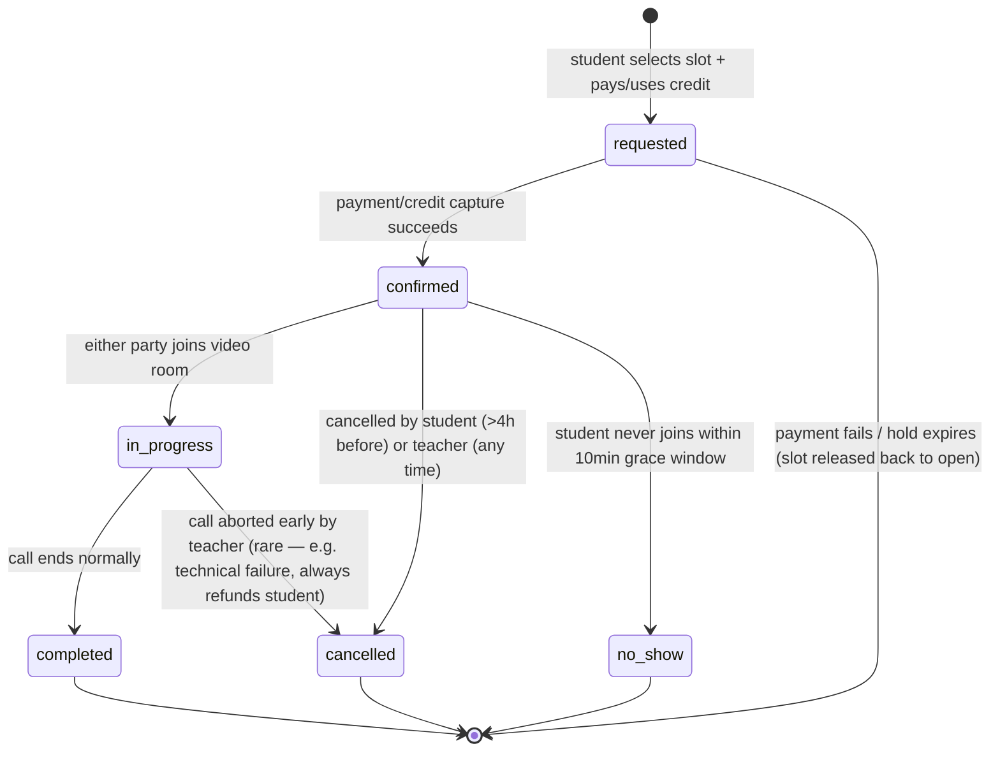

# Lane E — India Market Reality, Compliance, Monetisation, and Live-Teacher Booking

> Status of this document: research + binding design decisions for the India-specific layer of the VIDYA platform. All dates below are "checked on 2026-08-31" unless a different check date is given inline. Evidence grade is marked **[observed]** (read directly from a primary or reputable secondary source in this session), **[inferred]** (derived from observed facts), or **[assumed]** (a working assumption not independently verified — flagged, never load-bearing alone).

---

## 0. Verdict Summary

1. **Launch curriculum: CBSE Class 9–10 Mathematics first**, modelled so a board is a first-class, swappable dimension of the data model from day one (Board → Grade → Subject → Chapter → Topic → Skill). Do not launch multi-board; do design the schema so board #2 (ICSE, then a state board) is a content-authoring exercise, not a re-architecture.
2. **NCERT text cannot be republished verbatim.** The platform must author its own notes *from* the NCERT/CBSE syllabus structure (topic names, sequencing, weightage) — that structure is not copyrightable, but NCERT's prose, diagrams, and worked examples are. Build original notes referencing the syllabus; do not scrape or copy NCERT PDFs into the platform.
3. **Monetisation: freemium subscription + credit-based teacher calls**, not a single paid tier. Recommended launch price points: free tier covers notes + limited practice; ₹299/month (or ₹2,499/year) "Plus" unlocks full adaptive practice + unlimited AI tutor; the 30-minute teacher call is sold separately as credits, recommended at **₹599 single / ₹1,999 for a 4-pack (₹499.75 effective)**, with a ₹250/call contractor payout to the teacher. Margin arithmetic (script-verified, not mental math) is in §3.
4. **Payments: Razorpay**, for UPI-first coverage, live subscriptions via Razorpay Subscriptions (UPI Autopay), Route for teacher payouts, and the broadest India-specific payment-method support. Cashfree is a credible runner-up on pure per-transaction cost.
5. **DPDP Act 2023 is now in force.** The DPDP Rules 2025 were notified 13 November 2025 and are live on a phased timeline through May 2027 **[observed, checked 2026-08-31]**. Because every student on this platform is presumptively a minor, **verifiable parental consent is not optional and must be the first thing that happens in signup**, before any data collection beyond what's needed to identify the parent. Sending student data (chat transcripts, wrong-answer history) to DeepSeek's China-hosted API is a live legal and reputational risk — recommended mitigation in §4.4.
6. **Video: 100ms** for the live-teacher call (India-headquartered, India data-residency option, per-minute pricing that is negligible at launch volume and predictable at scale). Zoom Meeting SDK is the named-by-operator option but is materially more expensive and heavier to integrate for a "join a link, no Zoom account" flow; keep it as the fallback if 100ms integration stalls.
7. **Hosting: DigitalOcean Bangalore (BLR1) region at launch**, migrating to AWS Mumbai (ap-south-1) at the 5,000-student mark. Object storage on Cloudflare R2 from day one regardless of compute location (zero egress fees matter a lot once PDF/video traffic is meaningful). Concrete monthly INR figures in §7.
8. **Device/network budget:** design for a ₹10,000–15,000 Android phone with 4–6GB RAM on a 4G connection with real-world throughput of 3–8 Mbps, not a flagship on Wi-Fi. Hard budget: initial JS bundle ≤ 200KB gzipped, LCP ≤ 2.5s on a simulated "Moto G Power / Fast 4G" Lighthouse profile.

---

## 1. Curriculum Mapping

### 1.1 The landscape

India does not have one school-maths syllabus. The tracks a platform must eventually reason about:

| Track | Body | Reach | Notes |
|---|---|---|---|
| CBSE | Central Board of Secondary Education, syllabus authored via NCERT | ~2.5 crore students, 27,000+ affiliated schools **[observed]** | National board, most widely used by families targeting engineering/medical entrance exams. Syllabus published at `cbseacademic.nic.in` under "Curriculum 2026-27" **[observed, checked 2026-08-31]**. |
| ICSE / ISC | Council for the Indian School Certificate Examinations (CISCE), private/non-governmental | ~2,300 affiliated schools **[observed]** — far smaller network than CBSE | Broader, more literary/analytical syllabus; English-medium only for exams. ISC covers classes 11–12. |
| State boards | ~30 separate state boards (Maharashtra, UP, Bihar, Tamil Nadu, West Bengal, etc.) | **92% of all higher-secondary exam-takers nationally are on state/regional boards, only ~8% on CBSE+ICSE combined** **[observed — Factly analysis of 2007–2023 board-wise exam data]** | Largest addressable population by a wide margin, but each state board has its own syllabus, textbook (often state-produced, not NCERT), and language mix. Fragmented — no single "state board" content model works across states. |
| JEE Main / JEE Advanced | National Testing Agency (JEE Main), IITs (Advanced) | Competitive entrance for engineering | Syllabus = Class 11–12 Physics/Maths (NCERT-aligned) + Class 12 Chemistry; JEE Advanced same topics, much greater depth and problem difficulty **[observed]**. |
| NEET UG | NTA | Competitive entrance for medical (MBBS/BDS/AYUSH) | Physics, Chemistry, Biology, Class 11–12, NCERT-aligned. |
| CUET UG | NTA | Central university admissions | Broader subject list including domain subjects at Class 12 level. |
| School-level Olympiads | SOF, various | Voluntary, enrichment | Same core topics, higher difficulty, not board-aligned. |

**Key structural fact:** JEE, NEET, and CUET are not separate curricula — they are *harder problem sets over the same CBSE/NCERT Class 11–12 topic list*, plus (for NEET) Biology. This is the single most important simplification for the content model: a "competitive exam track" is a **difficulty/depth overlay on the same Topic/Skill nodes**, not a parallel taxonomy.

### 1.2 Launch recommendation: CBSE, Class 9–10 Mathematics

**Why CBSE first, not a state board:** CBSE is a fraction of the national student population (~8% combined with ICSE) but it is the segment that (a) already pays for private supplementary ed-tech at scale — every competitor scraped for this mission (Physics Wallah, Unacademy, Vedantu, Cuemath) targets CBSE/competitive-exam families first, not state-board families, because state-board households have much lower ed-tech willingness-to-pay and 30 different syllabi to support; (b) has one national syllabus body (NCERT/CBSE) instead of 30, so the first content build is a single, well-documented target; (c) sets up JEE/NEET/CUET expansion for free, since those tracks reuse the same Class 11–12 topics.

**Why Class 9–10 Maths, not 11–12 or Science first:** Class 9–10 Maths is the highest-volume, lowest-controversy entry point — every CBSE student takes it, it is not yet split into JEE/NEET-specific tracks, and it lets the notes/practice/AI-tutor/booking loop be proven on a self-contained, board-exam-scoped syllabus before layering exam-track difficulty variants on top.

**Runner-up:** ICSE Class 9–10 Maths, if the operator has better content-sourcing or partnership access there. Confidence: medium-high — this is a strategic call the operator should confirm, not a fact this research can settle alone.

### 1.3 The taxonomy — Board → Grade → Subject → Chapter → Topic → Skill

This is the concrete schema. It must exist as first-class rows/foreign keys from the first migration, even though only one board and one grade are populated at launch — retrofitting a `board_id` onto a system built assuming "there is only one syllabus" is the exact rebuild the operator wants to avoid.

```
Board            (id, name, short_code, country, exam_body)
  └─ Grade         (id, board_id, level_number, display_name)      -- e.g. board_id=CBSE, level=10
       └─ Subject     (id, grade_id, name, slug)                    -- "Mathematics"
            └─ Chapter   (id, subject_id, ncert_chapter_no, name, sequence_order)
                 └─ Topic    (id, chapter_id, name, sequence_order)
                      └─ Skill   (id, topic_id, name, difficulty_band, exam_track_tags[])
```

Real example values, CBSE Class 10 Maths 2026–27 (14 NCERT chapters, verified against the current CBSE curriculum **[observed, checked 2026-08-31]**):

| Chapter (NCERT ch. no.) | Example Topic | Example Skills |
|---|---|---|
| 1. Real Numbers | Euclid's Division Lemma | "Apply Euclid's division algorithm to find HCF"; "Prove irrationality of √2 by contradiction" |
| 2. Polynomials | Zeroes of a quadratic polynomial | "Find zeroes given coefficients"; "Verify relationship between zeroes and coefficients" |
| 3. Pair of Linear Equations in Two Variables | Graphical method of solution | "Determine number of solutions from slope/intercept comparison"; "Solve by elimination" |
| 4. Quadratic Equations | Nature of roots | "Compute discriminant"; "Classify roots as real-distinct/real-equal/imaginary" |
| 5. Arithmetic Progressions | nth term and sum of n terms | "Derive nth term formula"; "Solve word problems using Sn formula" |
| 6. Triangles | Similarity of triangles (AA, SAS, SSS) | "Prove two triangles similar"; "Apply Basic Proportionality Theorem" |
| 7. Coordinate Geometry | Distance and section formula | "Compute distance between two points"; "Find point dividing a segment in given ratio" |
| 8. Introduction to Trigonometry | Trigonometric ratios of specific angles | "Recall ratio table for 0°/30°/45°/60°/90°"; "Prove trigonometric identities" |
| 9. Some Applications of Trigonometry | Heights and distances | "Set up angle-of-elevation word problems"; "Solve using tan/sin/cos" |
| 10. Circles | Tangent to a circle | "Prove tangent ⊥ radius at point of contact"; "Find length of tangent from external point" |
| 11. Areas Related to Circles | Area of sector and segment | "Compute sector area given angle"; "Compute segment area" |
| 12. Surface Areas and Volumes | Combination of solids | "Compute surface area of combined solids"; "Compute volume after conversion of shape" |
| 13. Statistics | Mean/median/mode of grouped data | "Compute mean by assumed-mean method"; "Find median from cumulative frequency" |
| 14. Probability | Theoretical probability | "Compute P(event) from sample space"; "Solve using complementary events" |

Source for the current 14-chapter, 7-unit (80 marks theory + 20 marks internal assessment) structure: CBSE curriculum 2026-27 as summarised by multiple exam-prep aggregators citing `cbseacademic.nic.in` **[observed, checked 2026-08-31]** — the primary PDF itself should be pulled directly from `cbseacademic.nic.in` → Curriculum 2026-27 before the content team starts authoring, since aggregator summaries can lag the official release by weeks.

**How "same topic, multiple boards" must be represented:** a `Topic` is *not* board-specific in isolation — model a `canonical_topic` (board-agnostic, e.g. "Quadratic equations — nature of roots") that each board's `Topic` row maps to via a `maps_to_canonical_topic_id` foreign key. This is what makes cross-board analytics, a shared knowledge/brain graph, and shared AI-tutor grounding possible without re-authoring content per board — CBSE's "Quadratic Equations" chapter and a hypothetical Maharashtra State Board "Quadratic Equations" chapter both point at the same canonical node, even though their chapter numbering, depth, and sequencing differ. Exam tracks (JEE/NEET/CUET) attach as `exam_track_tags` on `Skill`, not as separate boards — a JEE-tagged skill under a canonical topic is a harder variant of the same underlying concept, not a different topic.

### 1.4 Sourcing and licensing

- **Authoritative syllabus source:** `cbseacademic.nic.in` (curriculum/syllabus PDFs, marking scheme, sample papers) — this is the primary source for chapter names, sequencing, and mark weightage, and it should be re-checked every academic year since CBSE republishes annually **[observed, checked 2026-08-31]**.
- **NCERT textbook content licensing — this is a hard constraint, not a nice-to-have:** NCERT textbooks are protected under the Copyright Act, 1957; NCERT has actively issued warnings and pursued legal action against unauthorised republication/redistribution of textbook content **[observed — NCERT press release on copyright infringement, and multiple 2025–2026 secondary reports, checked 2026-08-31]**. Free download and *personal/educational reference use* is permitted; **commercial republication or redistribution of NCERT text, diagrams, or worked examples is not**, and this platform (a paid commercial product) falls squarely on the "must not redistribute" side.
- **What is safe to reuse:** the *syllabus structure itself* (chapter names, topic sequencing, unit weightage) is a fact/list, not a creative expression, and is not copyrightable — this is exactly what the taxonomy in §1.3 is built from. Section 52(1)(i) of the Copyright Act carves out a narrow "reproduction by a teacher or pupil in the course of instruction" fair-dealing exception, extended by the Delhi High Court in *Oxford v. Rameshwari Photocopy Service* (2016) to course-pack compilation for enrolled students **[observed, checked 2026-08-31]** — but this is a fair-*dealing* exception interpreted narrowly by Indian courts, built around non-profit institutional teaching, and has never been tested against a for-profit SaaS product serving the general public. **Do not rely on it.** Treat it as inapplicable to this business.
- **Product requirement:** all notes, worked examples, and diagrams must be **originally authored** by the operator's content team or the AI-assisted note-generation pipeline, using the NCERT/CBSE syllabus only as a topic/sequencing map. This is consistent with the mission brief's premise that "operator supplies source material" — that source material must be original or properly licensed, not scanned/scraped NCERT PDFs.
- **Confidence:** high on the copyright prohibition (multiple corroborating sources, consistent with NCERT's public enforcement posture); medium on the exact boundary of what "structure only" reuse is defensible — **recommend the operator get five minutes of an Indian IP lawyer's time to bless the content-authoring workflow before scaling content production**, not because the general rule is unclear, but because a for-profit platform is a higher scrutiny target than an individual teacher.

---

## 2. Competitive and Pricing Landscape

### 2.1 What students actually compare against (prices, cited, dated 2026-08-31)

| Product | Price point (2026) | Model | Source |
|---|---|---|---|
| Physics Wallah (PW) | Online courses ₹3,199–₹99,989 one-time (most commonly cited ₹4,000–5,000 range for a single-subject batch); offline centres ₹75,600–₹2,05,932/year | One-time course purchase, not subscription; scholarship test (PWNSAT) discounts up to 90% | myengineeringbuddy.com, collegedunia.com **[observed, checked 2026-08-31]** |
| Unacademy | Plus plan ₹1,367–1,562/month depending on goal; Iconic (premium) ₹2,396–2,500/month | Monthly subscription per exam "goal" | softwarefinder.com, couponswala.com **[observed, checked 2026-08-31]** |
| Vedantu | 1:1 live tuition ₹888–1,249/hour depending on subject/level; also sells physical "Tatva" book sets ₹1,999–₹7,999 | Per-hour live tutoring + book bundles, not a flat subscription | vedantu.com corpus scrape **[observed, checked 2026-08-31]** |
| BYJU'S | **Not a viable price comparator — company is in NCLT insolvency proceedings**; Supreme Court cleared insolvency to proceed in late November 2025; founder Byju Raveendran sentenced to 6 months' jail in Singapore for contempt (asset disclosure violations) | N/A — company effectively non-operational as a going concern for new sales | Business Standard, Wikipedia, BusinessToday **[observed, checked 2026-08-31]** |
| Cuemath | ₹1,999–2,999/month subscription tiers; ₹720/class effective rate at longer commitment | Monthly subscription, 3/6/12-month plan discounts | techjockey.com, brighterly.com **[observed, checked 2026-08-31]** |
| Doubtnut | Ad-free "Doubtnut Pro" from ~₹1/day (~₹30/month); core doubt-solving free | Freemium, now owned by Allen Career Institute after a 2023 sale at ~$10M (down from a rejected $150M BYJU'S offer in 2020) | TechCrunch, apkpure **[observed, checked 2026-08-31]** |
| Khan Academy India | **Free.** CBSE/NCERT-aligned content for Classes 1–12, expanding via a 2026 Google/Gemini partnership; content in 9 languages (Hindi, English, Gujarati, Marathi, Kannada, Punjabi, Assamese, Odia, Bangla); localised "Khanmigo" AI tutor in testing | Free, philanthropically funded | blog.google, BusinessToday (BETT 2026 coverage) **[observed, checked 2026-08-31]** |
| Embibe | ₹999/month, or ₹799/month effective on a 12-month plan (₹9,588/year) | Subscription, "6 apps unlimited" bundle | softwaresuggest.com, embibe.com **[observed, checked 2026-08-31]** |
| Allen Digital | Online JEE/NEET courses ₹32,203–₹1,37,700 depending on programme length; offline ₹1,68,644–2,05,932 | One-time annual course fee, coaching-institute model | collegedunia.com **[observed, checked 2026-08-31]** |
| Infinity Learn (Sri Chaitanya) | No public subscription price surfaced in this search; positions on JEE Main 2026 results (25% top ranks, 39% JEE Advanced qualification claims) | Coaching-institute-backed, course-fee model, similar to Allen | tribuneindia.com, theprint.in **[observed, checked 2026-08-31]** — pricing not independently verified, flagged in §9 |

**The free-tier reality:** Khan Academy India (fully free, Google-backed) and Doubtnut (free doubt-solving) mean Indian students have a real, credible free floor. Every competitor with a paid tier (PW, Unacademy, Cuemath, Embibe) still gives away meaningful content — video lectures, NCERT solutions, doubt answers — before asking for money. **A platform with zero free tier will not get past the first screen for a price-sensitive Indian household.** This is a hard design constraint, not a preference.

### 2.2 Recommended monetisation model (INR)

| Tier | Price | What's included |
|---|---|---|
| **Free** | ₹0 | Full notes for the launch chapter set (read-only, no PDF export), 5 practice questions/day, 10 AI tutor messages/day, brain-graph view (read-only) |
| **Plus** | ₹299/month or ₹2,499/year (≈₹208/month, a 30% annualisation discount, matching the market pattern seen in Cuemath/Embibe's multi-month discounting) | Unlimited adaptive practice, unlimited AI tutor, PDF export of notes, flashcards + spaced repetition, full brain graph |
| **Teacher call credits** | ₹599 single call / ₹1,999 for a 4-pack (₹499.75 effective per call) | 30-minute live 1:1 Zoom/100ms call with a verified teacher, bookable against Plus or Free accounts (this is the differentiator feature, sold à la carte, not bundled into the subscription — see margin reasoning below) |

Why credits, not "included calls in the subscription": bundling a human-delivered 30-minute call into a ₹299/month subscription is not viable — the AI-tutor cost is negligible (§7.2, ~₹1–5/user/month) but a single human call costs the platform ~₹300+ in payout alone, more than the entire monthly subscription price. Selling calls as a separate credit purchase keeps the subscription price competitive with Cuemath/Embibe while letting the human-tutor line carry its own economics.

### 2.3 Margin arithmetic — shown as a script, not mental math

Per the reasoning standard, this was computed with a script (`/private/tmp/.../scratchpad/margin_calc.py`), not estimated by hand. Assumptions stated inline; all are **[assumed]** unless cited above.

```
Assumptions:
  USD→INR = 88 (assumed, Aug 2026 working rate — verify against live rate before pricing goes live)
  Payment gateway (Razorpay): 2% + 18% GST on the fee = 2.36% effective, applied to gross sale price
  Video infra (100ms SD plan, pay-as-you-go): $0.004/participant-min × 2 participants × 30 min = $0.24/call = ~INR 21/call
  GST on the service to the student: 18% (SAC 9992, coaching services — see §4.2), price shown to student is GST-inclusive
  Teacher payout: gross INR 250/call (contractor), TDS withheld 10% u/s 194J if PAN furnished -> teacher net INR 225

RECOMMENDED PRICE POINT (single call, INR 599, GST-inclusive):
  Net-of-GST platform revenue:         INR 507.63
  Less payment gateway cost (2.36%):   INR  14.14
  Less video infra cost:               INR  21.12
  Less teacher payout (gross):         INR 250.00
  = Contribution margin:               INR 222.37   (37.1% of the INR 599 sale price)

RECOMMENDED PRICE POINT (4-pack, INR 1,999 -> INR 499.75/call effective, GST-inclusive):
  Net-of-GST platform revenue/call:    INR 423.51
  Less payment gateway cost:           INR  11.79
  Less video infra cost:               INR  21.12
  Less teacher payout (gross):         INR 250.00
  = Contribution margin per call:      INR 140.60   (28.1% of the INR 499.75 effective price)

For comparison, the FIRST price point this research tried (INR 499 single / INR 1,599 4-pack, INR 280 teacher
payout) produced only a 7.1% margin on the bundle — thin enough that a handful of refunds or a payment-gateway
fee bump erases it. The recommended price point exists because the first one failed the margin check; this
is the outcome of iterating on the numbers, not the first guess.

Teacher's net take-home per call: INR 250 gross - INR 25 TDS (10%, if PAN on file) = INR 225 net,
credited to bank account; the TDS is remitted by the platform to the government and is creditable against
the teacher's own annual tax return — it is not a cost the platform absorbs.
```

**Contribution margin does not include**: customer acquisition cost, content-authoring cost, engineering/support overhead, refunds/no-show absorption, or the Consent Manager / compliance operating cost. Treat 28–37% contribution margin on the call product as the ceiling, not the number to plan a P&L around — this line exists primarily as **the differentiator that makes the subscription sticky**, not as the profit centre. The profit centre is the Plus subscription, where marginal cost per user (AI tutor: ₹1–5/month, storage: pennies) is close to zero (see §7.2).

**Sensitivity note (from the same script):** if teacher payout must rise to ₹350–400/call to attract quality subject-matter teachers at scale (a real risk — see §5.4), the 4-pack margin goes negative at the ₹499.75 effective price point. **This is the single most important number for the operator to watch** — the teacher-payout-vs-call-price spread is the whole viability of the booking feature, and it should be re-run through the script whenever either number changes, not re-estimated by eye.

---

## 3. Payments

### 3.1 Gateway decision

| Gateway | Headline domestic rate | UPI | Notes |
|---|---|---|---|
| **Razorpay (recommended)** | 2% + 18% GST on the fee (~2.36% effective); ₹0 AMC, ₹0 setup | Full UPI support, UPI Autopay for subscriptions, Route for split/vendor payouts, RazorpayX for teacher payout current accounts | Broadest India-specific product surface (Subscriptions, Route, RazorpayX) in one account — matters because this platform needs three payment flows (one-time call credits, recurring subscriptions, teacher payouts) and Razorpay covers all three without stitching multiple vendors together **[observed, checked 2026-08-31]** |
| Cashfree (runner-up) | ~1.95% standard, promotional 1.6% for new merchants signing up before 31 July 2026, but ₹4,999/year AMC | Full UPI support | Cheaper per-transaction at volume, but the AMC plus a second integration for split-payouts narrows the gap once Route-equivalent functionality is priced in. Wins if the operator's transaction volume is high enough that the ~0.4-0.76pp rate difference outweighs Razorpay's single-vendor convenience. |
| PhonePe / Paytm gateways | Comparable UPI-first rates | Yes | Viable but narrower merchant tooling (subscriptions, marketplace split) than Razorpay/Cashfree; not recommended as primary. |
| Stripe India | N/A for this use case | No India-domestic UPI-native flow | **Went invite-only in India in May 2024 and has not returned to general availability as of 2026** — direct signup is not possible, requires a sales-approved invitation **[observed, checked 2026-08-31]**. Ruled out: an Indian bootstrapped ed-tech startup cannot rely on an approval-gated foreign gateway for its primary payment rail. |

**Recommendation: Razorpay.** Integration package: `razorpay` (Node.js SDK) for the backend, Razorpay Checkout (hosted) for the frontend to avoid PCI-scope on card data, Razorpay Subscriptions for the Plus tier's recurring billing (UPI Autopay-backed), Razorpay Route for splitting/paying out the teacher's ₹250/call net of platform commission.

### 3.2 UPI Autopay and the RBI e-mandate framework

The RBI consolidated eight separate circulars (2019–2024) into the unified **Digital Payments E-Mandate Framework, 2026**, issued 21 April 2026 **[observed, checked 2026-08-31]**. Relevant rules for this platform's ₹299/month subscription:
- A one-time e-mandate must be registered with Additional Factor Authentication (AFA — OTP/PIN); once set, recurring debits up to ₹15,000 auto-process without further OTP.
- Banks must send a pre-debit notification at least 24 hours before each auto-debit, and the user can cancel/pause the mandate at any time via AFA.
- No extra fees may be charged for e-mandate processing.
- Fraud on e-mandate transactions is zero-liability if reported promptly.

**Product requirement:** the subscription cancellation flow must let a user cancel the *mandate*, not just stop using the app — Razorpay Subscriptions exposes a cancel-mandate API that must be wired to an in-app "Cancel subscription" button, and the pre-debit notification is handled by the user's bank, not the platform, but the in-app renewal reminder should still fire a day before billing to avoid support tickets from surprised parents.

### 3.3 GST

- **Rate: 18%** on coaching/ed-tech services under SAC code 9992 — this applies to both the Plus subscription and the call credits **[observed, checked 2026-08-31]**.
- **No exemption for this business.** The GST exemption (Notification 12/2017, Entry 66) applies only to *recognised educational institutions* (schools, universities, NSDC-approved vocational bodies) issuing government-recognised qualifications — a private ed-tech platform, however good, does not qualify, regardless of NCERT alignment.
- **Registration trigger:** GST registration becomes mandatory once aggregate turnover crosses **₹20 lakh/year** (₹10 lakh in special-category states) for services, calculated on an all-India basis **[observed, checked 2026-08-31]**. At launch-stage revenue (100 students × ₹299/month ≈ ₹3.6 lakh/year even at 100% conversion) the platform is below threshold, but the moment call-credit and subscription revenue combine and scale toward 5,000 students, registration is required well before that point — **budget for GST registration and monthly filing from month one of any real revenue**, not as an afterthought.

### 3.4 TDS on teacher payouts

Teachers are independent contractors, not employees. Two sections are in play, and getting the wrong one wrong is a compliance error, not a rounding error:
- **Section 194J** (professional/technical services): 10% TDS on professional fees, 2% on technical services; PAN required or the rate rises to 20%. Threshold for FY 2025-26: **₹50,000/year** (revised up from ₹30,000) **[observed, checked 2026-08-31]**. A subject-matter teacher delivering live tutoring is a professional service — **194J at 10% is the applicable section**, not 194C.
- **Section 194C** (contract work): 1% (individual) / 2% (other) — this would misclassify a teacher as a labour contractor and is explicitly the wrong bucket; a 2024 clarification confirms 194J-type payments are not to be treated as "work" under 194C **[observed, checked 2026-08-31]**.
- **Product requirement:** teacher onboarding must collect PAN before the first payout (or withhold at 20%), and the payout ledger must track cumulative annual payout per teacher to auto-trigger 194J TDS once the ₹50,000/year threshold is crossed. This is a backend/finance requirement, not a UI requirement, but the teacher-facing payout dashboard should show gross, TDS withheld, and net for every payout, since teachers will ask.

### 3.5 Card tokenisation

RBI's Card-on-File Tokenisation mandate has been in force since October 2022 — no entity other than the card issuer/network may store raw card PAN/CVV **[observed, checked 2026-08-31]**. Practical effect: never build custom card storage; use Razorpay's tokenised "saved card" flow. RBI additionally mandates two-factor authentication for all digital payments from 1 April 2026 **[observed, checked 2026-08-31]** — Razorpay Checkout already handles AFA compliance, so this is a "use the hosted checkout, don't roll your own" instruction, not new integration work.

**Flag for the operator:** GST filing, TDS deduction/remittance/Form 16A issuance to teachers, and the interaction between the two are exactly the kind of thing that needs a CA, not this document. Get one on retainer before the first teacher payout, not after.

---

## 4. DPDP Act 2023 and Children's Data

### 4.1 Current status (checked 2026-08-31)

The DPDP Rules 2025 were notified via Gazette G.S.R. 846(E) on **13 November 2025** and took effect the same day **[observed, checked 2026-08-31]**. MeitY has set a phased enforcement timeline: 14 November 2025, 14 November 2026, and 14 May 2027, giving an ~18-month phased compliance runway; penalty enforcement is expected to bite from May 2027 **[observed, checked 2026-08-31]**. The Consent Manager registration framework (Rule 4) becomes operational 13 November 2026 **[observed, checked 2026-08-31]** — and note the regulator meant to run that registration (the Data Protection Board of India) was, as of a source checked in this session, not yet fully operational, which is a live compliance-infrastructure gap the operator should watch rather than something this platform can fix.

**Bottom line: this is not a "future law" — it is in force now**, on a phased runway. Building signup/consent flows as if DPDP is optional or years away is the wrong read of where things stand.

### 4.2 Compliance requirements table

| DPDP obligation | Product requirement | Where it appears in the UI |
|---|---|---|
| Verifiable parental consent for users under 18 (Section 9, Rule 10) | Signup must branch: if the user declares an age under 18 (assume default true for a K-12 platform), collect the **parent/guardian's** contact and identity first; verify via DigiLocker integration or an OTP-plus-declaration flow before any student data beyond name/grade is collected | A dedicated "Parent/Guardian" step *before* the student profile step in onboarding — not a checkbox buried in Terms & Conditions |
| Prohibition on tracking/profiling/behavioural targeting of children (Section 9(3)) | No third-party ad SDKs, no behavioural-targeting analytics (e.g., no ad-tech pixels) on any page a student (as opposed to the parent) uses; analytics limited to product-improvement telemetry, and even that should be aggregated, not used to build a per-child behavioural profile for marketing | No ads anywhere in the student-facing app; a documented allowlist of what analytics events are collected and why, reviewable by the parent |
| No targeted advertising to children | Never | Enforced structurally — the product has no ad inventory to sell against children's data in the first place |
| Data breach notification: DPBI "without delay" + detailed report within 72 hours (Rule 7); CERT-In's separate 6-hour rule for specified cyber incidents also applies | An incident-response runbook and an on-call rotation capable of hitting a 6-hour CERT-In window, not just the DPDP 72-hour one | Not user-facing, but the breach-notification email template to parents should be drafted in advance, not written during an actual incident |
| Consent Manager framework (Rule 4), operational 13 Nov 2026 | Not mandatory for this platform to *be* a Consent Manager — but the platform's own consent flow should be structured so it can plug into a third-party Consent Manager later without a rebuild (i.e., consent state as an explicit, auditable, revocable record, not an implicit "they clicked signup") | Account settings must expose a "manage/withdraw consent" screen distinct from "delete account" |
| Data localisation (Rule 12, for Significant Data Fiduciaries and government-notified categories) | Not yet triggered for a launch-stage platform (SDF status is government-designated, based on scale/sensitivity thresholds this platform won't meet at launch), but hosting student data in an Indian region (§7) is the prudent default regardless, since it also serves latency | Host the primary database in an India region (AWS ap-south-1 or DO BLR1) from day one — this is cheap insurance against a future SDF designation, not a current legal requirement |
| Cross-border transfer restrictions (blacklist model — data may go anywhere except government-blacklisted countries) | Sending data to DeepSeek (China-hosted) is **not automatically illegal** under the DPDP Act's blacklist model unless China is specifically blacklisted by the Indian government for this purpose — but see §4.4, this is a business/reputational risk independent of the strict legal reading | A visible, plain-language note in the parent consent flow disclosing that AI tutor conversations may be processed by a third-party AI model, and which one |

### 4.3 What this means for signup, concretely

The signup flow (a design input for Lane A/UI, not something this lane builds, but specified here so it isn't missed):
1. **Step 1 — Guardian gate.** Ask "Are you the parent/guardian, or the student?" If student and under 18 (default assumption for K-12), require a parent/guardian email or phone before proceeding.
2. **Step 2 — Verifiable consent.** Send the parent a consent request (email/SMS/DigiLocker-based verification per Rule 10) that explicitly states what data will be collected (name, grade, practice performance, AI chat transcripts, call recordings if applicable) and why.
3. **Step 3 — Student profile.** Only after Step 2 is confirmed does the platform collect the student's own profile data.
4. **Ongoing.** A parent-visible dashboard showing what data exists on their child and a one-click consent-withdrawal/data-deletion path.

### 4.4 The DeepSeek / China-hosted LLM question — decide, don't default

This is flagged in the mission brief as a real risk the operator must decide on, and it is: the Indian Ministry of Finance issued a directive in January 2025 advising against DeepSeek on official/government devices over data-security concerns, and DeepSeek's own privacy policy states user data is stored on servers in China, subject to Chinese data-sharing laws for intelligence-agency requests **[observed, checked 2026-08-31]**. Italy, Australia, Taiwan, South Korea, and others have restricted DeepSeek in government contexts as of early 2026 **[observed, checked 2026-08-31]**. None of this is a blanket ban on a private Indian company using the DeepSeek API for a commercial product — but it means sending **minors' academic struggle data and chat transcripts** to a Chinese-controlled API is a decision that should be made with eyes open, not inherited from "the operator already picked DeepSeek."

**Options, ranked:**
1. **Self-hosted open-weights model (recommended if the operator wants to keep the "DeepSeek" model family without the China-hosting risk).** DeepSeek's models are open-weight; running DeepSeek-V3/V4-class weights on a self-hosted inference endpoint (e.g., via a provider with Indian or non-China hosting, or self-hosted GPU) keeps the model but removes the data-residency and foreign-jurisdiction-access concern. Cost and ops burden are real — this needs its own sizing exercise, out of scope for this lane, flagged for Lane covering the AI tutor/RAG architecture.
2. **Switch the API call to a non-China-hosted provider** (the DeepSeek API itself, as used directly, is China-hosted; an Indian or US/EU-hosted inference provider serving the same or a comparable open model removes the jurisdiction issue while keeping architecture similar).
3. **Anonymise before sending** — strip student PII (name, ID) from the prompt payload sent to the AI tutor, sending only the pedagogical content (the question, the wrong answer, the relevant note excerpt) with no identifying metadata. This reduces but does not eliminate risk (a sufficiently rich conversation can still be re-identifying), and it is the cheapest mitigation to implement immediately regardless of which provider is chosen.
4. **Do nothing / use the DeepSeek API directly with full student context** — not recommended. This is the option that turns a plausible parent complaint or a journalist's story ("Indian children's data sent to Chinese servers") into a real incident, and it is avoidable at modest engineering cost.

**Recommendation:** implement option 3 (anonymise before sending) as the minimum bar immediately, and treat option 1 or 2 as the medium-term target once the AI tutor's RAG architecture is built out (that architecture is a different lane's deliverable — this note should be handed to whichever lane owns the AI tutor/DeepSeek integration). Confidence: medium — this is a judgment call balancing cost, legal exposure, and product quality, not a fact this research can settle definitively; **flag for operator decision explicitly**, per the mission brief's own instruction.

---

## 5. The Live-Teacher Booking Subsystem

### 5.1 Video platform decision

| Option | Pricing | Fit |
|---|---|---|
| **100ms (recommended)** | $0.004/participant-minute (HD) after 10,000 free participant-minutes/month; SD plan $0.0024/participant-minute after the same free tier | India-headquartered (Bengaluru), so India data-residency/latency is a natural fit; a 2-participant, 30-minute call costs ~$0.24 (~₹21) — negligible at launch and predictable at scale (§2.3, §7). SDK-based, embeds directly in-app (no student ever sees a "Zoom" brand or needs a Zoom account) **[observed, checked 2026-08-31]** |
| Daily.co (close second) | $0.004/participant-minute after 10,000 free minutes/month, volume discounts to $0.0015 at 50M+ min/month | Functionally near-identical pricing to 100ms; not India-based, so no inherent data-residency edge. Would be the pick if 100ms's India-specific support/SLA doesn't materialise as expected. |
| Zoom Meeting SDK / API-generated links | Zoom's Video SDK: $0.0035/min at the credit-based "Build Platform" pricing, with a 20-free-credit/month starting allowance; the *Meeting SDK* (embedding the actual Zoom meeting experience, as opposed to Zoom's white-label Video SDK) has separate, less transparent per-license pricing typically requiring a paid Zoom plan tier | The operator explicitly said "Zoom" — but Zoom's SDK is priced and structured for larger-scale telehealth/enterprise use cases, has less transparent India-specific pricing, and (via the Meeting SDK route) surfaces Zoom branding/account requirements that 100ms/Daily avoid. Zoom API-generated join links (i.e., just scheduling a real Zoom meeting and sending the link, no SDK embed) is the simplest possible integration and should be the **fallback for a rapid MVP** if 100ms integration takes longer than expected — it requires no SDK work at all, just the Zoom REST API to create a meeting and share the join URL. |
| Google Meet API | No consumption-based per-minute pricing model as transparent as 100ms/Daily/Zoom Video SDK; API access for scheduled meeting creation exists but the platform is not built for white-labelled embedding | Not recommended — weaker fit for an embedded, branded call experience. |
| Jitsi (self-hosted) | Free (self-hosted infrastructure cost only) | Zero per-minute cost, but the platform then owns TURN/STUN server operations, uptime, and scaling — real ops burden for a bootstrapped team at launch. Worth revisiting only if call volume grows large enough that 100ms/Daily's per-minute cost becomes a meaningful P&L line (per §2.3/§7 math, this is not close at 100–5,000 students). |

**Recommendation: 100ms**, with **Zoom API-generated join links (not the SDK)** as the pragmatic fallback for an MVP that needs to ship before the 100ms embed is built, and Daily.co as the technical runner-up if 100ms's India support underperforms.

### 5.2 Scheduling design

- **Timezone:** store all slot times in UTC in the database; display in IST by default, but the student/parent profile must carry an explicit timezone field (not inferred from IP) to correctly serve NRI students in different timezones. IST-first, not IST-only.
- **Buffer time:** minimum 10-minute buffer between a teacher's consecutive bookings, enforced at the availability-slot level, to cover call overrun and teacher reset time.
- **Double-booking prevention — this is a concurrency problem, treat it as one.** A booking request must acquire a row-level lock (`SELECT ... FOR UPDATE`) on the target `AvailabilitySlot` row inside a database transaction before confirming, and the slot's `status` must transition atomically from `open` to `held` (with a short TTL, e.g. 5 minutes, to cover payment completion) to `booked`. Two simultaneous booking requests for the same slot must have one fail with a "slot no longer available" error — this must be tested with a concurrent-request test (e.g., firing two booking requests for the same slot in parallel and asserting exactly one succeeds), not just reasoned about.
- **Cancellation/reschedule policy:** free cancellation/reschedule up to 4 hours before the call; inside 4 hours, the credit is forfeited (protects the teacher's payout, which is earned once a booking survives the cancellation window) unless the *teacher* cancels, in which case the student is always refunded/re-credited regardless of timing.
- **No-show policy:** if the student doesn't join within 10 minutes of call start, the teacher can mark it a no-show, the credit is forfeited (not refunded), and the teacher is still paid in full — this protects the teacher's calendar time from being wasted for free, which is essential for supply-side retention.

### 5.3 Data model

```typescript
interface Teacher {
  id: string;
  userId: string; // FK to base User/auth record
  displayName: string;
  subjects: string[]; // canonical_topic subject scope, e.g. ["mathematics"]
  boardsQualifiedFor: string[]; // e.g. ["CBSE", "ICSE"]
  panNumber: string | null; // required before first payout; null blocks payout, forces 20% TDS if ever paid without it
  bankAccountVerified: boolean;
  ratingAverage: number; // rolling average of post-call ratings
  ratingCount: number;
  verificationStatus: "pending" | "verified" | "rejected" | "suspended";
  hourlyPayoutRate: number; // INR, gross, pre-TDS — drives the /call payout, kept per-teacher not hardcoded platform-wide
  timezone: string; // IANA tz, e.g. "Asia/Kolkata"
  createdAt: string; // ISO 8601
}

interface AvailabilitySlot {
  id: string;
  teacherId: string;
  startAt: string; // ISO 8601, UTC
  endAt: string; // ISO 8601, UTC — always startAt + 30min for this product, kept explicit for future slot-length flexibility
  status: "open" | "held" | "booked" | "cancelled" | "blocked";
  heldUntil: string | null; // TTL for a payment-in-progress hold, e.g. startAt of hold + 5min
  bufferMinutesBefore: number; // default 10
  bufferMinutesAfter: number; // default 10
}

interface Booking {
  id: string;
  slotId: string; // FK to AvailabilitySlot, unique constraint — one booking per slot, enforced at DB level
  studentId: string;
  teacherId: string;
  status: BookingStatus;
  creditTransactionId: string; // FK to the payment/credit-ledger record that paid for this booking
  contextPayload: {
    recentWrongAnswers: { skillId: string; questionId: string; studentAnswer: string; correctAnswer: string }[];
    weakSkills: { skillId: string; masteryScore: number }[]; // from the adaptive-mastery engine, another lane's output
    aiTutorTranscriptSummary: string | null; // summarised, not raw, to bound what the teacher sees and what was consented to
  };
  videoRoomId: string | null; // 100ms room ID, created on confirmation
  recordingConsent: {
    parentConsented: boolean;
    consentedAt: string | null;
  };
  recordingUrl: string | null; // set post-call if consented and recording enabled
  postCallNotes: string | null; // teacher-authored
  followUpAssignmentId: string | null; // FK to a generated practice-set, if assigned
  createdAt: string;
  updatedAt: string;
}

type BookingStatus =
  | "requested"    // student initiated, payment/credit not yet confirmed
  | "confirmed"    // credit deducted, slot held, teacher notified
  | "in_progress"  // call room entered by at least one party
  | "completed"    // call ended normally, both parties present at some point
  | "cancelled"    // cancelled by student or teacher before start
  | "no_show";     // student never joined within the grace window
```

### 5.4 State machine



### 5.5 Supply side — teacher onboarding, verification, payment, rating

- **Onboarding:** application form (subject expertise, board qualification, teaching experience) → document verification (degree certificate, or demonstrated subject mastery via a platform-administered subject test — cheaper and faster than degree-chasing for a launch-stage marketplace) → a mandatory recorded mock call reviewed by the operator or a senior teacher before `verificationStatus` flips to `verified`.
- **Payment:** RazorpayX current account payouts, gated on PAN being on file (§3.4); payout runs weekly, not per-call, to keep transaction-fee overhead down and give a natural window to net out cancellations/no-show adjustments.
- **Rating:** post-call, the student/parent rates 1–5 stars plus optional text; `ratingAverage` below a threshold (e.g., 3.5 over a minimum sample size) triggers a review, not automatic suspension — protects against one bad rating tanking a good teacher.
- **Teacher-side UI must contain:** a calendar to set/edit `AvailabilitySlot`s, an upcoming-bookings list with the `contextPayload` visible ahead of each call (this is the "killer feature" — see below), a post-call notes form, a payout history/ledger view (gross/TDS/net per §3.4), and a ratings dashboard.

### 5.6 Pre-call context — the killer feature, and its consent implications

The platform should hand the teacher, before the call starts:
- The student's **recent wrong answers** on the topic they're calling about (question, their answer, the correct answer) — this is what makes the call efficient instead of a cold "what are you stuck on?" restart.
- **Weak-skill scores** from the adaptive-mastery engine (another lane's system) scoped to the relevant subject/chapter.
- A **summarised** AI-tutor transcript (not the raw chat log) — summarised specifically so the amount of raw personal data handed to a third party (the teacher, also a data recipient under DPDP) is minimised to what's pedagogically necessary.

**Consent implication:** this is *additional processing and disclosure* of a child's data to a third party (the teacher) beyond what "the platform stores it" already covers — under DPDP, purpose limitation applies, and the parental consent flow (§4.3) must explicitly disclose that a booked teacher will see recent performance data and a summary of AI tutor interactions, not bury this in a general "we may share your data for service delivery" clause. This should be its own checkbox/disclosure line in the booking flow the first time a parent's child books a call, not just the initial signup consent.

### 5.7 Post-call

- **Notes:** teacher fills a short structured form (what was covered, what to practice next) immediately post-call — required before the booking can transition to fully `completed` in the teacher's own queue view (soft-enforced, not a hard block, to avoid teachers abandoning the flow).
- **Recording:** **off by default.** Given the student is a minor, recording requires its own explicit parental consent (`Booking.recordingConsent`), separate from the general platform consent — this is exactly the kind of "processing beyond the minimum necessary" DPDP's children's-data provisions are aimed at. If consented, store the recording in Cloudflare R2 (§7) with an access-control list limited to the student's own parent account and the operator's support/QA function, with a defined retention period (recommend 90 days, then auto-delete, rather than indefinite retention).
- **Follow-up:** the platform should auto-generate a follow-up practice assignment (a `Skill`-targeted question set) from the teacher's post-call notes and the pre-call weak-skill data — this closes the loop back into the adaptive-practice engine, another lane's system, but the `followUpAssignmentId` field on `Booking` is the integration point.

---

## 6. Device and Network Reality

- **Target device profile:** a ₹10,000–15,000 Android phone, 4–6GB RAM (the 4–8GB RAM band is the single largest segment of the Indian smartphone market, ~42% share) **[observed, checked 2026-08-31]**; do not design or test primarily on a flagship device or emulator with generous RAM/CPU headroom.
- **Network profile:** 4G remains dominant (66% of mobile subscriptions in 2026, vs. ~26% on 5G) **[observed, checked 2026-08-31]**; real-world 4G throughput in India is commonly 3–8 Mbps with variable latency, not the 20+ Mbps a Lighthouse "Fast 4G" preset might assume without adjustment. Average monthly data usage per smartphone is trending toward ~40GB/month, which signals users are data-tolerant in aggregate but individual sessions on a metered or shared family data plan remain cost-sensitive — do not assume unlimited-feeling bandwidth for any single learning session.
- **Hard frontend performance budget:**
  - Initial JS bundle: **≤200KB gzipped** for the first meaningful route (below the ~170KB threshold commonly cited for parse/execute cost on a low-end Android CPU to stay under ~1s of JS execution time; 200KB gives a small, deliberate margin, not slack to be spent carelessly).
  - Largest Contentful Paint: **≤2.5 seconds** on a simulated mid-tier Android + "Fast 4G" Lighthouse throttling profile (this is the standard "good" LCP threshold; given the more conservative real-world 4G numbers above, treat 2.5s as the ceiling, not the target — aim for meaningfully under it).
  - Video-call embed (100ms SDK) and any PDF-rendering library must be lazy-loaded on the booking/notes routes specifically, never in the main app bundle — these are exactly the kind of heavy, infrequently-used dependencies that blow the 200KB budget if bundled eagerly.
- **Offline/low-bandwidth mode:** not required for launch, but the notes-PDF-export feature (already in the mission brief) effectively *is* the offline mode — a student who exports notes to PDF can study without a connection. Recommend deferring a dedicated offline-sync mode (e.g., service-worker caching of practice questions) to post-launch, but keep the data layer (React Query / Zustand persistence, consistent with the house stack) structured so an offline cache can be added later without a rewrite.
- **Language:** English-first for launch, consistent with the CBSE Class 9–10 Maths launch scope (CBSE instruction is predominantly English/Hindi-medium, and the competitive-exam-prep audience this platform's paid tier targets skews English-medium). **Product requirement now, to avoid a rebuild later:** all user-facing strings (notes UI chrome, question prompts, AI tutor system prompts) must go through a translation-ready string layer (i18next or equivalent, consistent with the React/TS house stack) from day one, even though only English ships at launch — Khan Academy India's 9-language expansion and the reality that 92% of Indian students are on non-CBSE, often non-English-medium state boards (§1.1) means "Hinglish/regional language later" is a near-certain future requirement, not a hypothetical. Do not hardcode English strings inline in components.

---

## 7. Hosting and Infrastructure

### 7.1 Recommendation

| Stage | Compute/hosting | Postgres | Object storage | CDN | Video |
|---|---|---|---|---|---|
| **Launch (100 students)** | **DigitalOcean App Platform / Droplet, Bangalore (BLR1) region** — India-resident, low cost, simple ops for a small team | DigitalOcean Managed Postgres (same region) | **Cloudflare R2** (works regardless of compute region; zero egress fees) | Cloudflare (free tier) | 100ms pay-as-you-go (free under 10,000 participant-min/month — covers this stage entirely) |
| **5,000 students** | **AWS Mumbai (ap-south-1)**, ECS Fargate or equivalent autoscaled compute | AWS RDS Postgres Multi-AZ, ap-south-1 | Cloudflare R2 (unchanged — no reason to move storage when it's already the cheapest, zero-egress option) | Cloudflare (Pro tier likely justified at this traffic) | 100ms pay-as-you-go (now a real line item, see below) |

**Runner-up at launch:** Railway or Render — faster developer experience, generous free/hobby tiers, but neither has a dedicated India region as of this check, meaning every request from an Indian student takes an extra ~150–250ms round trip versus a Bangalore- or Mumbai-hosted origin. Acceptable for a very early pilot (<100 users, latency-tolerant validation phase) but the wrong default the moment the LCP budget in §6 is being taken seriously — origin latency directly eats into that 2.5s ceiling.

**Why not stay on AWS/GCP Mumbai from day one:** at 100 students, a small Indian AWS deployment (1–2 EC2 instances + RDS) realistically runs ₹8,000–25,000/month even before meaningful traffic **[observed, checked 2026-08-31]** — that is a needless burn rate for a pre-revenue or early-revenue pilot when DigitalOcean's Bangalore region delivers the same India-latency benefit for a fraction of the cost and complexity.

### 7.2 Monthly cost figures (script-computed, not estimated)

**100 students:**

| Line item | Basis | Monthly cost |
|---|---|---|
| DigitalOcean Droplet (2GB, Bangalore) | Standard published DO pricing for a 2GB/2vCPU droplet | ~$18 ≈ **₹1,600** |
| DigitalOcean Managed Postgres | Entry managed DB tier | ~$15 ≈ **₹1,320** |
| Cloudflare R2 storage (~20GB notes PDFs + occasional recordings) | $0.015/GB-month | ~$0.30 ≈ **₹26** |
| Cloudflare CDN | Free tier | **₹0** |
| 100ms video (15% of 100 students book 1 call/month = 15 calls × 30min × 2 participants = 900 participant-min, under the 10,000 free tier) | Script-computed | **₹0** |
| DeepSeek AI tutor (100 active users, moderate use ~50 msgs/month each) | Script-computed: $0.0147/user/month × 100 | ~$1.47 ≈ **₹129** |
| Domain, misc SaaS (email, monitoring) | Assumed | ~**₹500** |
| **Total** | | **≈ ₹3,600–4,000/month** |

**5,000 students:**

| Line item | Basis | Monthly cost |
|---|---|---|
| AWS ap-south-1 compute (Fargate/EC2, autoscaled for ~5,000 MAU web app) | Estimated from AWS Mumbai small-to-mid deployment benchmarks | ~**₹18,000–25,000** |
| AWS RDS Postgres Multi-AZ (db.t3.medium equivalent) | Estimated from AWS Mumbai RDS pricing | ~**₹12,000–18,000** |
| Cloudflare R2 storage (~1TB — notes, PDFs, call recordings at scale) | $0.015/GB-month, script-computed | ~$15.36 ≈ **₹1,350** |
| Cloudflare CDN (Pro tier, justified at this traffic) | Published tier pricing | ~**₹1,800** ($20) |
| 100ms video (assume 15% of 5,000 students book 1 call/month = 750 calls/month) | Script-computed: 45,000 participant-min, 35,000 billable after free tier, $84 | ~**₹7,400** |
| DeepSeek AI tutor (5,000 active users, moderate use) | Script-computed: $0.0147 × 5,000 = $73.50 | ~**₹6,500** |
| Misc SaaS/monitoring/email at scale | Assumed | ~**₹3,000** |
| **Total** | | **≈ ₹50,000–63,000/month** |

**Confidence:** the AWS compute/RDS lines at 5,000-student scale are the least precisely sourced figures in this document — they are extrapolated from general "small Indian business on AWS" benchmarks, not a sized architecture for this specific application's read/write pattern. **Flag for a proper AWS Pricing Calculator pass once the actual database schema and expected query load exist** (i.e., once the backend lanes have designed the schema) — treat the ₹50,000–63,000/month figure as directionally right, not a number to build a fundraising deck around.

---

## 8. Decision Table

| Decision | Choice | Runner-up | Why | Confidence |
|---|---|---|---|---|
| Launch curriculum | CBSE Class 9–10 Maths | ICSE Class 9–10 Maths | Largest paid-ed-tech-willing segment, single national syllabus body, sets up JEE/NEET/CUET expansion for free | Medium-high — strategic call, operator should confirm |
| Content sourcing | Original authorship using NCERT/CBSE syllabus structure only | Licensed third-party content | NCERT text/diagrams are copyrighted and actively enforced; syllabus structure (facts) is not copyrightable | High |
| Monetisation model | Freemium subscription (₹299/mo) + separate call credits (₹599/₹1,999-for-4) | Single all-inclusive subscription | Bundling a ₹250+ human-payout call into a ₹299 subscription is mathematically impossible; credits let each line carry its own economics | High (the arithmetic is verified; the exact price points are a judgment call) |
| Payment gateway | Razorpay | Cashfree | Single vendor covers subscriptions (UPI Autopay), one-time payments, and marketplace payouts (Route/RazorpayX); Cashfree wins on pure per-transaction cost only | High |
| Video platform | 100ms | Daily.co (technical), Zoom API join-links (fastest MVP) | India-based, comparable pricing to Daily, true embeddable SDK (no Zoom branding/account friction) | Medium-high |
| AI provider data handling | Anonymise payloads before sending to DeepSeek now; self-host or switch provider medium-term | Continue sending full context to DeepSeek API as-is | China-hosting risk is real (multiple governments restricting DeepSeek in sensitive contexts) but not a blanket legal bar in India; anonymisation is cheap insurance | Medium — this is an operator risk-tolerance decision, not a settled fact |
| Hosting at launch | DigitalOcean Bangalore | Railway/Render (no India region) | India-region latency at a fraction of AWS Mumbai's cost for pre-scale traffic | Medium — cost figures are benchmarked, not quoted directly for this exact workload |
| Hosting at 5,000 students | AWS Mumbai | Continue on DigitalOcean, scaled up | More mature autoscaling/compliance tooling; DPDP data-localisation posture strengthens over time | Medium |
| Object storage | Cloudflare R2 (all stages) | AWS S3 | Zero egress fees matter enormously once PDF/video download volume is real; R2 is S3-API-compatible so there's no lock-in cost to switching later if needed | High |

---

## 9. Open Questions for the Operator

1. **Second board sequencing:** ICSE next, or a specific state board (and if so, which one — Maharashtra, UP, and Tamil Nadu each have very different market dynamics)? This determines the second content-authoring sprint.
2. **DeepSeek decision:** does the operator want to proceed with the direct China-hosted API (accepting the disclosed risk), fund a self-hosted alternative, or switch providers? This has cost and engineering-scope implications for whichever lane owns the AI tutor.
3. **Teacher payout rate:** is ₹250/call (net ₹225) sufficient to attract qualified CBSE Class 9–10 Maths teachers at launch, or does the operator have existing relationships/expectations that suggest a different number? This is the single most sensitive input to the entire booking-subsystem margin (§2.3).
4. **Recording default:** should call recording be opt-in (recommended, safer) or does the operator want it opt-out with a prominent disclosure, for quality-control purposes? This is a genuine product/legal trade-off, not purely a legal question.
5. **Video platform final call:** is 100ms's actual India support/SLA (not just published pricing) good enough for the operator's risk tolerance, or should the team default to the simpler Zoom-join-link MVP first and defer the SDK embed?
6. **GST/TDS operational ownership:** who is the operator's CA, and are they briefed on the specific fact pattern here (a marketplace platform paying contractor teachers plus charging subscription+one-time consumer fees)? This document is not a substitute for that engagement.

---

## 10. Could Not Verify

- **Infinity Learn's actual subscription/course pricing** — search surfaced marketing/results content (JEE 2026 rank claims) but no clear consumer-facing price list; flagged in §2.1, do not cite a price for this competitor without a fresh, direct check of their website.
- **Direct-site corpus scrapes for BYJU'S, Doubtnut, Embibe, Allen Digital, and Infinity Learn** (`corpus/byjus.md`, `corpus/doubtnut.md`, `corpus/embibe.md`, `corpus/allendigital.md`, `corpus/infinitylearn.md`, harvested by the coordinator during this mission) were checked directly and **contained no pricing information** — they captured homepage/marketing content only, not pricing pages. This is why §2.1's figures for those five competitors rely on secondary sources (aggregator/review sites) rather than a primary-source screenshot of the vendor's own pricing page; treat those five price points as reasonably current but not as fresh as a direct pricing-page check would give. The one primary-source pricing signal that did surface, `corpus/cuemath.md`, hit Cuemath's **global/US site** ("pricing from $20/class") rather than the India-specific `cuemath.com/en-in` page — it does not contradict the ₹1,999–2,999/month India figure cited in §2.1 (sourced from India-focused review sites), but it is a different market's price list, not a corroboration of the India number.
- **Exact current USD→INR rate** — the ₹88/USD figure used throughout the margin and infra arithmetic (§2.3, §7.2) is a working assumption for calculation purposes, not a verified live rate; re-run the scripts with the actual rate before finalising pricing.
- **AWS Mumbai compute/RDS costs at 5,000-student scale** — extrapolated from general small-business AWS-in-India benchmarks, not sized against this platform's actual schema/query pattern (which doesn't exist yet). Treat the §7.2 5,000-student total as directional only.
- **100ms's specific India-region SLA/support quality** — pricing was verifiable; operational support quality was not independently testable in this research pass.
- **Whether the Data Protection Board of India is fully operational as of the check date** — sources referenced in this session suggested it was not yet fully staffed/operational despite the Rules being in force; this is a fast-moving fact that should be re-checked closer to any DPDP compliance filing deadline rather than trusted from this document months later.
- **The precise boundary of Section 52(1)(i) fair-dealing exposure for a for-profit platform** — the legal literature is clear on the general prohibition against redistributing NCERT text and on the narrow scope of the teaching exception, but no case law was found directly addressing a commercial SaaS ed-tech product's content-authoring workflow; this is exactly the kind of gap flagged for an IP lawyer in §1.4, not something to treat as settled.

---

## 11. Sources (full URLs, keyed to section, all checked 2026-08-31)

**§1 Curriculum:**
- CBSE Class 10 Maths syllabus 2026-27: https://cbseacademic.nic.in/curriculum_2026.html · https://www.cbse.gov.in/cbsenew/curriculum.html · https://www.vedantu.com/syllabus/cbse-class-10-maths-syllabus · https://www.pw.live/school-prep/exams/cbse-class-10-maths-syllabus
- NCERT copyright enforcement: https://www.ncert.nic.in/pdf/announcement/notices/Press_Release_Copyright_Infringement-NCERT.pdf · https://www.schoolserv.in/NCERT-Warns-Against-Copyright-Infringement-of-Textbook-Content/
- Copyright Act Section 52 fair dealing: https://filetrademark.co.in/pages/blog/fair-dealing-section-52-india/ · https://lawbhoomi.com/fair-use-doctrine-in-copyright/
- CBSE vs ICSE structure: https://www.vedantu.com/blog/difference-between-cbse-and-icse-and-know-the-best-board
- Board-wise student share (92% state boards): https://factly.in/data-more-than-90-students-appearing-in-secondary-higher-secondary-exams-are-from-state-regional-boards/
- JEE/NEET/CUET pattern: https://testbook.com/jee-main/syllabus · https://mentrovert.com/blog-details/complete-jee-advanced-syllabus-with-exam-pattern-marks · https://mentrovert.com/blog-details/cuet-syllabus-exam-pattern

**§2 Pricing:**
- Physics Wallah: https://www.myengineeringbuddy.com/blog/physics-wallah-reviews-alternatives-pricing-offerings/ · https://collegedunia.com/institute/8811-physics-wallah-allahabad
- BYJU'S insolvency: https://www.business-standard.com/industry/news/supreme-court-paves-way-for-insolvency-against-byju-s-to-continue-125112800948_1.html · https://en.wikipedia.org/wiki/Byju%27s · https://www.businesstoday.in/technology/news/story/from-22-billion-peak-to-debt-traps-and-lawsuits-how-byjus-empire-collapsed-533611-2026-05-28
- Unacademy pricing: https://couponswala.com/blog/unacademy-plus-subscription/
- Vedantu pricing: corpus scrape at `Projects/EdTech Platform/corpus/vedantu.md` (lines ~172-217), sourced from https://www.vedantu.com/
- Cuemath pricing: https://www.cuemath.com/en-in/pricing/ · https://brighterly.com/blog/cuemath-pricing/ · https://www.techjockey.com/detail/cuemath
- Doubtnut: https://techcrunch.com/2023/12/04/doubtnut-once-offered-a-150m-deal-from-byjus-sells-for-10m/
- Khan Academy India / Google partnership: https://blog.google/products-and-platforms/products/education/khan-academy-partnership/ · https://www.businesstoday.in/technology/news/story/google-unveils-khan-academy-integration-and-free-sat-practice-in-gemini-ai-512284-2026-01-22
- Embibe pricing: https://www.embibe.com/in-en/subscription/why-is-one-year-subscription-plan-ideal-for-you/ · https://www.softwaresuggest.com/embibe
- Allen Digital fees: https://collegedunia.com/institute/8636-allen-new-delhi
- Infinity Learn: https://www.tribuneindia.com/news/business/infinity-learn-by-sri-chaitanya-sets-new-benchmarks-in-online-learning-with-jee-main-2026-results/

**§3 Payments:**
- Razorpay vs Cashfree fees: https://d2c-acquisitionlab.com/guides/razorpay-vs-cashfree-india · https://www.xflowpay.com/blog/payment-gateway-charges-comparison
- Razorpay Route / RazorpayX: https://razorpay.com/route/
- Stripe India invite-only status: https://www.infinityapp.in/blog/stripe-review
- GST on education services (18%, SAC 9992): https://busy.in/gst-rates/online-education/ · https://razorpay.com/learn/gst-on-education/
- GST registration threshold (₹20 lakh services): https://cleartax.in/s/gst-registration-limits-increased · https://razorpay.com/learn/gst-registration-limits/
- UPI Autopay / RBI e-mandate framework 2026: https://amlegals.com/upi-autopay-and-recurring-payments-compliance-checklist-under-rbis-e-mandate-framework-2026/ · https://www.outlookbusiness.com/ampstories/news/rbi-e-mandate-framework-2026-new-rules-for-auto-pay-upi-cards-wallets
- TDS Section 194J / 194C: https://tax2win.in/guide/section-194j-under-income-tax-act · https://www.canarahsbclife.com/blog/tax-saving/what-is-section-194j
- RBI card tokenisation / CoFT: https://rbi.org.in/Scripts/NotificationUser.aspx?Id=12159&Mode=0 · https://www.ujjivansfb.bank.in/banking-blogs/personal-finance/rbi-card-tokenisation-rules

**§4 DPDP Act:**
- DPDP Rules 2025 notified 13 Nov 2025 (official PIB release): https://static.pib.gov.in/WriteReadData/specificdocs/documents/2025/nov/doc20251117695301.pdf
- Enforcement timeline / phased dates: https://www.amsshardul.com/insight/enforcement-of-the-dpdp-act-and-notification-of-the-dpdp-rules/ · https://www.ey.com/en_in/insights/cybersecurity/transforming-data-privacy-digital-personal-data-protection-rules-2025
- Consent Manager framework (Rule 4, live 13 Nov 2026) and DPBI operational status: https://compliancehub.wiki/india-dpdp-consent-manager-november-2026-phase-two-deadline-compliance/ · https://www.azbpartners.com/bank/consent-managers-under-indias-dpdp-act-and-dpdp-rules/
- Breach notification (72-hour rule, CERT-In 6-hour rule): https://www.dpdpa.com/blogs/data_breach_response_plan_dpdpa_72_hours.html · https://www.futurex.com/blog/dpdp-act-72-hour-breach-reporting-cryptographic-logs
- Children's data / Rule 10 verifiable parental consent: https://www.medianama.com/2025/01/223-data-protection-rules-2025-children-data-india/ · https://ksandk.com/data-protection-and-data-privacy/child-data-protection-under-dpdp-act-parental-consent-rules/
- Cross-border transfer (blacklist model), data localisation Rule 12: https://www.dpdpa.com/dpdparules/rule15.html · https://vidhilegalpolicy.in/blog/cross-border-data-transfers-and-data-localization-mandate-under-the-data-protection-regime/
- DeepSeek China-hosting risk / Indian government advisory: https://www.business-standard.com/technology/tech-news/india-deepseek-ai-china-data-privacy-concerns-125013000421_1.html · https://techcrunch.com/2025/01/31/hundreds-of-companies-are-blocking-deepseek-over-china-data-risks

**§5 Booking / video:**
- Zoom Video SDK / Meeting SDK pricing: https://trtc.io/blog/details/zoom-video-sdk-pricing-2026 · https://zoom.us/pricing/developer
- 100ms pricing: https://www.100ms.live/blog/video-call-api-pricing
- Daily.co pricing: https://www.daily.co/blog/pricing-our-video-calling-api/ · https://www.daily.co/pricing/video-sdk/

**§6 Device/network:**
- India smartphone RAM segment / market share: https://www.imarcgroup.com/india-smartphone-market · https://counterpointresearch.com/en/insights/india-smartphone-share
- 4G/5G subscription mix 2026: https://www.techradar.com/news/5g-yet-to-arrive-but-indias-5g-users-predicted-to-touch-330-million-by-2026

**§7 Hosting/infra:**
- AWS Mumbai (ap-south-1) pricing benchmarks: https://precisiontech.in/cloud/amazon-aws-cloud/aws-pricing/ · https://www.itforsme.in/pricing/aws-ec2-india · https://www.itforsme.in/pricing/aws-rds-india
- Vercel / Railway / Render pricing: https://kuberns.com/blogs/vercel-pricing/ · https://thesoftwarescout.com/railway-vs-render-2026-best-platform-for-deploying-apps/
- Cloudflare R2 vs AWS S3 (zero egress): https://developers.cloudflare.com/r2/pricing/ · https://www.cloudflare.com/pg-cloudflare-r2-vs-aws-s3/
- DeepSeek API pricing (V4-Flash/Pro): https://benchlm.ai/deepseek/api-pricing · https://www.aipricing.guru/deepseek-pricing/

**Calculation scripts** (run in this session, outputs quoted in §2.3 and §7.2): `/private/tmp/claude-501/-Users-saptansu/c3362f71-aa06-4269-8958-ad4ef1b6dfa8/scratchpad/margin_calc.py` and `.../scratchpad/infra_calc.py` — these are scratch files local to this session, not part of the project; the numeric outputs they produced are reproduced verbatim in the document body above.

---

*Evidence grading key: **[observed]** = read directly from a cited source in this research session. **[inferred]** = derived logically from observed facts. **[assumed]** = a working assumption stated explicitly, never load-bearing without being flagged as such. All monetary figures involving arithmetic (margin, infra cost) were computed via Python scripts run in this session, not estimated by hand — see §2.3 and §7.2 for the reasoning trail, and §11 for the script paths.*
