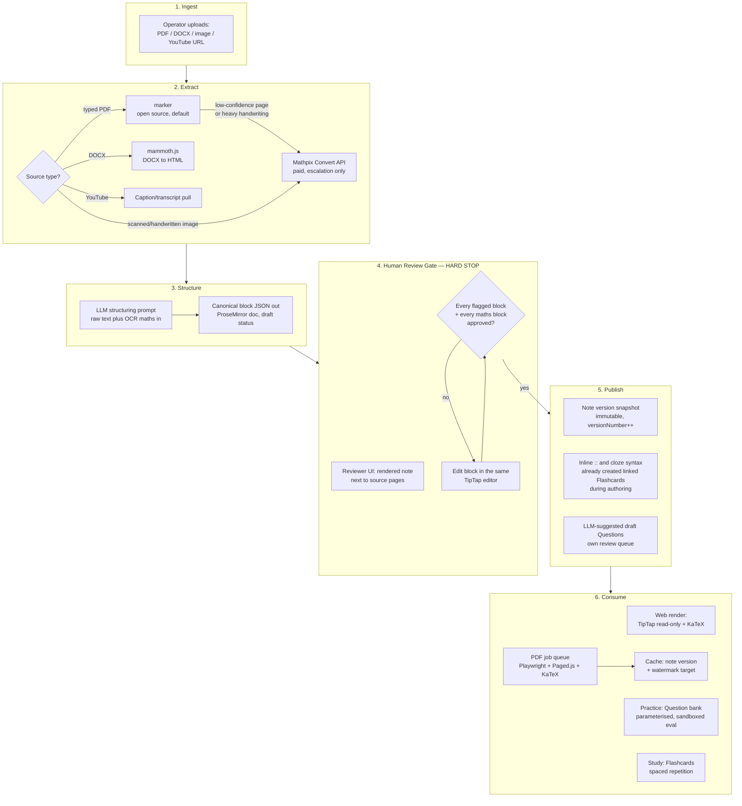

# Lane F — The Content Pipeline: Authoring, Maths Typesetting, PDF Export, Question Bank

Status: **DONE_WITH_CONCERNS** (see §13 for the concerns). Evidence grading used throughout: **[O]** observed (read directly from a fetched source), **[I]** inferred (follows from something observed), **[A]** assumed (imported prior belief, flagged, not load-bearing on its own). External claims carry a URL and the access date (2026-08-31, this session).

---

## 1. Verdict Summary

| # | Question | Verdict | Confidence |
|---|---|---|---|
| Canonical format | TipTap/ProseMirror JSON is the single source of truth, not Markdown+MDX and not a hand-rolled block-JSON dialect. | High |
| Maths renderer | KaTeX primary, with the official `@tiptap/extension-mathematics` (MIT, free) plus KaTeX's own `mhchem` contrib module for chemistry. MathJax v3 is the fallback if a screen-reader-accessibility audit later demands richer MathML. | High |
| PDF route | Headless Chromium (Playwright) print, using Paged.js as a print-CSS polyfill, rendering the exact same KaTeX HTML the web app already produces. Queued job, not synchronous; cached per (note version, watermark target). | High |
| Ingestion / OCR | `marker` (open source, Apache-2.0 code since v2.0, July 2026) as the default PDF/DOCX-adjacent extractor; escalate only low-confidence pages or handwritten-image ingestion to Mathpix (paid, $0.002/image and up). Nougat is explicitly rejected. | Medium-High |
| AI note authoring | LLM structures raw material into the canonical block JSON, but nothing reaches students without an explicit human-approval gate — no exceptions, regardless of the model's self-reported confidence. | High |
| Flashcards/questions | RemNote-style inline `Term :: Definition` and `{{cloze}}` syntax create linked entities addressed by stable block IDs; distractors for MCQs are generated primarily by deterministic error-transform (not free LLM invention), with LLM suggestions as a reviewer-only queue. | Medium-High |
| Parameterised questions | Evaluated with a sandboxed expression engine (`mathjs` expression parser or `expr-eval`), never `eval`; every question is validated against N random seeds at publish time. | High |

**The one non-negotiable this whole lane hangs off:** an AI-authored or AI-modified block never reaches a student without a human clicking "approve" on that exact block. Every other decision below is built to make that gate cheap to run, not to route around it.

---

## 2. The Content Pipeline (mermaid)



---

## 3. Pipeline Stages in Detail

### 3.1 Ingest and extract (research item 4)

| Source | Tool | Cost | Note |
|---|---|---|---|
| Typed/digital PDF | `marker` (datalab-to/marker) | Free (code Apache-2.0 since v2.0, released 2026-07-20 **[O]**; model weights free under a modified OpenRAIL-M for orgs under $5M funding/revenue **[O]**, https://github.com/datalab-to/marker, accessed 2026-08-31) | Benchmarks at 76.0% overall / 83.5% on born-digital PDFs on the third-party olmocr-bench, ahead of MinerU and docling **[O]** (PyPI `marker-pdf` page, accessed 2026-08-31). Good enough as the default extractor for a bootstrapped build; escalate rather than replace. |
| Scanned / handwritten image, or any `marker` page marked low-confidence | Mathpix Convert API | Pay-as-you-go from **$0.002/image**, prepaid plans from ~**$20/month**, billed monthly in arrears **[O]** (mathpix.com/pricing/api, accessed 2026-08-31) | This is the "Mathpix is not free" flag the brief asked for — budget it as a per-document line item, not a fixed cost. Reserve for the ingestion paths where accuracy genuinely matters most: handwriting and dense multi-line derivations. |
| DOCX | `mammoth.js` → HTML → same LLM structuring step | Free, open source | **Not verified**: mammoth's fidelity converting Word's native OMML equations. Flag any DOCX-sourced note containing equations for mandatory manual re-check until this is tested against real operator files (see §13). |
| YouTube transcript | Platform captions / `youtube-transcript`-style library | Free | Lower structural fidelity — treat as raw text with no layout signal; the LLM structuring step has to infer topic breaks itself. |
| ~~Nougat~~ | Rejected | — | Reporting from projects that tried it: **~1 in 500 pages produced a repetitive garbage-text failure mode**, and teams migrated to Mathpix starting November 2024 specifically because of this **[O]** (search synthesis, accessed 2026-08-31). Not worth the operational surprise for a maths-correctness-critical pipeline. |

Decision rule for the marker → Mathpix escalation: `marker` emits a per-block confidence signal (and visibly garbles inline maths when it fails, rather than silently misreading it in most cases **[I]**); route any page where the maths-bearing blocks fall under a confidence threshold, or any image-only upload, to Mathpix. This keeps the default cost at zero and only spends money where OCR is hardest.

### 3.2 Structure (research item 4)

The extracted text/markup (with LaTeX-ish maths spans from `marker`/Mathpix, which both emit LaTeX for equations **[O]**) is passed to an LLM with the prompt in §9.2, which must emit exactly the canonical block JSON from §4 — nothing else. The mission brief already commits the platform to the DeepSeek API for the AI tutor; reusing DeepSeek here is reasonable for vendor/cost consistency, but flagged as an open question in §12: this is the one LLM call in the whole product where a wrong output teaches a student wrong mathematics, so if DeepSeek's reasoning-mode model (R1-class) is available and affordable, prefer it over the non-reasoning chat model specifically for this call — chain-of-thought before emitting final JSON measurably reduces silent arithmetic/derivation errors compared to direct generation **[A]**, though this specific claim about DeepSeek's own model lineup was not independently benchmarked in this session.

### 3.3 Human review gate (research item 4 — the product-killing failure mode)

Concrete gate, not a vague "review step":

1. Every note produced by the AI structuring step starts in `status: "ai_draft"`, invisible to all students, always.
2. The structuring LLM is required (by the schema in §9.2) to tag any block it is not fully confident in with `needsReview: true`, but the gate does **not** trust that self-report as sufficient — *every* block whose type is `mathInline`, `mathBlock`, `workedExample`, `calloutTheorem`, or `calloutMistake` is force-flagged for review regardless of the model's own confidence, because these are exactly the block types where a wrong output teaches wrong maths.
3. The review UI renders the note (via the same web renderer students will see) side-by-side with the original source pages/PDF, so the reviewer is checking against ground truth, not just checking that the JSON is well-formed.
4. A note cannot transition `ai_draft → in_review → published` while any flagged block is unresolved. This is a database constraint (a boolean `allBlocksApproved` computed from a `block_reviews` table, checked in the publish transaction), not a UI-only nudge that a reviewer can bypass by clicking fast.
5. Reviewing and approving is done by editing directly in the same TipTap instance used for authoring — there is no separate "AI output viewer" tool to build and maintain.

### 3.4 Flashcards and questions as first-class linked objects (research item 5)

RemNote's actual trick, reproduced concretely for TipTap:

- **Inline card creation.** A TipTap `InputRule` (ProseMirror's standard mechanism for "text pattern typed → structural transform," used for things like `## ` → heading) watches for `Term :: Definition` typed in a paragraph. On match, it creates a `Flashcard` row (`front`, `back`, `sourceBlockId` = the paragraph's stable `blockId`, `sourceNoteId`, `sourceNoteVersion`), replaces the raw text with a `flashcardEmbed` node referencing that ID, and renders it as a visible chip in the editor rather than leaving literal `::` characters in the note. This keeps notes and flashcards *the same object*, per the brief's framing, while keeping the on-page text clean.
- **Cloze syntax.** `{{hidden text}}` (single cloze) or `{{c1::hidden text}}` (grouped clozes, several blanks that hide/reveal together) is implemented as a **Mark** (`clozeMark`, attrs: `{ groupIndex }`), not a Node — clozes apply to inline spans inside otherwise normal prose, and ProseMirror marks are exactly the primitive for "this inline text has a property" without breaking the block's flow. Study mode renders the marked span as a blank; edit mode renders it as highlighted text.
- **Card stays linked, edits don't silently mutate live cards.** Because `Flashcard.sourceBlockId` is a stable ID (assigned once, never reassigned — see §4), editing a published note creates a new draft version whose block tree can be diffed by ID against the previous version. If the source block's text changed, the flashcard is flagged `sourceUpdated: true` in an authoring-side queue rather than having its front/back silently rewritten — a student mid-review-cycle should never have a card's content change under them without a human deciding that's correct.
- **LLM-assisted draft questions.** A second, narrower prompt (same shape as §9.2 but targeting `Question` objects, not full notes) takes one note section and proposes N candidate questions into a review queue identical in spirit to §3.3 — draft status, never auto-published, always shown next to the source block.

**Question quality control — distractor generation (research item 5, the actual hard part).** Free LLM generation of wrong multiple-choice answers has a specific and dangerous failure mode: an LLM asked to "give three wrong answers" for a maths problem will sometimes produce a distractor that is *actually* correct in an equivalent form, or one that's so implausible no misconception produces it (defeating the point of the option), or one that quietly evaluates true. The recommended default is **transform-based distractor generation**: given the correct parameterised answer expression, apply a small library of known error transforms specific to the skill tag (sign flip, off-by-one in an exponent, dropped term in a distribution, swapped operator precedence, forgot to invert when dividing by a fraction) to *deterministically* produce wrong-but-plausible options, then run the same sandboxed evaluator (§9.3) against every option to mechanically confirm exactly one is correct within the acceptance tolerance. Common-mistake callout blocks already authored in the note (see §4's `calloutMistake` block) are the direct source of which transforms are plausible for a given skill — feed them into the transform library rather than treating the two systems as unrelated. LLM-suggested distractors are allowed only as an additional item in the reviewer's suggestion list, never auto-inserted, and always re-checked by the same evaluator pass before a human can accept them.

### 3.5 Authoring workflow and versioning (research item 7)

- **Who authors, where:** the operator/content team, directly in the TipTap block editor — there is no separate CMS to build or maintain. AI-assisted drafting (§3.2–3.3) is a mode within the same editor, not a different tool.
- **Lifecycle:** `draft → in_review → published`, enforced as above. A note's `published` transition writes an **immutable version snapshot**: `{ noteId, versionNumber, publishedAt, publishedBy, contentSnapshot: <full ProseMirror JSON> }`. Snapshots are never mutated after creation; a further edit always produces `versionNumber + 1`.
- **Not disrupting a student mid-course:** the default policy is **version pinning at enrollment/topic-start** — a student's course-run records the `noteVersionId` it started against, and continues serving that exact snapshot for the duration of that run, with a passive "this topic was updated — refresh to see the latest" banner rather than a silent content swap mid-session. A course-level policy flag can opt a topic into always-latest instead (useful for a note that's actively being corrected), but pinning is the default because silently changing content under a student is the disruption the brief explicitly warned against.
- **Question banks versioned alongside notes, not independently:** every `Question` and `Flashcard` carries `sourceNoteVersion` (the published note version it was authored/reviewed against). When a note is revised, the publish step diffs the new snapshot against the old one by block ID and flags every Question/Flashcard whose `sourceBlockId` changed materially for a "needs re-review" queue — the same mechanism used for flashcard revalidation in §3.4, generalised to questions.

---

## 4. Canonical Content Format and Block JSON Schema

### 4.1 The decision

**TipTap/ProseMirror JSON is the canonical source of truth for a note.** Not Markdown+MDX, not a hand-rolled Notion-style block tree (the generic `{id, type, data, children}` shape already documented in the `notion-style-productivity-app` skill, `~/.claude/skills/notion-style-productivity-app/SKILL.md`, is a good *general* pattern but the wrong choice as the *canonical storage format specifically for this lane* — see the decision table in §8 for why it's the named runner-up, not a rejected idea).

The deciding factor is the brief's own first constraint: *"it must round-trip losslessly through the editor."* ProseMirror JSON **is** the editor's native in-memory document model — there is no serialisation/deserialisation step between "what's stored" and "what TipTap edits," so there is no possible lossy-round-trip bug class to introduce. Markdown+MDX and a custom block dialect both require a bidirectional serializer between the editor's real state and the canonical format; every such serializer is a standing source of exactly the bug this constraint is trying to prevent (this is a widely-reported pain point for MDX-in-a-WYSIWYG-editor setups generally — custom MDX components round-tripping through a rich editor is known to be fragile **[A]**, not independently re-verified this session).

To satisfy the remaining constraints without paying for that risk:

- **Stable block IDs for linking (questions/flashcards → exact block):** every block-level node carries a required `attrs.blockId` (a UUID, assigned once at creation, never reassigned even if the block moves) via a small custom extension — this is the same technique production TipTap apps use for stable references (comment anchors, backlinks, etc.), not a novel scheme invented for this project.
- **Diffable in version control:** don't rely on line-based git diff of a JSON blob — a tree, once pretty-printed, still diffs badly on reordering. Instead (a) diff version *snapshots* structurally with `jsondiffpatch` for the in-app version-history UI, and (b) generate a derived, read-only Markdown export of each published snapshot purely for human-readable diffing/audit trails — this export is never edited directly and is regenerated on publish, so it can't drift from the canonical source.
- **Renders on web:** trivially — it's literally what TipTap renders.
- **Renders to PDF:** via the pipeline in §6 — the exact same rendered HTML is fed to the print pipeline, so there is only one rendering implementation to keep correct, not two.
- **Queryable:** stored as `jsonb` in Postgres; a note's block IDs and skill tags can be extracted into a normalised `note_blocks(note_id, block_id, block_type, skill_tags[])` index table on publish for fast lookups ("which questions cite this block," "which blocks have no skill tag") without JSON-path querying the blob at request time.

### 4.2 Document root

```json
{
  "schemaVersion": 1,
  "noteId": "9f2b1e40-...",
  "title": "Quadratic Formula",
  "type": "doc",
  "content": [ /* Block[] — see 4.3 */ ]
}
```

### 4.3 Block shape (generic, ProseMirror-native)

Every non-text node:

```json
{
  "type": "<nodeTypeName>",
  "attrs": {
    "blockId": "uuid-v4, required, immutable once assigned",
    "skillTags": ["algebra.quadratics.formula"]
  },
  "content": [ /* child Block[] or absent for leaf/atom nodes */ ]
}
```

`skillTags` is required and non-empty on any block whose type is in the "teaching block" set (`paragraph` with substantive content, `heading`, `mathBlock`, `workedExample`, `calloutTheorem`, `calloutMistake`) — enforced at publish time (see §11, gate 4). Purely structural nodes (`bulletList`, `listItem`, `figure` caption wrapper) are exempt.

### 4.4 Standard prose nodes

`paragraph`, `heading` (`attrs.level`), `bulletList`/`orderedList`/`listItem`, `blockquote`, `hardBreak` — these are stock ProseMirror/TipTap node kinds, used as-is; no custom schema needed.

### 4.5 Maths-specific nodes and marks (the ones the brief asked for explicitly)

**Inline math** (a leaf inline node — text-like, sits inside a paragraph):

```json
{
  "type": "mathInline",
  "attrs": {
    "blockId": "b3...",
    "latex": "x = \\frac{-b \\pm \\sqrt{b^2-4ac}}{2a}",
    "altText": "x equals negative b plus or minus the square root of b squared minus 4ac, all over 2a"
  }
}
```

`altText` is a **required** attribute, authored by a human (or AI-drafted and human-approved like everything else) — see the accessibility gate in §11. It is not derived automatically from the LaTeX; KaTeX's generated MathML is a fallback annotation, not a substitute for a real spoken description (see §5.3 on why this matters).

**Display math** (block-level, centred, can be numbered for cross-reference):

```json
{
  "type": "mathBlock",
  "attrs": {
    "blockId": "b4...",
    "skillTags": ["algebra.quadratics.formula"],
    "latex": "ax^2+bx+c=0",
    "altText": "a x squared plus b x plus c equals zero",
    "numbered": true
  }
}
```

**Worked example with revealable steps** — a container node whose children are `workedStep` nodes, each of which can itself contain arbitrary flow content (so a step can mix prose and maths):

```json
{
  "type": "workedExample",
  "attrs": { "blockId": "b5...", "skillTags": ["algebra.quadratics.formula"], "title": "Solve 2x² + 5x - 3 = 0" },
  "content": [
    {
      "type": "workedStep",
      "attrs": { "blockId": "b5-s1", "revealOrder": 1, "label": "Identify a, b, c" },
      "content": [{ "type": "paragraph", "content": [{ "type": "text", "text": "a=2, b=5, c=-3" }] }]
    },
    {
      "type": "workedStep",
      "attrs": { "blockId": "b5-s2", "revealOrder": 2, "label": "Substitute into the formula" },
      "content": [{ "type": "mathBlock", "attrs": { "blockId": "b5-s2-m1", "latex": "x=\\frac{-5\\pm\\sqrt{25+24}}{4}", "altText": "x equals negative 5 plus or minus the square root of 49, over 4" } }]
    }
  ]
}
```

`revealOrder` is what the study-mode renderer uses to hide steps ≥ N behind a "show next step" control; it has no effect on the printed PDF, where all steps render in full and — per the PDF fidelity requirement in §6 — a `workedExample` node is never allowed to be split across a page break.

**Theorem / definition callout:**

```json
{ "type": "calloutTheorem", "attrs": { "blockId": "b6...", "skillTags": ["algebra.quadratics"], "kind": "definition", "label": "Discriminant" }, "content": [ /* paragraph/mathBlock content */ ] }
```

**Common-mistake callout** (also the direct feed for distractor generation, §3.4):

```json
{ "type": "calloutMistake", "attrs": { "blockId": "b7...", "skillTags": ["algebra.quadratics.formula"] }, "content": [ /* explains the specific error, e.g. "forgetting the ± sign" */ ] }
```

**Figure / diagram:**

```json
{ "type": "figure", "attrs": { "blockId": "b8...", "src": "https://cdn.../parabola.svg", "alt": "Graph of y = x^2 - 4 showing roots at x = -2 and x = 2", "caption": "Fig. 1 — the parabola's roots", "width": 480 } }
```

**Embedded practice question** (references a `Question` row by ID, never inlines the question body into the note — one source of truth per §4.6):

```json
{ "type": "questionEmbed", "attrs": { "blockId": "b9...", "questionId": "q_881f...", "displayMode": "inline" } }
```

**Embedded flashcard:**

```json
{ "type": "flashcardEmbed", "attrs": { "blockId": "b10...", "flashcardId": "fc_20ac..." } }
```

**Cloze mark** (applies to a text span, not a node — sits alongside a `text` node's `marks` array):

```json
{ "type": "text", "text": "the discriminant", "marks": [{ "type": "clozeMark", "attrs": { "groupIndex": 1 } }] }
```

### 4.6 One rule that keeps this consistent

`questionEmbed` and `flashcardEmbed` are **references**, never copies. The question/flashcard body lives in its own table (§7), addressed by ID; the note only says "a question/flashcard goes here." This is what lets a single question be reused across multiple notes' embed points, and what makes the "flag for re-review when the source block changes" mechanism in §3.4/§3.5 possible — there is exactly one place the question's content can be edited.

---

## 5. Maths Typesetting on the Web (research item 2)

### 5.1 Renderer decision

**KaTeX**, with the official `@tiptap/extension-mathematics` package (MIT-licensed, free — confirmed distinct from the paid `@tiptap-pro/extension-mathematics` Pro-tier package; the free version already wraps KaTeX and is sufficient **[O]**, tiptap.dev/pricing + npm, accessed 2026-08-31) as the TipTap integration, or the actively-maintained community alternative `@aarkue/tiptap-math-extension` (npm, accessed 2026-08-31) if the official extension's editing UX doesn't fit. Either way, install `katex` directly as a dependency alongside it (both extensions require it).

Reasoning against the brief's stated evaluation criteria:

- **Rendering speed on low-end Android:** KaTeX is the faster of the two in the common case and has no runtime dependencies, contributing to a smaller footprint; MathJax v3 has closed much of the historical gap and can even edge ahead in specific scenarios, but KaTeX keeps the edge on font-loading time and bundle size **[O]** (BigGo comparison and mathstohtml 2026 guide, accessed 2026-08-31). Given the explicit low-end-Android constraint, and that this platform renders maths on nearly every screen (not occasionally, as a general web page might), the smaller/faster default matters more than MathJax's edge-case wins.
- **Bundle size:** KaTeX has no dependencies and bundles smaller than MathJax **[O]** (same sources).
- **Accessibility:** this is the one axis where MathJax is genuinely ahead — it produces richer MathML specifically for screen readers, and KaTeX's default `htmlAndMathml` output mode ships MathML as a secondary, largely hidden annotation rather than MathJax's more complete accessibility-first pipeline **[O]** (KaTeX options docs; KaTeX GitHub Issue #820, "VoiceOver screenreader can't read KaTeX's hidden MathML," accessed 2026-08-31). This is a real, acknowledged gap, not a solved problem on either library — MathML 4's new `intent` attribute (meant to fix exactly this ambiguity for screen readers) is still an emerging spec as of the most recent sources found **[O]** (arXiv 2605.16562, accessed 2026-08-31). The mitigation the brief needs is **not** "switch renderer" — it's the required `altText` field on every math block (§4.5), which is authored content a screen reader can announce directly via `aria-label`, independent of whichever renderer's MathML output quality is. This is why `altText` is a hard schema requirement, not a nice-to-have.
- **Copy-paste behaviour:** both libraries emit a hidden MathML/LaTeX-annotation layer that governs what gets copied; not independently tested this session — flagged in §13.
- **JEE-level notation coverage (matrices, integrals) and chemistry:** KaTeX supports matrices, integrals, and the full range of JEE/school-level notation needed here, and ships an official `mhchem` contrib module specifically for chemical equations (`\ce{...}` macro) — used by Notion, Typora, and Stack Exchange, among others **[O]** (KaTeX/contrib/mhchem README, katex.org/docs/libs.html, accessed 2026-08-31). This directly covers the brief's forward-looking note about Science-subject chemical equations.

**Runner-up: MathJax v3.** Would win if the platform later needs a formal accessibility certification (e.g. a dedicated blind-student compliance requirement) where MathML completeness outweighs phone-rendering speed — worth re-evaluating post-launch, not at MVP.

**Rejected: MathML-Core native.** Native browser MathML rendering only reached broad support in Chromium starting in 2023 **[O]** (search synthesis, accessed 2026-08-31), which is too recent to trust across the population of older Android WebViews this platform's low-end-device users are likely running; it also has essentially no editing-tooling maturity for a TipTap-based authoring flow.

### 5.2 Integration approach

```
npm install katex @tiptap/extension-mathematics
```

Register the extension in the TipTap editor config alongside the custom `workedExample`/`calloutTheorem`/etc. node extensions from §4; load KaTeX's CSS once at app shell level (not per-note) so it's cached across notes; load `katex/dist/contrib/mhchem.js` as a side-effecting import wherever chemistry content is possible (Science subjects) so `\ce{...}` macros resolve.

### 5.3 The `altText` gate, restated

Because neither renderer solves screen-reader accessibility outright (§5.1), treat KaTeX's MathML output as a fallback annotation only. The `altText` field on `mathInline`/`mathBlock` is mandatory at the schema level and enforced at publish time (§11, gate 1) — this is the actual accessibility mechanism for this product, not the renderer choice.

---

## 6. PDF Export (research item 3)

### 6.1 Route evaluated and decision

| Route | Maths fidelity | Page-break control | Fits this pipeline without a second rendering path? |
|---|---|---|---|
| **Headless Chromium print (Playwright) + Paged.js + KaTeX** — chosen | Exact same rendering the web app already produces (KaTeX HTML, pre-rendered) | Full — Paged.js implements the CSS Paged Media / Generated Content spec (TOC, running page numbers, `break-inside: avoid`) that Chromium's native `@page` support doesn't fully cover on its own **[O]** (pagedjs.org, W3C-specifications-for-printing page, accessed 2026-08-31) | Yes — one renderer, one codepath |
| React-PDF (`@react-pdf/renderer`) | Poor for this use case — it has its own layout engine, not the browser's, and has **no native LaTeX/KaTeX integration**; the community pattern is exporting each equation as a standalone SVG and embedding it as an image **[O]** (search synthesis across react-katex/react-latex-next ecosystem pages, accessed 2026-08-31) | Manual, per-component | No — every new maths-bearing block type needs a second, PDF-specific implementation |
| Typst | Native, excellent — visually comparable to LaTeX for the vast majority of documents, and compiles roughly an order of magnitude faster **[O]** (Typst-vs-LaTeX 2026 comparisons, accessed 2026-08-31) | Native, strong | No — content is authored as TipTap/ProseMirror blocks (§4), not Typst markup; this route requires building and maintaining a ProseMirror-JSON → Typst-source generator, and every new block type needs a new mapping in that generator |
| LaTeX (Tectonic/pdflatex) | Native, best-in-class for complex layouts | Native, strong, but slower iteration | No — same translation-layer cost as Typst, plus a heavier toolchain, for no fidelity gain over the chosen route at this content complexity |
| Paged.js alone | N/A — it's a polyfill, not a route | — | Paged.js is not a competing option; it's the piece that makes the chosen route's page-break/TOC/page-number control possible inside headless Chromium, since Chromium's native print CSS support is incomplete for a real generated TOC and fine-grained break control |

**Primary: headless Chromium print.** **Fallback: Typst**, worth building only if content volume grows enough to justify the translation-layer engineering cost and the team wants materially lower per-render compute than a full browser process — not a v1 concern.

### 6.2 Synchronous vs queued, and caching

**Queued, not synchronous**, with a synchronous fast-path on a cache hit. A cold headless-Chromium render (cold Lambda-style start pulling in `@sparticuz/chromium`, ~50MB compressed, decompressed to `/tmp` on first invocation **[O]**, npmjs.com/package/@sparticuz/chromium, accessed 2026-08-31) plus Paged.js layout for a multi-page note is a multi-second operation — not something to make a student stare at a spinner for synchronously on every click. Concrete design:

1. Student clicks "Download PDF."
2. Server checks the cache key `(noteId, publishedVersionNumber, watermarkTargetUserId)`.
3. **Cache hit** (the base rendered PDF for this note version already exists — see step 5): apply the cheap per-user watermark overlay (§6.4) with `pdf-lib` (a few hundred milliseconds, no browser involved) and return the file synchronously.
4. **Cache miss:** enqueue a render job (BullMQ + Redis, or an equivalent simple Postgres-backed job queue — no need for a heavier system at this scale), return a job ID, and the client polls or receives a push notification when it's ready.
5. The render job produces one **base PDF per published note version** (unwatermarked, or watermarked with a placeholder), caches it, and only the lightweight per-user overlay step (step 3) runs per download after that. This is the caching strategy the brief asked for explicitly: **the note is rendered by the heavy pipeline once per version, not once per download.**

### 6.3 Print CSS / template skeleton

```html
<!-- Loaded inside the print-render context, not the interactive app shell -->
<link rel="stylesheet" href="/katex/katex.min.css" />
<script src="/pagedjs/paged.polyfill.js"></script>
<style>
  @page {
    size: A4;
    margin: 2.2cm 1.8cm 2.4cm 1.8cm;
    @bottom-center { content: counter(page) " / " counter(pages); }
  }
  @page :first {
    @bottom-center { content: normal; } /* no footer on the cover page */
  }

  /* Table of contents generated from headings via Paged.js's TOC handler */
  .toc-entry::after { content: leader(dotted) target-counter(attr(href), page); }

  /* --- the single most important rule for this document type --- */
  .worked-example, .callout-theorem, .callout-mistake, figure {
    break-inside: avoid;
  }
  /* Never split a worked example's title from its first step either */
  .worked-example > .we-title { break-after: avoid; }

  h1, h2, h3 { break-after: avoid; }   /* a heading never ends a page alone */
  .katex-display { break-inside: avoid; }

  /* Watermark: composited by pdf-lib after this base render, not here —
     see 6.4. This stylesheet renders the CLEAN base document only. */
</style>

<body>
  <section class="cover-page"> <!-- title, subject, board, version --> </section>
  <nav class="toc"> <!-- populated at build time from heading blocks --> </nav>
  <main>
    <!-- one <section> per top-level note block, rendered by the SAME
         renderer the web app uses read-only, so this markup is generated,
         not hand-maintained -->
    <section class="worked-example" data-block-id="b5...">
      <h4 class="we-title">Solve 2x² + 5x − 3 = 0</h4>
      <ol class="we-steps">
        <li><p>Identify a, b, c</p><p>a=2, b=5, c=−3</p></li>
        <li><p>Substitute into the formula</p>
          <div class="katex-display" data-latex="x=\frac{-5\pm\sqrt{25+24}}{4}"><!-- KaTeX-rendered HTML --></div>
        </li>
      </ol>
    </section>
  </main>
</body>
```

Render with Playwright: load this HTML (all KaTeX spans pre-rendered server-side via `katex.renderToString`, not client-side JS, so there's no race with `page.pdf()`), wait for the Paged.js polyfill's `pagedjs.rendered` event (not a fixed `waitForTimeout`), then call `page.pdf({ format: 'A4', printBackground: true })`.

### 6.4 Branding and per-user watermarking

Two layers, composited separately from the base render so the expensive step (§6.2) only runs once per note version:

1. **Visible branding** — baked into the print CSS template itself (cover page, running header/footer with the platform's name) — free, no extra step.
2. **Per-user anti-piracy watermark** — applied with `pdf-lib` (MIT, free) as a post-process on top of the cached base PDF: a faint diagonal visible stamp (`student email + download timestamp`) on every page, which is a deterrent, not enforcement — visible watermarks scare off casual sharing but a determined pirate can crop or edit them out **[O]** (LockLizard social-DRM analysis, accessed 2026-08-31). For genuine forensic traceability (identifying who leaked a copy after the fact, rather than just discouraging casual sharing), a proper solution embeds an imperceptible, per-user unique pattern rather than visible text **[O]** (Custos Media Technologies model, accessed 2026-08-31) — flagged as a **§12 open question**, since that class of forensic watermarking is a specialised, likely paid, third-party capability and not something to hand-roll with `pdf-lib` alone. For v1, the visible per-user stamp is the pragmatic, in-budget choice; treat forensic watermarking as a later hardening step if piracy actually becomes a measured problem.

### 6.5 Cost

- `@sparticuz/chromium` + `puppeteer-core`/Playwright on a small serverless function: free tooling, pay only for compute time. Cold starts are the known cost driver for this pattern and are mitigated by using the `-core` package plus the Lambda-optimised Chromium build rather than the full `puppeteer` package (~170MB, which exceeds typical serverless package-size limits outright) **[O]** (search synthesis, accessed 2026-08-31).
- Because rendering happens once per published note version (§6.2) and most downloads are cache hits served by a sub-second `pdf-lib` overlay, the recurring cost is dominated by storage/egress for cached PDFs, not compute.
- **Exact per-invocation ₹/$ cost was not verified this session** against a live AWS (or equivalent) pricing page for an India region — flagged in §13 rather than asserted as a number.

---

## 7. The Question Bank Data Model (research item 6)

See §10 for the full TypeScript. Summary of the design decisions behind it:

- **Parameterisation is answer-safety, not just variety.** Dr Frost Maths — a live UK product cited in the mission's own corpus — explicitly gives each pupil a different set of numbers on the same question specifically "to save them from the temptation to share answers" **[O]** (drfrostmaths.md corpus file, `Projects/EdTech Platform/corpus/drfrostmaths.md`). That's the exact justification the brief gives too; it's not a hypothetical benefit.
- **A `Question` stores a template + parameter generators + an answer expression in terms of the parameters, not pre-baked numbers.** A specific student attempt gets a `variantSeed` (stored, not discarded) so the exact numbers shown can be regenerated deterministically for grading, audit, or dispute resolution — never re-derive "what the student was shown" from memory or a snapshot that could drift from the generator.
- **Evaluation of both the answer expression and every MCQ distractor happens through the same sandboxed expression evaluator** — `mathjs`'s expression parser (which explicitly documents a sandboxed evaluation mode with no access to the global scope, https://mathjs.org/docs/expressions/security.html, accessed 2026-08-31 **[O]**) or the lighter `expr-eval` library. **Never `eval` or `new Function` on anything derived from question authoring or student input** — both are unnecessary and unsafe for this domain; a purpose-built expression parser is simultaneously safer and better-suited to symbolic/numeric maths than general-purpose JS evaluation.
- **The acceptance rule for "is this answer correct" is explicitly out of this lane's scope** — the brief is right to flag this connects to the answer-checking lane (accepting `0.5` vs `1/2`, `2(x+3)` vs `2x+6`, etc.). This lane's `Question.acceptanceRule` is a typed reference/pointer into whatever contract that lane defines (an `AnswerAcceptanceRule` shape with a `mode: 'exact' | 'numeric_tolerance' | 'symbolic_equivalence'` and a tolerance/normalisation config) — designed here only far enough to have somewhere to plug that lane's output in, not designed further.
- **Difficulty/discrimination and skill tags are populated by other lanes, not computed here.** `irtParams` (a 2PL/3PL item-response-theory shape: difficulty `b`, discrimination `a`, optional guessing `c`) is the standard, well-established model for this — not a "jazzy" reinforcement-learning invention — but the actual estimation/updating algorithm belongs to the adaptive-engine lane. Likewise `skillTags` reference IDs into the knowledge/brain-graph taxonomy owned elsewhere; this lane only needs the field to exist and be queryable (§4.6's `note_blocks` index table is exactly what lets "every block maps to ≥1 skill tag" be checked mechanically).

---

## 8. Decision Table

| Decision | Choice | Runner-up | Why | Confidence |
|---|---|---|---|---|
| Canonical content format | TipTap/ProseMirror JSON, with a required `attrs.blockId` on every block | Custom Notion-style block JSON (`{id,type,data,children}`, per the `notion-style-productivity-app` skill) | Lossless-round-trip-through-the-editor is the brief's own top criterion; ProseMirror JSON *is* the editor's native state, so there's no serializer to introduce lossiness. The custom-block runner-up wins if the team ever needs to decouple storage from TipTap specifically (editor swap, multi-editor support) — worth revisiting only if that need materialises | High |
| Maths renderer | KaTeX + `@tiptap/extension-mathematics` (free/MIT) + `mhchem` contrib | MathJax v3 | Faster, smaller, no-dependency, sufficient notation coverage including chemistry; MathJax's accessibility edge is real but addressed instead via a mandatory `altText` field, which is needed regardless of renderer choice | High |
| PDF route | Headless Chromium (Playwright) print + Paged.js, reusing the web KaTeX render | Typst (build later if volume justifies the ProseMirror→Typst generator) | One rendering implementation for both web and PDF; React-PDF and LaTeX both require a second, block-type-by-block-type reimplementation of the same content for no fidelity gain at this content complexity | High |
| Ingestion/OCR for maths-bearing PDFs | `marker` (free, Apache-2.0) by default; escalate to Mathpix (paid, per-image) for low-confidence pages and handwriting | Mathpix for everything | Keeps default cost at zero for a bootstrapped build; escalation only where OCR is genuinely hardest. Mathpix-for-everything is the safer-but-costlier fallback if `marker`'s confidence signal proves unreliable in practice | Medium-High |
| Nougat | Rejected outright | — | Documented ~1-in-500-page repetition failure mode drove other teams off it in favour of Mathpix in late 2024; not worth the correctness risk here | Medium (based on one convergent search synthesis, not a hands-on test) |
| Distractor generation | Deterministic error-transform library, LLM suggestions as reviewer-only queue | Free LLM generation, auto-inserted | LLM-invented wrong maths answers can accidentally be correct, implausible, or silently true — error-transforms are auditable and testable against the same evaluator used to check the right answer | Medium-High |
| Expression evaluation (parameterised questions, distractor checking) | `mathjs` sandboxed expression parser (or `expr-eval`) | Hand-rolled parser | Purpose-built, documented sandboxed mode, mature libraries; `eval`/`Function` are flatly unacceptable here regardless of any perceived convenience | High |

---

## 9. Concrete Code

### 9.1 Print CSS / PDF template skeleton
See §6.3 in full.

### 9.2 AI note-structuring prompt and output schema

```text
SYSTEM:
You convert raw teaching material (textbook excerpt, lecture transcript, or OCR'd
PDF text — maths already extracted as LaTeX where present) into a single JSON
document matching the schema below EXACTLY. You do not invent mathematical facts,
formulas, or worked-example steps that are not present or directly and
unambiguously implied by the source material. If the source is ambiguous or you
are not fully confident a block is mathematically correct, set that block's
"needsReview": true and explain why in "reviewNote" — do not silently guess.
Every block that teaches something (paragraph with substantive content, heading,
mathBlock, workedExample, calloutTheorem, calloutMistake) MUST have a non-empty
"skillTags" array using ONLY tags from the provided skill-tag taxonomy list
below; if no existing tag fits, propose one prefixed "NEW:" for a human to
confirm — never invent an ungoverned taxonomy. Every mathInline/mathBlock MUST
include a human-readable "altText" spoken description of the formula, not a
restatement of the LaTeX.

Output ONLY the JSON document. No prose, no markdown fences.

USER:
Skill-tag taxonomy (subset relevant to this subject): {{skillTagList}}
Source material:
---
{{extractedText}}
---
Source maths spans already extracted as LaTeX (map back to their approximate
position in the text above): {{latexSpans}}
```

Output schema (abbreviated — full block shapes are §4):

```json
{
  "schemaVersion": 1,
  "title": "string",
  "type": "doc",
  "content": [ "Block, per §4, with two additional per-block fields used only during AI drafting:" ],
  "_draftMeta": {
    "needsReview": "boolean, per block",
    "reviewNote": "string, present when needsReview is true"
  }
}
```

`_draftMeta` fields live only on the draft; they are stripped (or rather, resolved into the `block_reviews` table, §3.3) before a note can leave `ai_draft` status — they are never present on a published snapshot.

### 9.3 Parameterised-question evaluator sketch

```ts
// Uses mathjs's sandboxed expression parser — NEVER eval / new Function.
import { create, all } from "mathjs";
const math = create(all, {}); // default config has no access to JS globals

interface ParamSpec {
  name: string;
  // e.g. "randint(2,9)" or "randint(2,9,exclude=[b])" — a small, fixed
  // vocabulary of generator functions, not arbitrary code.
  generator: string;
  constraints?: string[]; // e.g. "b % a != 0" — evaluated post-generation
}

function generateVariant(params: ParamSpec[], seed: number): Record<string, number> {
  const rng = mulberry32(seed); // deterministic PRNG from the stored seed
  const values: Record<string, number> = {};
  for (const p of params) {
    let attempt = 0;
    do {
      values[p.name] = runGenerator(p.generator, rng, values);
      attempt++;
      if (attempt > 100) throw new Error(`Param space exhausted for ${p.name}`);
    } while (p.constraints?.some(c => !math.evaluate(c, values)));
  }
  return values;
}

function checkAnswer(answerExpression: string, params: Record<string, number>, studentAnswer: number, tolerance = 1e-9): boolean {
  const correct = math.evaluate(answerExpression, params); // sandboxed
  return Math.abs(correct - studentAnswer) <= tolerance;
  // NOTE: symbolic/equivalent-form acceptance (fractions, factored forms,
  // reordered terms) is the answer-checking lane's job, not this evaluator's —
  // this function is the numeric ground-truth the other lane's equivalence
  // checker is validated against, not a replacement for it.
}

// Publish-time validation: never ship a parameterised question that can
// break for some seed in its own parameter space.
function validateAtPublish(question: QuestionTemplate, sampleCount = 100): ValidationResult[] {
  const results: ValidationResult[] = [];
  for (let seed = 0; seed < sampleCount; seed++) {
    try {
      const params = generateVariant(question.parameters, seed);
      const correct = math.evaluate(question.answerExpression, params);
      if (!Number.isFinite(correct)) results.push({ seed, ok: false, reason: "non-finite result" });
      // for MCQ: also confirm exactly one distractor equals `correct` within tolerance -> fail if so
    } catch (e) {
      results.push({ seed, ok: false, reason: String(e) });
    }
  }
  return results;
}
```

---

## 10. TypeScript Interfaces

```ts
// ---- Note / Block (canonical format, §4) ----

interface NoteDocument {
  schemaVersion: 1;
  noteId: string;
  title: string;
  type: "doc";
  content: Block[];
}

interface Block {
  type: string; // "paragraph" | "heading" | "mathInline" | "mathBlock" |
                // "workedExample" | "workedStep" | "calloutTheorem" |
                // "calloutMistake" | "figure" | "questionEmbed" |
                // "flashcardEmbed" | ...standard ProseMirror node types
  attrs: {
    blockId: string;      // required, immutable once assigned
    skillTags?: string[]; // required non-empty on "teaching" block types — see §11 gate 4
    [key: string]: unknown; // type-specific attrs, see §4.5 per block type
  };
  content?: Block[];
  text?: string;   // present only on leaf text nodes
  marks?: Array<{ type: string; attrs?: Record<string, unknown> }>; // e.g. clozeMark
}

interface NoteVersion {
  noteId: string;
  versionNumber: number;
  status: "ai_draft" | "in_review" | "published";
  publishedAt?: string;
  publishedBy?: string;
  contentSnapshot: NoteDocument; // immutable once status === "published"
}

// ---- Flashcard (§3.4) ----

interface Flashcard {
  flashcardId: string;
  front: string;
  back: string;
  clozeGroupIndex?: number; // present for cloze-type cards; absent for front/back cards
  sourceNoteId: string;
  sourceBlockId: string;     // the exact block this card was authored from
  sourceNoteVersion: number;
  sourceUpdated: boolean;    // true when the source block changed since this card's text was set — see §3.4
  // spaced-repetition scheduling state (algorithm owned by the adaptive-engine lane; fields only)
  srsState?: { easeFactor: number; intervalDays: number; dueAt: string; reviewCount: number };
}

// ---- Question bank (§7) ----

type QuestionType =
  | "mcq"
  | "numeric_entry"
  | "algebraic_expression"
  | "multi_step_working"
  | "matching"
  | "ordering"
  | "graph_interaction";

interface ParamSpec {
  name: string;
  generator: string;       // fixed vocabulary, e.g. "randint(2,9)" — never arbitrary code
  constraints?: string[];  // e.g. "b % a != 0", evaluated by the sandboxed evaluator
}

interface AnswerAcceptanceRule {
  // Owned by the answer-checking lane; referenced here, not designed here.
  mode: "exact" | "numeric_tolerance" | "symbolic_equivalence";
  tolerance?: number;
  normalisation?: Record<string, unknown>;
}

interface Question {
  questionId: string;
  type: QuestionType;
  templateText: string;          // question text with {{paramName}} placeholders
  templateLatex?: string;        // maths portion, same placeholder convention
  parameters: ParamSpec[];
  answerExpression: string;      // in terms of `parameters`, evaluated by the sandboxed evaluator (§9.3)
  acceptanceRule: AnswerAcceptanceRule; // see note above — this lane only holds the reference
  options?: Array<{ optionId: string; expression: string; isCorrect: boolean; sourceTransform?: string }>; // MCQ only; sourceTransform names which error-transform generated a distractor
  difficulty: { irtParams?: { a: number; b: number; c?: number } }; // populated by the adaptive-engine lane
  skillTags: string[];           // references into the knowledge-graph taxonomy, owned elsewhere
  workedSolution: { noteBlockId?: string; standaloneContent?: Block[] }; // required non-empty, see §11 gate 3
  sourceNoteVersion?: number;    // for AI-drafted / note-linked questions, see §3.5
  status: "ai_draft" | "in_review" | "published";
}
```

---

## 11. Correctness and Accessibility Checklist

A coding agent can run this mechanically at publish time — each item names what it checks and what fails it.

1. **Every `mathInline`/`mathBlock` has a non-empty, human-authored `altText`.** Fails publish if any math block's `altText` is empty or byte-identical to its `latex` field (a sign someone auto-filled it without writing a real description).
2. **Generated PDFs are checked for tagging.** This is flagged, not solved, in this lane — Chromium's print-to-PDF path is not independently confirmed to emit a fully tagged/PDF-UA-compliant file by default; treat "PDF is tagged" as an open item requiring its own verification pass (§13), not something to claim done from this design alone.
3. **Every `Question.workedSolution` is non-empty.** A database constraint (`CHECK` on the column, or an application-level publish validator) rejects publishing a question with neither a `noteBlockId` reference nor `standaloneContent`.
4. **Every "teaching" block (paragraph-with-content, heading, `mathBlock`, `workedExample`, `calloutTheorem`, `calloutMistake`) has a non-empty `skillTags` array.** Checked against the `note_blocks` index table (§4.1) at publish time, not by scanning the JSON blob per request.
5. **Every MCQ has exactly one correct option**, verified by running the sandboxed evaluator (§9.3) against every option, not by trusting the `isCorrect` flag an author or LLM set by hand.
6. **Every parameterised question passes the N-seed validation sweep** (§9.3's `validateAtPublish`) before it can leave `ai_draft`/`in_review` — catches divide-by-zero, negative-under-a-root, and similar parameter-space edge cases before a student ever sees them.
7. **Chemistry `\ce{...}` spans are visually snapshot-tested before publish** — a malformed `mhchem` macro fails silently differently from a malformed plain-math macro, so a rendered-output check catches what a syntax check alone would miss.
8. **No AI-drafted block reaches `published` status without an explicit approval record** in `block_reviews` for that exact block ID and version — the hard gate from §3.3, restated as a mechanical check rather than a process description.

---

## 12. Open Questions

- Is DeepSeek's available model tier (chat vs. reasoning/R1-class) adequate for the note-structuring prompt specifically, given this is the one call in the product where a wrong output teaches wrong maths? This wasn't benchmarked this session and is a real decision for whoever wires up the LLM provider layer.
- Is the ProseMirror-JSON → Typst generator worth building once real content volume and PDF-render cost are measured post-launch? Revisit with actual numbers, not speculatively.
- What is the actual tolerance for visible-only vs. forensic per-user watermarking, given the brief's explicit anti-piracy concern? Forensic/imperceptible watermarking is a specialised (likely third-party, likely paid) capability not scoped or costed in this lane.
- Does mammoth.js extract Word's native OMML equations with acceptable fidelity for this platform's DOCX ingestion path? Needs a hands-on test against real operator-supplied files before DOCX ingestion is trusted for maths-bearing documents.
- Exact serverless per-invocation cost for the PDF render route in an India-relevant cloud region — needs a live pricing check against whichever provider is chosen, not the general pattern described in §6.5.

## 13. Could Not Verify

- **PDF/UA tagging behaviour of Chromium's print-to-PDF output.** Flagged as a real risk in §11 gate 2 but not independently confirmed via a fetched, authoritative source this session — verify directly against current Chromium documentation/behaviour before claiming the PDF export route meets a tagged-PDF accessibility bar.
- **Exact AWS Lambda (or equivalent) per-invocation cost** for the headless-Chromium PDF render in an India-relevant region — §6.5 gives the qualitative cost shape (dominated by compute-seconds, mitigated by caching) but no verified $/₹ figure.
- **mammoth.js fidelity on OMML (Word-native) equations** — not tested against a real file this session; flagged in §12 as needing a hands-on check before DOCX ingestion is trusted for maths content.
- **Copy-paste behaviour differences between KaTeX and MathJax output** — the brief asked this be judged explicitly; not independently tested this session, only the renderer's general architecture was reviewed.
- **The Nougat ~1-in-500-page failure-mode claim** rests on a convergent search synthesis (multiple sources describing teams migrating away from it in November 2024) rather than a hands-on reproduction in this session — treated as sufficient to reject Nougat given the maths-correctness stakes, but noted as inferred-from-reporting, not independently reproduced.
- **RemNote's exact inline card-creation and cloze syntax** (`Term :: Definition`, `{{cloze}}`) is described in §3.4 from general public knowledge of the product, not a primary RemNote source read this session — the two corpus scrapes that would have confirmed this directly (`corpus/remnote-docs-cardtypes.md`, `corpus/remnote-docs-editor.md`) both 404'd on RemNote's help site rather than returning content. The syntax as designed here is internally consistent and implementable regardless, but treat the specific delimiter characters as this lane's own design choice, not a verified RemNote fact, until confirmed against RemNote's actual docs or product.
