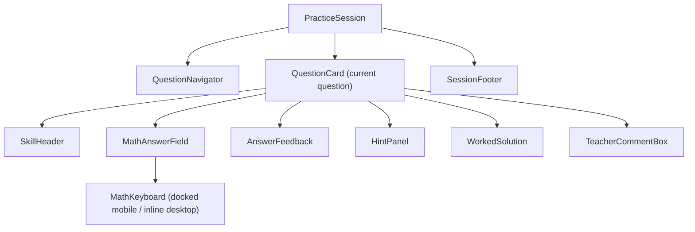
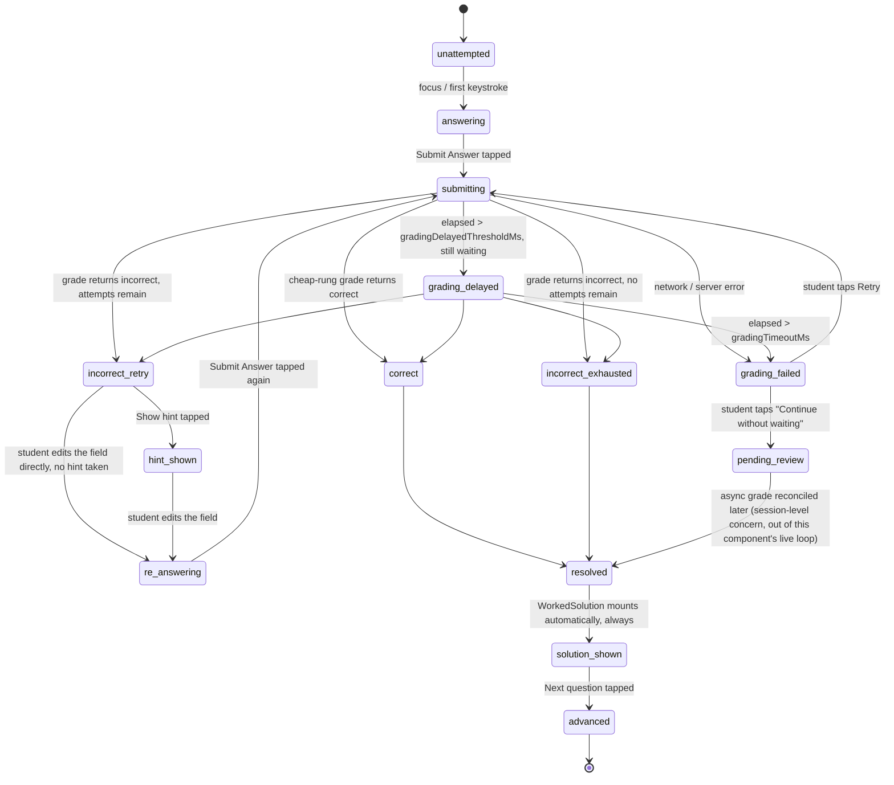

# P1 — Practice Question Player: Implementation Spec

> **⚠ ONE AMENDMENT — read `decisions/ADR-007-maths-input-strategy.md` first.**
> This lane's own measurement (MathLive ≈211–221KB gzip against a 200KB whole-app budget) was correct and
> load-bearing, and it changed the stack: **we are not shipping MathLive at launch.** `MathAnswerField`
> wraps a purpose-built constrained input for Class 6–8 emitting a small LaTeX subset, rendered by KaTeX.
> **Everything else in this spec stands** — the component tree, the state machine, the keyboard layout
> (already scoped to Class 6–8 and the Dr Frost layer pattern, so directly reusable), the hint panel, the
> worked-solution rendering, motion, responsive layout and error states.
> Also note: this lane predates ADR-006, so where it assumes a 3-rung hint ladder, see ADR-006
> Amendment 1 — the ladder is **two rungs**, with step-by-step worked-solution reveal as the third.

Owner: this file only. Written for a coding agent (Codex) with no access to this research session —
every recommendation below is meant to be buildable without further investigation. Where a value or
policy belongs to `decisions/ADR-006-practice-interaction-model.md` (being written in parallel by the
coordinator, not yet on disk at the time of writing), this document treats it as an **injected prop**,
never a hard-coded constant, and says so explicitly at each point.

**Evidence key** used throughout: **[observed]** = read or measured directly in this session (file
contents, a script's output, a fetched doc). **[inferred]** = follows from something observed.
**[assumed — verify]** = the best available answer where I could not get a session-verified source;
flagged so the coding agent budgets a verification step rather than trusting it blind.

Inputs read for this spec: `00_MISSION_BRIEF.md`, `MASTER_PLAN.md` §4/§5/§7/§12,
`corpus/drfrost-practice-ui-screenshots.md` (primary interaction evidence),
`research/A_ui_teardown_and_design_language.md` §4 (tokens) and §5 (motion), `decisions/ADR-002-canonical-data-model.md`
(canonical types: `Question`, `GradingMethod`, `AttemptEvent`, `Block`), `decisions/ADR-005-launch-curriculum-override.md`
(CBSE Class 6–8 scope), and `research/D_ai_grading_and_tutor.md` (grading-ladder latency and failure behaviour).
`decisions/ADR-006-practice-interaction-model.md` did not exist on disk yet — every policy value that
document should own is named "per ADR-006" below and modelled as a prop.

---

## 0. What this component must never do

Two invariants from the mission brief and ADR-002, restated because they constrain every section below:

1. **A student always sees the full worked solution at the end, whether right or wrong.** `WorkedSolution`
   is not conditionally rendered on correctness — see §5.
2. **`AttemptEvent` must be emitted for every submission, including `hintsUsed`, `attemptNumber`,
   `selectionPropensity` and `policyVersion`** (`decisions/ADR-002-canonical-data-model.md` lines 223–235,
   and MASTER_PLAN §5's invariant list) — this component's `onSubmit`/`onAttempt` contract in §1 is the
   only place that data is ever produced; skipping a field here is unrecoverable later.

---

## 1. Component tree



`PracticeSession` owns the per-question state machine (§2) and is the only component that talks to the
network. Everything below it is presentational-plus-local-UI-state; none of them fetch or grade directly.

### 1.1 `PracticeSession`

```ts
interface PracticeSessionProps {
  studentId: string;
  sessionId: string;
  questions: Question[];              // ADR-002 `Question[]`, already selected server-side by the adaptive engine
  policy: PracticePolicy;             // per ADR-006 — injected, never hard-coded (see below)
  initialIndex?: number;              // resume mid-session
  onAttempt: (attempt: AttemptDraft) => Promise<GradeResult>;  // may take multiple seconds — see §2
  onCommentSubmit: (questionId: string, commentLatexOrText: string) => Promise<void>;
  onSessionComplete: (summary: SessionSummary) => void;
  onExit: (reason: 'exit_task' | 'continue_later') => void;
}

/** Shape owned by ADR-006. This component treats it as opaque config it renders from, never computes. */
interface PracticePolicy {
  maxAttempts: number;                    // e.g. 3 — drives incorrect_retry vs incorrect_exhausted
  hintLadder: HintSpec[];                 // ordered; offered progressively after each failed attempt
  masteryDiscountPerHint?: number[];      // ADR-006's internal number — UI does NOT surface the raw value, see §4
  gradingTimeoutMs: number;               // e.g. 8000 — when to offer "continue without waiting" (see §2)
  gradingDelayedThresholdMs: number;      // e.g. 1500 — when copy switches to "still checking" (see §2)
  allowSkip: boolean;
  policyVersion: string;                  // stamped onto every AttemptEvent per ADR-002
}

interface HintSpec { id: string; level: number; content: Block[] }  // Block = ADR-002 note-block schema

type AttemptDraft = Pick<AttemptEvent,
  'studentId' | 'skillIds' | 'rawAnswer' | 'timeToAnswerMs' | 'hintsUsed' | 'attemptNumber'
> & { questionId: string; itemType: 'question' };

interface GradeResult {
  isCorrect: boolean;
  gradingMethod: GradingMethod;           // ADR-002 enum — exact/numeric_tolerance/cas_equivalence/llm_rubric/manual
  misconceptionId?: string;
  feedback?: string;
  status: 'graded' | 'needs_human_review' | 'timeout' | 'error';
}

interface SessionSummary {
  sessionId: string; correctCount: number; totalCount: number;
  hintsUsedTotal: number; durationMs: number;
}
```

**Why no state-machine library (XState, robot3, etc.):** the house budget is ≤200KB initial JS and
MathLive alone threatens to blow that on its own (§3) — do not add a second dependency to solve a problem
a `useReducer` with a well-typed discriminated union (§2) already solves for a single-question state
machine of this size. This is a deliberate bundle-budget decision, not an oversight.

### 1.2 `QuestionNavigator`

```ts
type QuestionTabState = 'unattempted' | 'current' | 'correct' | 'incorrect_resolved' | 'pending_review';

interface QuestionNavigatorProps {
  tabs: Array<{ questionId: string; state: QuestionTabState }>;
  currentIndex: number;
  progressPercent: number;              // 0–100, shown as the Dr Frost "40%" label
  onNavigate: (index: number) => void;  // jumping to an unattempted-but-not-current tab is allowed; jumping
                                         // to skip ahead of the adaptive engine's serve order is a policy
                                         // question for ADR-006, not this component — expose the callback,
                                         // let the caller decide whether to honour it
  onExit: () => void;                   // "Exit task" plain-text link, per corpus evidence
}
```

Colour-state mapping (per corpus item 1, adopted verbatim): `correct` → `--color-mastery-secure-solid` fill,
`current` → `--color-primary-600` fill with white label, `unattempted` → `--color-surface-raised` with
`--color-border-strong` outline, `incorrect_resolved` → `--color-mastery-towork-solid` fill (a resolved-wrong
question is still visibly distinct from unattempted — the student should be able to see which ones they got
wrong at a glance, which Dr Frost's screenshots don't show but which directly serves "task shape at a
glance," corpus item 1's own stated rationale), `pending_review` → a diagonal-hatch or dot-badge variant of
the `unattempted` tint (never conflated with plain unattempted — see §8).

### 1.3 `QuestionCard`

```ts
interface QuestionCardProps {
  question: Question;                    // ADR-002 `Question`
  attemptState: QuestionAttemptState;     // discriminated union, §2
  policy: PracticePolicy;
  onDraftChange: (latex: string) => void;
  onSubmit: () => void;
  onRequestHint: () => void;
  onCommentSubmit: (text: string) => void;
  onAdvance: () => void;                  // "Next question"
  onContinueLater: () => void;
  onOpenRemediation: () => void;
  onAskTutor: () => void;
}
```

`QuestionCard` composes `SkillHeader` + the question prompt (rendered via KaTeX, already in budget — not a
separate component per the brief's list) + `MathAnswerField` + `AnswerFeedback` + `HintPanel` (conditionally,
§4) + `WorkedSolution` (conditionally, §5) + `TeacherCommentBox` (conditionally, only once `resolved`, per
corpus screenshot 2). Container: white/`--color-surface` card, `--radius-lg`, `--shadow-1`, centred,
`max-width: 640px` above the `md` breakpoint (§7).

### 1.4 `SkillHeader`

```ts
interface SkillHeaderProps {
  skillCode: string;       // e.g. "201a" — exposed to the student verbatim, per corpus item 2
  skillTitle: string;      // e.g. "Change the subject of a linear formula requiring a single step."
  onOpenRemediation: () => void;  // "Read the notes" — our equivalent of Dr Frost's "Watch video ▷"
  onAskTutor: () => void;         // opens AI tutor pre-seeded with this skill's context (ADR-002 Skill id)
}
```

Layout: skill code + title left, two small text-link actions right (`Read the notes` / `Ask the tutor`) on
the same line as the corpus's single `Watch video ▷` — we split it into two verbs because the platform has
two distinct remediation paths (static notes vs. the RAG tutor) where Dr Frost has one (video).

### 1.5 `MathAnswerField` — see §3 for the full input contract.

### 1.6 `MathKeyboard` — see §3.

### 1.7 `HintPanel` — see §4.

### 1.8 `AnswerFeedback` — see §6 (extends the component already specified in `research/A_ui_teardown_and_design_language.md` §5e).

### 1.9 `WorkedSolution` — see §5.

### 1.10 `TeacherCommentBox`

```ts
interface TeacherCommentBoxProps {
  questionId: string;
  value: string;
  onChange: (v: string) => void;
  onSend: () => Promise<void>;
  sendState: 'idle' | 'sending' | 'sent' | 'failed';
  mathShortcutHint?: string;   // "Press Alt+Equals to insert mathematical expressions." — corpus screenshot 2, verbatim
}
```

Adopt corpus item 8 verbatim: appears only after `resolved`, accepts maths input (a lightweight MathLive
field is overkill here — see §8 for the failure-handling requirement instead), feeds the teacher-booking
escalation funnel named in MASTER_PLAN §7 ("Tutor and booking are one funnel").

### 1.11 `SessionFooter`

```ts
interface SessionFooterProps {
  canAdvance: boolean;          // true once attemptState.status === 'solution_shown'
  isLastQuestion: boolean;
  onContinueLater: () => void;  // plain text link, per corpus
  onNext: () => void;           // dark filled button, per corpus; label becomes "Finish session" on the last question
}
```

---

## 2. The state machine (one question)



```ts
type QuestionAttemptState =
  | { status: 'unattempted' }
  | { status: 'answering'; draftLatex: string; attemptNumber: number; hintsShown: HintSpec[] }
  | { status: 'submitting'; latex: string; attemptNumber: number; submittedAt: number; hintsShown: HintSpec[] }
  | { status: 'grading_delayed'; latex: string; attemptNumber: number; submittedAt: number; hintsShown: HintSpec[] }
  | { status: 'grading_failed'; latex: string; attemptNumber: number; reason: 'timeout' | 'network' | 'server_error'; hintsShown: HintSpec[] }
  | { status: 'pending_review'; latex: string; attemptNumber: number; hintsShown: HintSpec[] }
  | { status: 'correct'; latex: string; attemptNumber: number; gradingMethod: GradingMethod; hintsShown: HintSpec[] }
  | { status: 'incorrect_retry'; latex: string; attemptNumber: number; attemptsRemaining: number; hintsShown: HintSpec[] }
  | { status: 'incorrect_exhausted'; latex: string; attemptNumber: number; hintsShown: HintSpec[] }
  | { status: 'hint_shown'; latex: string; attemptNumber: number; attemptsRemaining: number; hintsShown: HintSpec[] }
  | { status: 're_answering'; draftLatex: string; attemptNumber: number; attemptsRemaining: number; hintsShown: HintSpec[] }
  | { status: 'resolved'; outcome: 'correct' | 'incorrect_exhausted'; latex: string; hintsShown: HintSpec[] }
  | { status: 'solution_shown'; outcome: 'correct' | 'incorrect_exhausted'; revealedStepCount: number; hintsShown: HintSpec[] }
  | { status: 'advanced' };
```

### 2.1 Grading-in-flight — exact UI behaviour

`research/D_ai_grading_and_tutor.md` establishes the ladder is **not uniformly instant**: `exact` and
`numeric_tolerance` resolve in well under 100ms (string/number comparison, no network round-trip beyond a
normal API call), but `cas_equivalence` runs a SymPy check with a **verified 2.0–3.0s hard timeout**
(`research/D_ai_grading_and_tutor.md` lines 147–202, run and observed in that session), and `llm_rubric`
adds a real model call plus, on a validation failure, **one full retry with a repair prompt** (line 267) —
so a worst-case grade can realistically take several seconds to run past ten. The UI must never look frozen
during this window and must never let a slow grade block the student indefinitely:

| Elapsed since submit | UI state | What's shown |
|---|---|---|
| 0–150ms | `submitting` | Submit button becomes a disabled spinner in place, immediately (matches lane A's "<150ms to first visual response" rule for the highest-frequency interaction in the product) |
| 150ms – `gradingDelayedThresholdMs` (default 1500ms) | `submitting` | Spinner only, no copy change — most answers resolve in this window |
| `gradingDelayedThresholdMs` → `gradingTimeoutMs` | `grading_delayed` | Copy changes to *"Still checking your working — this can take a few seconds for algebra."* so a 2–3s CAS check never reads as hung |
| past `gradingTimeoutMs` (default 8000ms, per ADR-006) | `grading_failed`, reason `'timeout'` | *"This is taking longer than expected."* Two actions: **Keep waiting** (stays in `grading_delayed`, resets a fresh timeout window) and **Continue without waiting** (moves to `pending_review`) |
| network drop / 5xx at any point | `grading_failed`, reason `'network'`/`'server_error'` | Same two-action pattern: **Retry** / **Continue without waiting** |

`pending_review` is a **distinct visual state**, never rendered as either `correct` or `incorrect` — this
directly matches `research/D_ai_grading_and_tutor.md`'s own rule that "an unresolved CAS check must never
default to 'correct'" (line 145): the UI-level consequence of that grading rule is that the student must
also never be shown a false-positive or false-negative badge while a grade is still outstanding. Render it
as a neutral grey chip: *"Submitted — we'll grade this and let you know."* The question's `WorkedSolution`
does not appear yet in `pending_review` (there is no `outcome` to key its default-expanded state off); when
the async grade eventually reconciles (a session-level concern, e.g. a toast or a badge update on
`QuestionNavigator`, both outside this component's live per-question loop), the question transitions into
`resolved` normally.

---

## 3. The maths input experience

### 3.1 Bundle size — the load-bearing finding for this whole section

**[observed, this session]** MathLive's published package (`mathlive`, latest npm version **0.110.0** at
time of writing) ships a single bundle, `mathlive.min.js`, fetched directly from
`https://cdn.jsdelivr.net/npm/mathlive@0.110.0/mathlive.min.js` and measured locally:

- Raw minified: **843,724 bytes** (~824 KB)
- Gzip (`gzip -9`): **226,317 bytes** (~221 KB)

This is corroborated independently by Bundlephobia's own reported figure for the package's main asset —
**822,343 bytes raw / 224,817 bytes gzip** — the two measurements agree within ~1.5KB (the small delta is
consistent with gzip level/version differences, not a different file). **[observed]** No lighter "core-only"
entrypoint is published for this version — the package's file listing exposes exactly one JS bundle
(`mathlive.min.js` / unminified `mathlive.js`) plus static CSS/font assets; there is nothing smaller to
import instead.

**Consequence, stated plainly: one library, on its own, costs ≈221KB gzip against a whole-app ceiling of
≤200KB initial JS (MASTER_PLAN §4).** This cannot ship in the initial bundle under any reading of the
budget. Required mitigations, non-negotiable:

1. **Route/mount-level code splitting only.** `MathAnswerField` dynamically imports `mathlive`
   (`await import('mathlive')`) the first time it mounts — never imported from the app shell, layout, or
   anything eagerly warmed on boot. Every other surface (notes reader, dashboard, flashcards without a
   maths-entry step) must be fully usable with zero bytes of MathLive downloaded.
2. **Even lazy-loaded, budget for it as the single heaviest secondary chunk in the app.** On a throttled
   3–8 Mbps 4G connection this is a genuinely felt delay (network fetch + parse/compile of an ~824KB script
   on a ₹10–15k Android phone is not free even off the critical path) — this is the top performance risk in
   the entire practice player, ahead of everything else in this document.
3. **This must be re-measured in MASTER_PLAN's own mandated Phase-0 budget spike** (§4: "Measure this in
   Phase 0 before committing to the architecture") **before the rest of this component is built.** If the
   measured, lazy-loaded cost is judged unacceptable even off the critical path, the documented fallback is
   a hand-rolled minimal LaTeX-fragment input (plain text entry + template-insertion buttons that write
   LaTeX substrings directly, live-previewed via KaTeX, which is already inside the budget) — this is a real
   architectural fork the coordinator should decide, not something this spec can quietly assume away. Given
   the fallback loses MathLive's structured caret-in-placeholder navigation and built-in LaTeX validation,
   this document proceeds on the assumption MathLive ships (lazy-loaded), and flags the fork as the single
   biggest open risk in this spec.

### 3.2 Field contract

```ts
interface MathAnswerFieldProps {
  staticPrefixLatex?: string;      // e.g. "x=" — rendered as plain KaTeX OUTSIDE the editable field
  value: string;                   // LaTeX string, controlled
  onChange: (latex: string) => void;
  placeholder?: string;
  disabled?: boolean;              // true once frozen post-submission (corpus screenshot 2)
  status: 'idle' | 'correct' | 'incorrect';  // border colour wash, no red border while attempts remain — see §6
  ariaLabel: string;
  mathfieldRef: React.RefObject<MathfieldElement>;  // imperative handle for MathKeyboard to dispatch into
}
```

**Static prefix, adopted verbatim from corpus item 5** ("Static `x =` outside the field, student supplies
only the RHS... removes a whole class of false-negative grading"):

```tsx
<div className="flex items-baseline gap-2">
  <StaticMathLabel latex={staticPrefixLatex} />  {/* plain KaTeX span, non-editable, ~0KB marginal — KaTeX is already loaded for notes/worked-solution */}
  <math-field ref={mathfieldRef} ... />
</div>
```

**Reading the value for grading:** the mathfield's `.value` getter returns LaTeX by default
**[assumed — verify against the pinned 0.110.0 API reference at build time]**; wire `onChange` off the
element's native `input` event (`mf.addEventListener('input', () => onChange(mf.value))`), never by polling.
This LaTeX string is exactly what `AttemptDraft.rawAnswer` (ADR-002) carries to the grading ladder.

**Preventing the OS keyboard:**

- Set the documented attribute `math-virtual-keyboard-policy="manual"` **[observed, MathLive's own virtual-
  keyboard guide]** so MathLive's own built-in virtual keyboard panel never auto-opens on touch focus — our
  `MathKeyboard` (§3.3) replaces it entirely, never runs alongside it.
- Hide MathLive's own keyboard-toggle affordance so there is only ever one keyboard UI on screen:
  `math-field::part(virtual-keyboard-toggle) { display: none; }` **[observed, this is the documented styling
  hook referenced in MathLive's own issue tracker for exactly this "I want to use my own keyboard" case]**.
- **Known, currently-open residual risk [observed, MathLive GitHub issue #1497]:** tapping near the edge of
  a `<math-field>` can still raise the native iOS keyboard even with a virtual-keyboard policy configured,
  because the field's internal hidden text-capture surface can pick up native focus in that case. This is an
  **unresolved upstream bug as of this writing, not a solved problem** — budget it as a Phase-0 testing task,
  not an assumption. Mitigation to implement and verify on real Android Chrome + iOS Safari hardware:
  overlay a transparent touch-catcher the exact size of the field that calls `mathfieldRef.current.focus()`
  programmatically on `pointerdown` rather than relying on the browser's default touch-to-focus path, so the
  app controls exactly when and how the field gains focus.
- On non-touch (desktop, §7), suppress none of this — a physical keyboard should type into the field
  normally, and `MathKeyboard` becomes optional inline chrome, not a forced overlay.

### 3.3 `MathKeyboard` — custom on-screen keyboard

```ts
type MathKeyboardLayer = 'main' | 'abc' | 'funcs' | 'symbs';
type MathKeyAction =
  | { kind: 'insert'; latex: string }        // e.g. '\\frac{#@}{#?}' — dispatched via mathfield.insert()
  | { kind: 'command'; command: string }     // e.g. 'deleteBackward', 'moveToNextChar' — mathfield.executeCommand()
  | { kind: 'layerSwitch'; layer: MathKeyboardLayer }
  | { kind: 'submit' };                      // ↵ triggers the parent's onSubmit directly, not a math command

interface MathKeyboardProps {
  activeLayer: MathKeyboardLayer;
  onKeyPress: (action: MathKeyAction) => void;
  visible: boolean;   // mounted for the whole answering phase of a question, not per-keystroke — see §3.5
}
```

**Why a bespoke React component instead of restyling MathLive's own virtual keyboard:** MathLive exposes a
`::part()` styling surface for its built-in panel, but that only reaches CSS-level theming, not the
Tailwind-token-driven, motion-integrated, exact Dr-Frost-pattern layout this spec calls for. Since the
~221KB MathLive bundle already includes its internal keyboard renderer regardless of whether we use it (no
smaller import exists per §3.1), building our own keycaps costs only a few KB of ordinary JSX and buys full
design-system control — a clean trade, stated explicitly rather than left implicit.

**Template insertion uses MathLive's own documented placeholder tokens** `#@` (current selection / implicit
argument) and `#?` / `#0` (empty placeholder) **[observed, MathLive's virtual-keyboard customisation guide]**
— e.g. the fraction key dispatches `{ kind: 'insert', latex: '\\frac{#@}{#?}' }`; if the student has a
selection it becomes the numerator, the cursor lands in the denominator placeholder, and MathLive's own
placeholder navigation (its core "structured entry" feature, per `corpus/mathlive.md` — "800 LaTeX
commands," built for exactly this) moves the caret between boxes on the keyboard's own `→`/Tab-equivalent
key. No custom placeholder-navigation logic needs to be written — this is stock MathLive behaviour once the
correct template LaTeX is inserted.

### 3.4 Layer layouts — CBSE Class 6–8 scope only

Per ADR-005, the launch curriculum is CBSE Class 6–8, **not** 9–10 — the keys below deliberately exclude
calculus, trigonometric functions, logarithms, and Euler's number, and prioritise fractions, mixed numbers,
decimals, ratios, percentages, negative numbers, simple powers, and basic geometry symbols, per the task
brief's explicit instruction. Each layer keeps Dr Frost's proven three-cluster shape (left symbol cluster +
middle numeric pad + right edit column) plus the far-right vertical layer-tab strip (corpus item 4, adopted).
All keycaps: `min-width`/`min-height: 44px` (see §3.5 for the sizing rationale), `8px` gaps.

**Main** (default layer — covers the large majority of Class 6–8 numeric/algebraic entry):

| Left cluster | Middle (numeric pad) | Right (edit) |
|---|---|---|
| `x`&nbsp;&nbsp;`y`&nbsp;&nbsp;`(`&nbsp;&nbsp;`)` | `7` `8` `9` `☐/☐` | `⌫` |
| `.`&nbsp;&nbsp;`%`&nbsp;&nbsp;`±`&nbsp;&nbsp;`:` | `4` `5` `6` `×` | `←` |
| | `1` `2` `3` `−` | `→` |
| | `0` `.` `=` `+` | `↵` |

**ABC** (variables — algebra and geometry point labels; class 6–8 rarely needs the full alphabet but "make
`x` the subject" / "label points A, B, C" both need letters beyond `x`, `y`):

| Row |
|---|
| `a` `b` `c` `d` `e` `f` `g` |
| `h` `i` `j` `k` `l` `m` `n` |
| `o` `p` `q` `r` `s` `t` `u` |
| `v` `w` `x` `y` `z` `⇧` `⌫` |
| *(full-width space bar)* |

`⇧` toggles case for the next keypress only (needed for `△ABC`-style point labels), not a persistent caps
lock — persistent caps would be surprising on a maths keyboard where lowercase is the overwhelming default.

**Funcs** (structured templates — the actual "template insertion" mechanism):

| Row |
|---|
| `√☐` `☐²` `☐³` `☐^☐` |
| `☐/☐` `☐ ☐/☐` (mixed number) `\|☐\|` `∛☐` |

Dispatch mapping: `√☐` → `\sqrt{#0}`, `☐²` → `#@^{2}`, `☐³` → `#@^{3}`, `☐^☐` → `#@^{#?}`, `∛☐` →
`\sqrt[3]{#0}` — all confirmed placeholder syntax **[observed]** per §3.3.

**Symbs** (comparison + basic geometry — no calculus, no trig, per ADR-005):

| Row |
|---|
| `<` `>` `≤` `≥` |
| `≠` `π` `°` `±` |
| `∠` `△` `⊥` `∥` |

### 3.5 Fitting this on a 360px viewport without occluding the question

- **Fixed keyboard height budget:** tab strip (40px) + 4 key rows at 44px + 3× 8px inter-row gaps + 16px
  vertical padding ≈ **260px total**, exposed as a CSS variable `--math-keyboard-height: 260px`. This is
  roughly a third of a 760–812px-tall Android/iPhone viewport, comparable in proportion to Dr Frost's own
  docked keyboard as shown in the operator's screenshots.
- **Keycap minimum size: 44×44px CSS**, deliberately at the WCAG 2.5.5 (AAA) target rather than the 24px AA
  minimum, given the primary audience is 11–14-year-olds whose touch precision is worse than an adult's.
- **Three-zone fixed layout**, using `100dvh` (dynamic viewport height — handles mobile browser chrome
  showing/hiding without the classic `100vh` jump):
  1. Top bar + `QuestionNavigator`: fixed, ~56px.
  2. `<main>` (question content): `flex: 1 1 auto; overflow-y: auto; padding-bottom: var(--math-keyboard-height)` —
     content can scroll fully clear of the docked keyboard rather than being covered by it.
  3. `MathKeyboard`: `position: fixed; inset-inline: 0; bottom: 0; height: var(--math-keyboard-height)`.
- **On focus**, call `mathfieldRef.current.scrollIntoView({ block: 'center', behavior: reducedMotion ? 'auto' : 'smooth' })`
  inside the scrollable `<main>`, so the field and enough of the question stem above it clear the newly-
  docked keyboard — this is the concrete answer to "how do you avoid occluding the question."
- **Mount lifecycle:** `MathKeyboard` mounts for the whole `answering`/`re_answering` phase of a question
  (not per-keystroke, and not only while the field has literal DOM focus) so it doesn't flicker in and out
  as the student glances at the question above. Enter: `translateY(100%) → 0` over `--duration-base` (200ms,
  `--ease-out`); exit (on submit-freeze) the reverse over `--duration-fast` (150ms) — both tokens reused
  verbatim from `research/A_ui_teardown_and_design_language.md` §5b.
- When the keyboard exits after submission, `SessionFooter`'s primary CTA slides into the **same fixed-
  bottom dock slot** the keyboard just vacated — the two never occupy the layout simultaneously, so the
  page's total height budget never jumps.

### 3.6 Accessibility

- Every keycap has an explicit `aria-label` independent of its glyph — e.g. the fraction key:
  `aria-label="Insert fraction"`; the power key: `aria-label="Insert power"`; layer tabs use
  `role="tablist"` / `role="tab"` / `aria-selected` (`aria-label="Switch to Functions keyboard layer"`, etc.).
- `MathKeyboard`'s outer container: `role="group" aria-label="Math on-screen keyboard"`.
- **Focus never leaves the mathfield when a keycap is tapped** — bind keycap taps to `onPointerDown` with
  `event.preventDefault()`, not `onClick`, so the browser's default focus-steal on pointerdown never fires;
  otherwise every keypress would blur-then-refocus the field, which is jarring and can retrigger native-
  keyboard heuristics (compounding the §3.2 residual risk).
- MathLive ships its own accessible math-reading support for screen readers (its own tagline: "a flexible,
  powerful, and **accessible** way to write math on the web," `corpus/mathlive.md`) — do not add a
  competing `aria-hidden`/`aria-live` layer on top of the mathfield itself; a screen-reader user's primary
  input path is the field's own accessibility tree plus a physical keyboard, not the touch keycaps, so
  `MathKeyboard`'s buttons must be reachable (real `<button>` elements, tab-order-visible) but are not the
  primary AT path.
- `aria-live="polite"` on `AnswerFeedback` (§6) and on `HintPanel`'s reveal region — announce a newly
  revealed hint once ("Hint 2 is now available"), not on every re-render.

---

## 4. The hint panel

```ts
interface HintPanelProps {
  hintsShown: HintSpec[];          // every hint revealed so far, in order — never removed once shown
  nextHintAvailable: boolean;      // false once hintLadder (PracticePolicy) is exhausted
  onRequestNextHint: () => void;
}
```

**Offered, not silently available.** After an `incorrect_retry` grade (attempt failed, attempts remain per
ADR-006's `maxAttempts`), a low-emphasis inline prompt appears directly under the `AnswerFeedback` chip:
*"Want a hint before you try again?"* with a single `Show hint` button. **This exact moment is this
document's own UX judgement, not lifted from the corpus** — the operator's Dr Frost screenshots only cover
the pre-submission and post-resolution states, not an in-between hint-offer moment, so this is flagged
explicitly as a recommendation for the coordinator to confirm against ADR-006's hint-ladder semantics.

**Progressive disclosure, never destructive:** hints accumulate in a numbered, always-visible stack
("Hint 1", "Hint 2", ...); the `Show next hint` control renders only below the last revealed hint and
disappears once the ladder is exhausted. Visual treatment uses the **info** token family
(`--color-info-50` background / `--color-info-700` text), not warning/danger — a hint is guidance, not an
error.

### 4.1 Cost signalling — the UX-ethics call the brief asks for

**Recommendation: state the mastery-credit cost plainly, once, in neutral language, attached to the first
hint button in a question — not escalating, not gated behind a confirmation step, and never stated as a
specific percentage.**

Exact copy under the first `Show hint` button, small and dim (`--text-xs` / `--color-text-dim`):

> *"Hints help you learn the method — using one means this question won't count fully toward mastery."*

Subsequent hints in the same question repeat the identical caption rather than an escalating warning — the
visual weight of the notice must **not** grow with how much help the student took; a shame gradient
proportional to hint count is exactly the outcome to avoid in a product for 11–14-year-olds. No warning
icon, no red/orange colour, no "are you sure?" modal — a confirmation dialog in front of a hint would itself
teach the wrong lesson (that asking for help is risky enough to need a gate).

**Justification, grounded in the mission's own adaptive-engine design:** `research/C_adaptive_engine.md`
(line 279) already maps a correct-with-hint answer to a lower-but-still-positive FSRS rating ("Good," not
"Easy") rather than treating hint use as a failure — the backend already encodes hint-assisted correctness
as real, partial learning. The UI's job, per the brief's own framing ("must not be surprised... must not be
shamed"), is to be honest about the mechanic without dramatizing it. This mirrors how Duolingo and Khan
Academy surface hint cost — a matter-of-fact note, not a penalty screen.

**Named deviation, flagged for the coordinator:** if ADR-006 lands with a specific mastery-discount number
per hint (e.g., "−15% credit"), this spec still recommends the vaguer *"won't count fully"* phrasing rather
than the literal number — a printed percentage reads as a scoreboard penalty to a Class 6–8 student, which
undercuts the unshaming intent above even if the number itself is small. `PracticePolicy.masteryDiscountPerHint`
stays available as a prop for future use (analytics, a parent/teacher-facing view, or a future A/B test) but
`HintPanel` itself never renders it. If the coordinator disagrees with hiding the exact number from the
student, that is the one open call in this section to resolve against ADR-006, not a silent choice.

---

## 5. The worked solution component

```ts
interface WorkedSolutionProps {
  steps: WorkedSolutionStep[];
  defaultExpandedSteps: number;   // 0 for incorrect_exhausted (start collapsed); Infinity for correct (start expanded, student may still collapse)
  onStepRevealed?: (index: number) => void;  // telemetry hook only
}

interface WorkedSolutionStep {
  id: string;
  reason: string;                          // plain-English, e.g. "Add 5 to both sides to isolate x."
  transformation?: EquationTransformation; // present when the step is an algebraic operation, absent for prose-only steps
  resultLatex?: string;                    // bold restatement, e.g. "x = 9y + 5" — typically only the summary step
}

/** Content-model contract this component REQUIRES from lane P2's authoring schema — flagged below. */
interface EquationTransformation {
  beforeLeftLatex: string;   // LHS before the operation, e.g. "x-5"
  beforeRightLatex: string;  // RHS before, e.g. "9y"
  annotationLeft?: string;   // e.g. "+5", shown under the LHS column
  annotationRight?: string;  // e.g. "+5", shown under the RHS column
  afterLeftLatex: string;    // LHS after, e.g. "x"
  afterRightLatex: string;   // RHS after, e.g. "9y+5"
}
```

**Always rendered after `resolved`, regardless of outcome — this is a fixed decision, not a per-question
choice.** `WorkedSolution` takes no "was this correct" prop that changes what it shows; only
`defaultExpandedSteps` (below) changes with outcome, and only affects *how much is pre-opened*, never *what
exists*. This distinction is called out explicitly because it is easy to accidentally couple the two.

### 5.1 Rendering the annotated transformation

Rather than measuring arbitrary KaTeX DOM output at runtime to position an annotation under a term (fragile,
and a real reflow cost on a low-end phone every time the panel resizes), each transformation step is a
**three-row CSS grid split at the equation's own `=` sign**, authored as separate left/right LaTeX strings
rather than one whole-equation string per row:

```
Row 1 (before):      [KaTeX: beforeLeftLatex]      =      [KaTeX: beforeRightLatex]
Row 2 (annotation):     [+5 ↓, small, dim]                   [+5 ↓, small, dim]
Row 3 (after):       [KaTeX: afterLeftLatex]       =      [KaTeX: afterRightLatex]
```

KaTeX renders each `...Latex` field independently (KaTeX is already inside the app's budget per
MASTER_PLAN §4b, so this adds no new library); the annotation row is plain styled text (a small down-arrow
plus the delta), centred per column via CSS Grid `justify-items: center`, coloured `--color-primary-600` to
read as "an operation being applied" rather than as ordinary maths text.

**Content-model dependency, flagged for the coordinator:** this rendering approach *requires*
`EquationTransformation` to store each side of the equation as a separate LaTeX field, already split at
`=`, at author time. If lane P2's worked-solution content schema instead stores one whole-equation LaTeX
string per row (which is the more natural authoring shape), this component cannot reliably align an
annotation under one side without parsing LaTeX at render time — a real reconciliation point between this
document and P2's schema that the coordinator should resolve before either side is built against the other.

### 5.2 Progressive reveal — recommendation: step-by-step, tap-gated

**Recommendation: one step at a time, behind an explicit "Show next step" tap — never auto-play.** This is
not a fresh decision; `research/A_ui_teardown_and_design_language.md` §5a already states the reasoning for
this exact component and it is reproduced here rather than re-litigated: *"auto-play removes the productive
struggle the mission's pedagogy depends on."*

The one degree of freedom this spec adds is `defaultExpandedSteps`, driven by outcome:
- `outcome === 'incorrect_exhausted'`: starts at `0` (fully collapsed) — the point is for the student to
  read and compare against their own attempt one step at a time before seeing the rest.
- `outcome === 'correct'`: starts at `Infinity` (fully expanded) — a student who solved it correctly is
  shown the ideal method immediately (per the brief's fixed decision that the full solution is shown
  regardless of correctness) but is not forced to click through steps they already know how to do; they may
  still collapse individual steps.

Both cases use the **same component and the same step data** — only the initial reveal count differs. Each
step's reveal/collapse transition reuses lane A's height+opacity pattern via `motion`, dropped to
`--duration-instant` under `prefers-reduced-motion` (per `research/A_ui_teardown_and_design_language.md`
§5d: "Unaffected — this is a tap-gated content reveal, not a motion effect... keep the transition but drop
it to `--duration-instant`").

A visible scrollbar on the panel (matching the corpus screenshot) rather than pagination — a single
scrollable region, `max-height` + `overflow-y: auto` inside the card.

---

## 6. Feedback and motion

### 6.1 Correct / incorrect moment

Reuse `research/A_ui_teardown_and_design_language.md` §5e's `AnswerFeedback` component verbatim as the base
(the spring scale-in, `LazyMotion`+`m`, `AnimatePresence` pattern is already specified there and should not
be re-implemented), extended only to add the practice player's two incorrect sub-states — both render
identically to the existing `'incorrect'` visual (the danger-100 chip, "✕ Not quite"), because the chip's
single job is "was this attempt right or wrong," not attempt bookkeeping; attempts-remaining is communicated
by the hint-offer copy (§4) and `QuestionNavigator`, not by the feedback chip itself:

```tsx
// AnswerFeedback.tsx — extends the lane-A base component
import { m, AnimatePresence, LazyMotion, domAnimation } from 'motion/react';

type FeedbackStatus = 'idle' | 'correct' | 'incorrect_retry' | 'incorrect_exhausted';

export function AnswerFeedback({ status }: { status: FeedbackStatus }) {
  const isCorrect = status === 'correct';
  const isIncorrect = status === 'incorrect_retry' || status === 'incorrect_exhausted';

  return (
    <LazyMotion features={domAnimation} strict>
      <AnimatePresence mode="wait">
        {status !== 'idle' && (
          <m.div
            key={status}
            role="status"
            aria-live="polite"
            initial={{ scale: 0.6, opacity: 0 }}
            animate={{ scale: 1, opacity: 1 }}
            exit={{ scale: 0.9, opacity: 0 }}
            transition={{ type: 'spring', stiffness: 500, damping: 28 }}
            className={
              'inline-flex items-center gap-1.5 rounded-full px-3 py-1 text-sm font-medium ' +
              (isCorrect
                ? 'bg-[--color-success-100] text-[--color-success-700]'
                : 'bg-[--color-danger-100] text-[--color-danger-700]')
            }
          >
            {isCorrect ? '✓ Correct' : '✕ Not quite'}
          </m.div>
        )}
      </AnimatePresence>
    </LazyMotion>
  );
}
```

**The maths field's own border does not turn red on every incorrect attempt** — it keeps a neutral
`--color-border-strong` outline for `incorrect_retry` (attempts remain, "productive struggle" is still in
play, per Mathspace's step-level-adaptivity framing in the teardown) and only takes a `--color-danger-300`
border once truly `incorrect_exhausted`. Wrongness escalates once, at resolution — not on every retry.

### 6.2 Celebration — narrowing Dr Frost's confetti, deliberately

**Recommendation: a small, restrained particle burst only on a question's first-ever correct answer within
a session is over-triggering; reserve the actual confetti burst for session-level milestones (finishing all
questions in the set, a streak day, first-time mastery-band-4), not per-question.** The existing
`AnswerFeedback` spring scale-in above already gives every correct answer some positive motion; that is
enough at item level.

**Why:** `research/A_ui_teardown_and_design_language.md` §5a's own motion catalogue scopes the particle-burst
mechanic to **low-frequency** events specifically because it is stated to compound badly across "60+
navigations/session." A realistic 10-question practice set means up to ten correct answers — full confetti
on each one cheapens the signal, adds real GPU/battery cost on a low-end Android device for a moment meant
to be brief, and risks training a Class 6–8 student toward chasing the animation rather than the method just
demonstrated in `WorkedSolution`. Note this is a **deliberate narrowing, not an omission**: even Dr Frost's
own screenshot shows only "faint" particles per the corpus description — this document goes one step
further and moves the full burst to session-level completion only.

```tsx
// SessionMilestoneBurst.tsx — session-level only, not per-question
import { m, LazyMotion, domAnimation } from 'motion/react';
import { useMemo } from 'react';

interface Props { show: boolean; reducedMotion: boolean; particleCount?: number }

export function SessionMilestoneBurst({ show, reducedMotion, particleCount = 16 }: Props) {
  const particles = useMemo(
    () => Array.from({ length: particleCount }, (_, i) => ({
      id: i,
      dx: (Math.random() - 0.5) * 240,
      dy: -Math.random() * 200 - 40,
      rotate: (Math.random() - 0.5) * 360,
    })),
    [particleCount]
  );

  if (!show) return null;

  // prefers-reduced-motion degradation, per §5d's table: a single static badge, no particle animation
  if (reducedMotion) {
    return (
      <div role="status" aria-live="polite" className="flex items-center justify-center">
        <span className="rounded-full bg-[--color-secondary-100] px-4 py-2 text-[--color-secondary-700] font-semibold">
          🎉 Session complete
        </span>
      </div>
    );
  }

  return (
    <LazyMotion features={domAnimation} strict>
      <div role="status" aria-live="polite" className="relative h-0 w-0">
        {particles.map((p) => (
          <m.span
            key={p.id}
            className="absolute h-2 w-2 rounded-sm bg-[--color-secondary-400]"
            initial={{ x: 0, y: 0, opacity: 1, rotate: 0 }}
            animate={{ x: p.dx, y: p.dy, opacity: 0, rotate: p.rotate }}
            transition={{ duration: 0.9, ease: [0.16, 1, 0.3, 1] }}
          />
        ))}
      </div>
    </LazyMotion>
  );
}
```

`reducedMotion` is sourced from the shared `usePerformanceTier`/`prefers-reduced-motion` check already
specified in `research/A_ui_teardown_and_design_language.md` §5d — do not re-implement a second detection
mechanism here. On the low-end-device performance tier (not just the motion preference), also cap
`particleCount` to 6 per that same section's rule ("skip the celebration burst's shape count down to 6").

---

## 7. Responsive layout

| | 360px (mobile, primary) | 768px (tablet) | 1280px (desktop) |
|---|---|---|---|
| `QuestionNavigator` | Horizontal scroll-snap tab strip, top, current tab auto-scrolled to centre | Same as mobile — touch remains the primary input method on Android tablets in this market | Persistent vertical list in a left/right rail, replacing the horizontal strip |
| `MathKeyboard` | Fixed-docked bottom, always mounted during answering (§3.5) | Fixed-docked bottom, same as mobile | **Optional and inline** — rendered in normal flow directly below `MathAnswerField`, toggled by a small "Show math keyboard" button; a physical keyboard plus MathLive's own typed shortcuts (e.g. typing `/` for a fraction) covers most desktop input |
| `QuestionCard` width | Full viewport width minus 16px gutters | `max-width: 640px`, centred | `max-width: 720px`, centred, two-column: question column + persistent nav rail |
| `SessionFooter` | Shares the fixed-bottom dock slot with `MathKeyboard` (never both present, §3.5) | Same pattern | Static, in normal document flow below the card — no fixed dock needed once the keyboard is no longer fixed |

Tailwind breakpoint mapping: 360px styles are the unprefixed (mobile-first) base; 768px changes use `md:`;
1280px changes use `xl:`. No new breakpoint tokens are needed beyond the house Tailwind v4 defaults.

---

## 8. Empty, loading, error and offline states

- **Initial loading:** CSS-only `@keyframes` opacity-pulse skeleton (per lane A's catalogue — "must render
  before JS hydrates," zero JS cost) shaped exactly like the real layout: skeleton `QuestionNavigator` tabs
  + a skeleton `QuestionCard` (fixed-height grey blocks for skill header, prompt lines, answer field, submit
  button) so real content never causes a layout jump on arrival.

- **Empty session (adaptive engine returns zero questions):** never render a blank practice screen. Show a
  dedicated card with a `lucide-react` icon chosen for positive framing (e.g. `CheckCircle2`, not a warning
  triangle) and one of three distinct copy variants keyed by `reason`:
  - `'all_mastered'` — positive framing: "You've cleared everything available here right now."
  - `'no_content_scoped'` — neutral framing: content for this topic isn't published yet.
  - `'config_error'` — the one genuine error case; say so honestly rather than papering over it with
    cheerful copy that would read as dishonest to a confused student.
  All three offer a single CTA back to the syllabus/home surface.

- **Session load failure** (network drop before any question data arrives) — distinct from a grading
  failure (§2), which happens per-answer mid-session: a full-card error state with **Retry** and the same
  **Continue later** escape hatch as the normal footer. Because progress must be persisted **per-question as
  it is submitted** (ADR-002's `AttemptEvent` invariant — never batched to session end), a crash here never
  loses answers already graded earlier in the session.

- **Grading failure:** fully specified in §2.1 (`grading_failed` → Retry / Continue-without-waiting →
  `pending_review`) — not duplicated here.

- **Offline:** the grading ladder is server-side and authoritative by design (`research/D_ai_grading_and_tutor.md`
  line 65: "never trust a client-computed correct flag") — so full offline practice grading is explicitly
  out of scope for this component, but a mid-session connectivity drop must be handled honestly rather than
  silently:
  - Detect via `navigator.onLine` plus `online`/`offline` event listeners — no polling.
  - While `offline` and a question is in `answering`: the student can keep typing (MathLive is fully local,
    no network dependency to render or edit) but `Submit Answer` becomes disabled and relabels to *"Waiting
    for connection…"* rather than allowing a submit that would silently hang — the same underlying honesty
    principle as the §2.1 timeout handling, triggered by a client-side signal instead of a server timeout.
  - No retroactive re-sync UI is built here — reconciling previously-submitted-but-unconfirmed attempts once
    connectivity returns is a Dexie/sync-layer concern outside this component's ownership. This component's
    only obligations are: never lose the student's local draft text, never claim a grade it does not have,
    and auto-retry the single pending submission once `online` fires again.

- **`TeacherCommentBox` send failure:** independent of grading — shown inline next to `Send` (not a
  blocking modal), with its own retry affordance; the drafted comment text is never cleared on a failed send.

---

## 9. Handoff — open items for the coordinator

1. **MathLive's ≈221KB gzip footprint (§3.1) is the top risk in this entire spec** — a Phase-0 measurement
   spike against the real lazy-loaded chunk, on a throttled Moto-G-class profile, should happen before the
   rest of this component is built, with the plain-LaTeX fallback as a named contingency, not an afterthought.
2. **`EquationTransformation`'s split-LHS/RHS content-model requirement (§5.1) needs reconciliation with
   lane P2's worked-solution authoring schema** before either side builds against assumptions about the
   other.
3. **The hint-offer moment (§4) and the decision to hide the exact mastery-discount percentage from students
   are this document's own UX judgement calls**, not lifted from the corpus evidence — both should be
   checked against `decisions/ADR-006-practice-interaction-model.md` once it lands, since ADR-006 owns hint-
   ladder and mastery-discount policy.
4. **The MathLive OS-keyboard-suppression mitigation (§3.2) rests on a currently-open upstream GitHub issue**
   (#1497) — this is a real, unresolved risk to test on physical Android/iOS hardware, not a solved problem
   this spec can guarantee.
5. `gradingTimeoutMs` and `gradingDelayedThresholdMs` values used throughout (8000ms / 1500ms) are this
   document's own reasonable defaults for illustrating the state machine — ADR-006 is the authority on the
   final numbers; `PracticePolicy` is deliberately shaped so changing them is a config change, not a
   component rewrite.

**Status: DONE_WITH_CONCERNS.** The spec is complete against all eight requested deliverables and every
external claim above is either observed in this session (with the command/fetch shown) or explicitly marked
inferred/assumed. The concerns are the five handoff items above — none of them block writing code against
this document, but items 1 and 4 in particular should be resolved (or at least test-verified) early in
implementation rather than discovered late.
